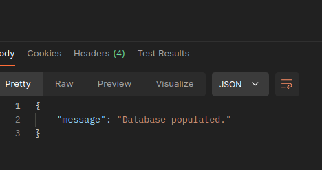
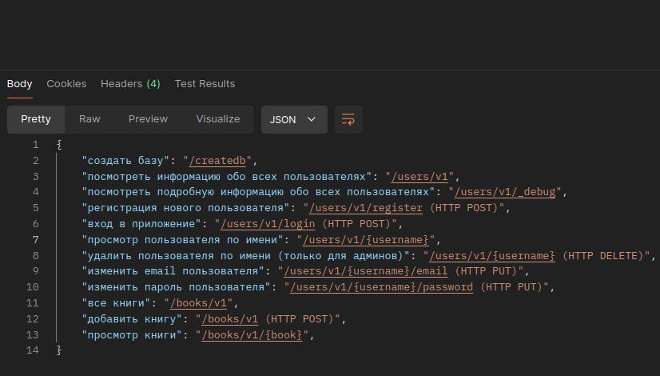
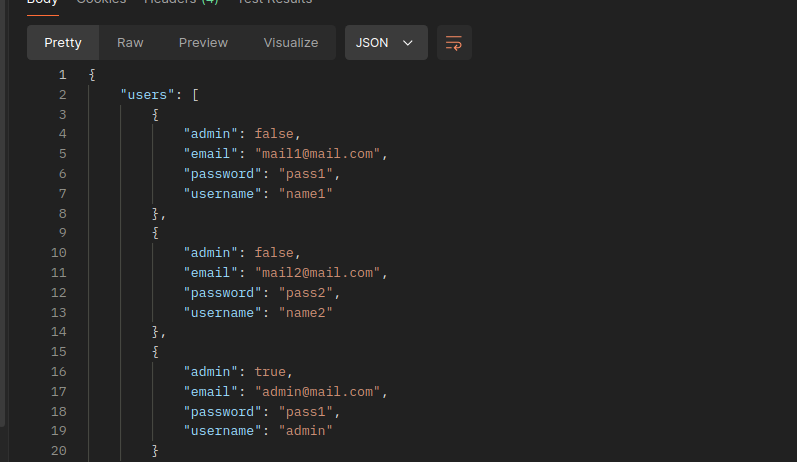
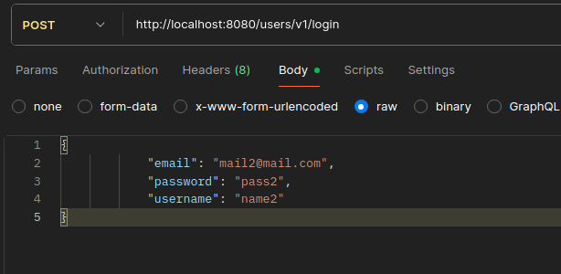
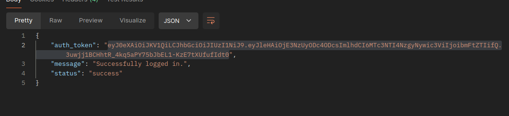
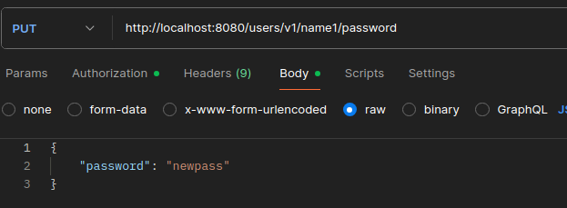
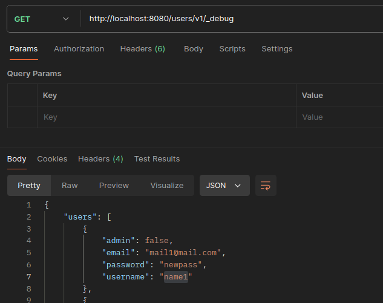

# Лабораторная работа №1

## Часть I

#### 1. CVE-2025-54822: Недостаточная авторизация на уровне объектов (BOLA)
Категория OWASP: API1:2023 — Broken Object Level Authorization (BOLA).

[Сcылка на источник](https://nvd.nist.gov/vuln/detail/CVE-2025-23325)

Описание: Уязвимость ненадлежащей авторизации [CWE-285] в Fortinet FortiOS (версии с 7.4.0 по 7.4.1, с 7.2.0 по 7.2.8, с 7.0.0 по 7.0.11) и FortiProxy (версии с 7.4.0 по 7.4.8, все версии 7.2, 7.0 и 2.0) позволяет аутентифицированному злоумышленнику получить доступ к статическим файлам других виртуальных доменов (VDOM) с помощью специально сформированных HTTP или HTTPS запросов.

Причина: Проверка на наличие токена, но не проверка на наличие прав в токене

#### 2. CVE-2025-49559: Недостаток контроля потребления ресурсов (DoS)
Категория OWASP: API4:2023 — Unrestricted Resource Consumption.
[Сcылка на источник](https://nvd.nist.gov/vuln/detail/CVE-2025-49559)

Описание: В REST API платформы электронной коммерции (Magento/Adobe Commerce) был найден эндпоинт для генерации PDF-счетов, который не ограничивал количество одновременно запрашиваемых записей или размер выходного файла.

Причина: Отсутствие лимитов (Rate Limiting и Payload Size Limiting).

#### 3. CVE-2025-50125 : Нарушение авторизации на уровне свойств объекта
Категория OWASP: API7:2023 Server Side Request Forgery
[Сcылка на источник](https://nvd.nist.gov/vuln/detail/CVE-2025-50125)

Описание: Существует уязвимость CWE-918: подделка серверных запросов (SSRF), которая может привести к неавторизованному удаленному выполнению кода (RCE), если доступ к серверу осуществляется через сеть при условии знания скрытых URL-адресов и манипулирования заголовком запроса Host.

Причина: доверие сервера к данным из HTTP-заголовков и отсутствии строгой проверки путей назначения для запросов.

## Часть II

Для выполнения запросов воспользуюсь программой ```Postman```


### 1. Запуск приложения

Заполняем базу по адресу ```http://localhost:8080/createdb```


### 2. Проверка эндпоинтов

По адресу ```http://localhost:8080/``` получаем все эндпоинты


### 3.Список юзеров

По адресу ```http://localhost:8080/users/v1/_debug``` можем получить всех юзеров


Помимо юзернейма мы получаем пароль в открытом виде и информацию о правах пользователя.
Значит это уязвимость типа API3:2023 Broken Object Property Level Authorization. Мы получаем чувствительные поля, которые не должный быть доступны обычному юзеру.

Меры предотвращения:  
1. Проверять право доступа к чувствительным объектам при обращении.
2. Не хранить пароли в открытом виде.

### 4.Смена пароля

Логинимся как юзер `name2`
```http://localhost:8080/users/v1/login```


Получаем токен


Пробуем поменять пароль у другого юзера - `name1`



Что успешно получается 


Эта уязвимость называется API1:2023 — Broken Object Level Authorization (BOLA).
Мы можем менять чужой ресурс
Меры предотвращения:
1. Проверка владения ресурсом (проверить, что мы меняем свой ресурс)
2. Использование (UUID), чтобы мы могли менять данные по скрытому айди, а не по известному username
3. Требование старого пароля