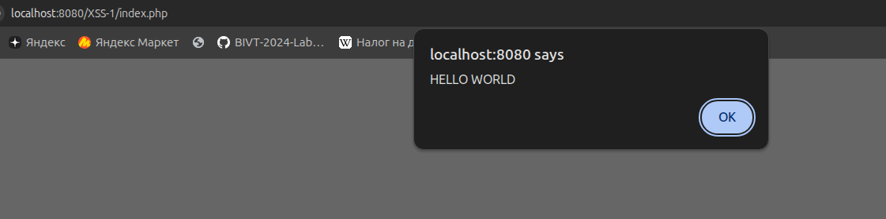
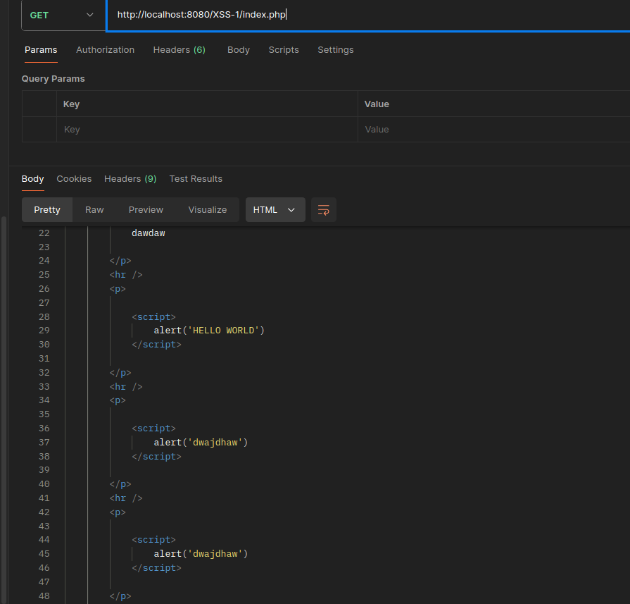

# Лабораторная работа №3

## Часть I

#### 1. CVE-2021-38704: ClinicCases
[Ссылка на источник](https://nvd.nist.gov/vuln/detail/CVE-2021-38704)

**Уязвимый компонент**: Система управления делами для юридических клиник ClinicCases (версия 7.3.3).

**Описание**: Множественные уязвимости типа XSS в ClinicCases версии 7.3.3 позволяют неавторизованным злоумышленникам внедрять произвольный JavaScript-код с помощью создания вредоносной ссылки. Это может привести к захвату учетной записи путем кражи токенов сессии.

**Для чего используется**: Это специализированная open-source система Она позволяет вести базу данных клиентов, отслеживать рабочее время сотрудников, хранить документы по делам и организовывать совместную работу юристов.

**Функционал**: Предоставляет веб-интерфейс для регистрации кейсов, управления календарем и формирования отчетов. Уязвимость была обнаружена в механизме обработки URL-параметров, что позволяло неавторизованному злоумышленнику украсть сессионные токены сотрудников.

#### 2. CVE-2021-24495: Marmoset Viewer (WordPress Plugin)
[Ссылка на источник](https://nvd.nist.gov/vuln/detail/CVE-2021-24495)

**Уязвимый компонент**: Плагин Marmoset Viewer для CMS WordPress.

**Описание**: Плагин Marmoset Viewer для WordPress версии до 1.9.3 не выполняет надлежащую очистку, проверку или экранирование параметра 'id' перед его выводом обратно на страницу. Это приводит к возникновению уязвимости типа XSS.

**Для чего используется**: Этот PHP-плагин предназначен для интеграции 3D-сцен и моделей, созданных в программе Marmoset Toolbag, непосредственно в статьи или страницы сайта на WordPress.

**Функционал**: Плагин добавляет шорткоды и специальный плеер, который позволяет посетителям сайта вращать и рассматривать 3D-объекты в реальном времени. 

#### Общее количество CVE за 2021 год
Согласно данным cve.ord за 2021 год общее количество CVE - 20161
C 2021 по 2024 год общее количество CVE, связанных с XSS - 11245

[Ссылка на истоник (CVE 2021)](https://www.cve.org/About/Metrics)

[Ссылка на истоник(XSS 2021-2024)](https://medium.com/s2wblog/detailed-analysis-of-recent-vulnerability-trends-and-attack-patterns-742d37ff4ced)

## Часть II

## 1. Начало 

Переходим на `http://localhost:8080/XSS-1/index.php`.
Видим окошко для загрузку комментов

Пишем в окошко скрипт для вывода фразы;

``

Скрипты также добавились в код страницы. Код вставился в страницу в изначальном состоянии

То есть при каждом обновлении скрипты выполнятся заново

Эта уязвимость называется Межсайтовый скриптинг (Cross-Site Scripting,XSS).

Ее суть заключается в том, что приложение принимает данные от пользователя без должной проверки и санитизации. В результате браузер интерпретирует текст не как обычную строку, а как javascript код, и запускает его.

Меры предотвращения:

1. Экранирование спецсимволов (`<`, `>`, `"`, `'`, `&`)
2. Санитизация HTML
3. Не вставлять ввод напрямую в код страницы