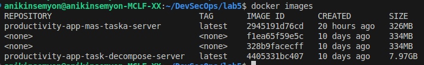
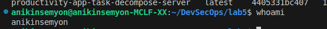
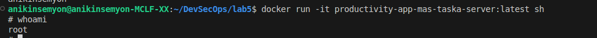
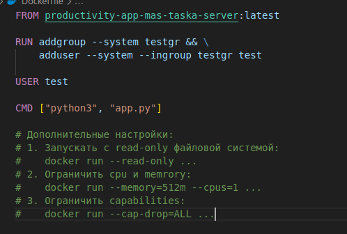
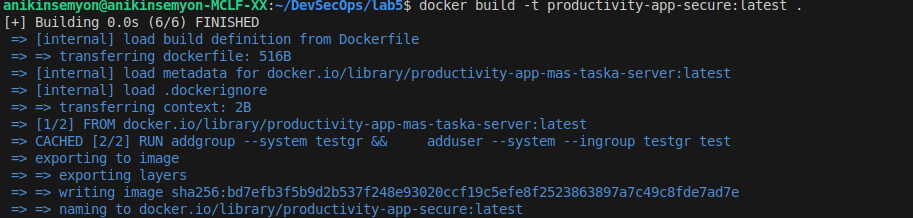
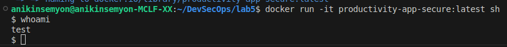
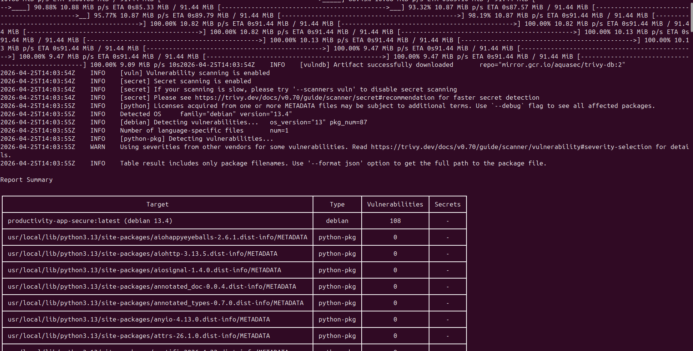
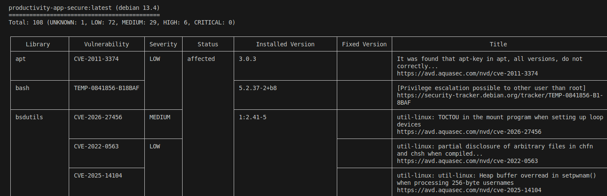
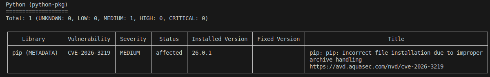

# Лабораторная работа №5

## Часть I

### Образы
Смотрим какие есть образы командой `docker images`


### Пользователь
Смотрим юзера командой `whoami` до захода в образ



### В образе

Заходим в образ командой 

```docker run -it productivity-app-mas-taska-server:latest sh```

и смотрим юзера командой `whoami`



## Часть II

### Dockerfile
Создадим Dockerfile на основе предыдущего образа. В нем создадим нерутового юзера `test`



### whoami
Сбилдим новый образ

 `docker build -t productivity-app-secure:latest .`



Заходим в образ командой 

```docker run -it productivity-app-secure:latest sh```

и смотрим юзера командой `whoami`



### Доп флаги

1. Запускать с read-only файловой системой:

    ```docker run --read-only ...```
2. Ограничить cpu и memrory:

    ```docker run --memory=512m --cpus=1 ...```

3. Ограничить capabilities:

    ```docker run --cap-drop=ALL ...```

## Часть III

### Запускаем сканирование командой при помощи trivy

```
docker run --rm \
  -v /var/run/docker.sock:/var/run/docker.sock \
  aquasec/trivy image productivity-app-secure:latest
```






### Вывод

Общий результат:

Всего найдено 109 уязвимостей.

CRITICAL уязвимостей - 0.

Обнаружено 6 уязвимостей уровня HIGH.

Некоторые уязвимости высокого уровня:

1. libncursesw6 — CVE-2025-69720.

   Уязвимость переполнения буфера может привести к выполнению произвольного кода.

2. libsystemd0 — CVE-2026-29111.

   Выполнение произвольного кода или отказ в обслуживании через некорректный/ложный IPC

Эти уязвимости относятся не к коду приложения напрямую, а к системным пакетам базового Debian-образа. 