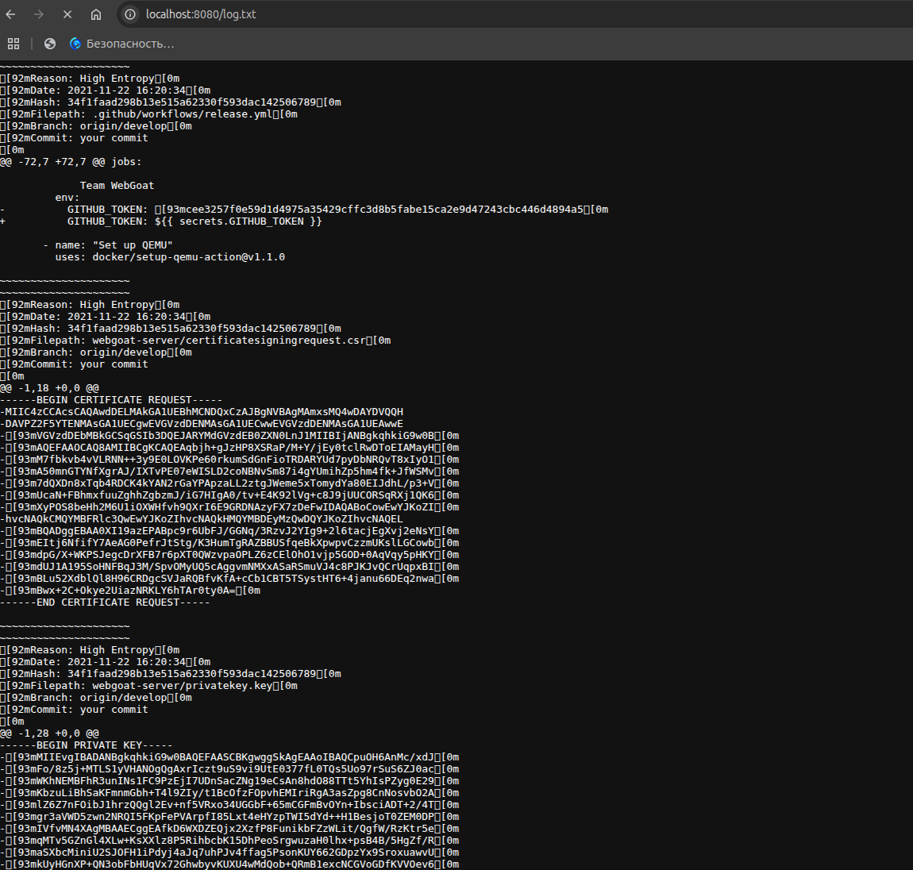
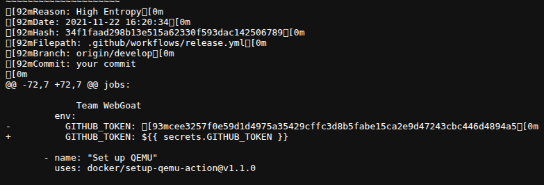
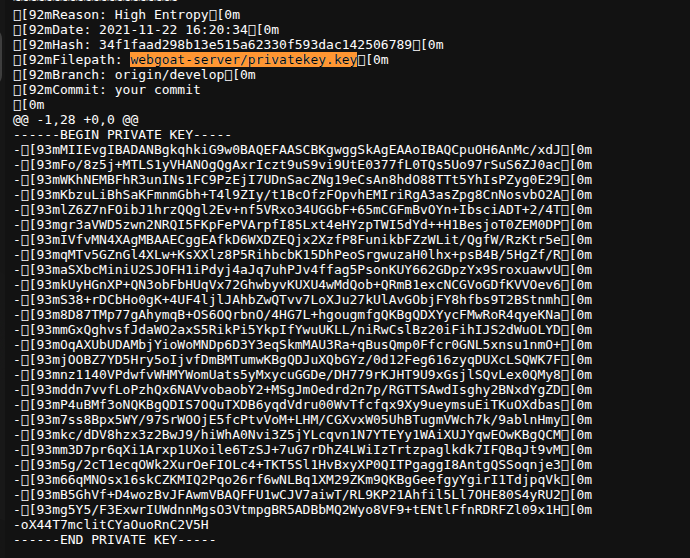
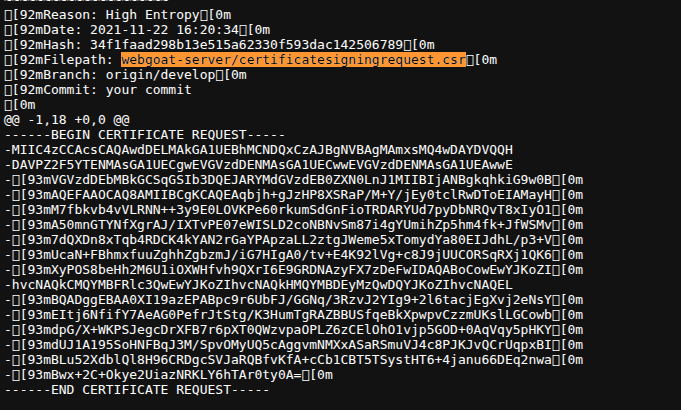
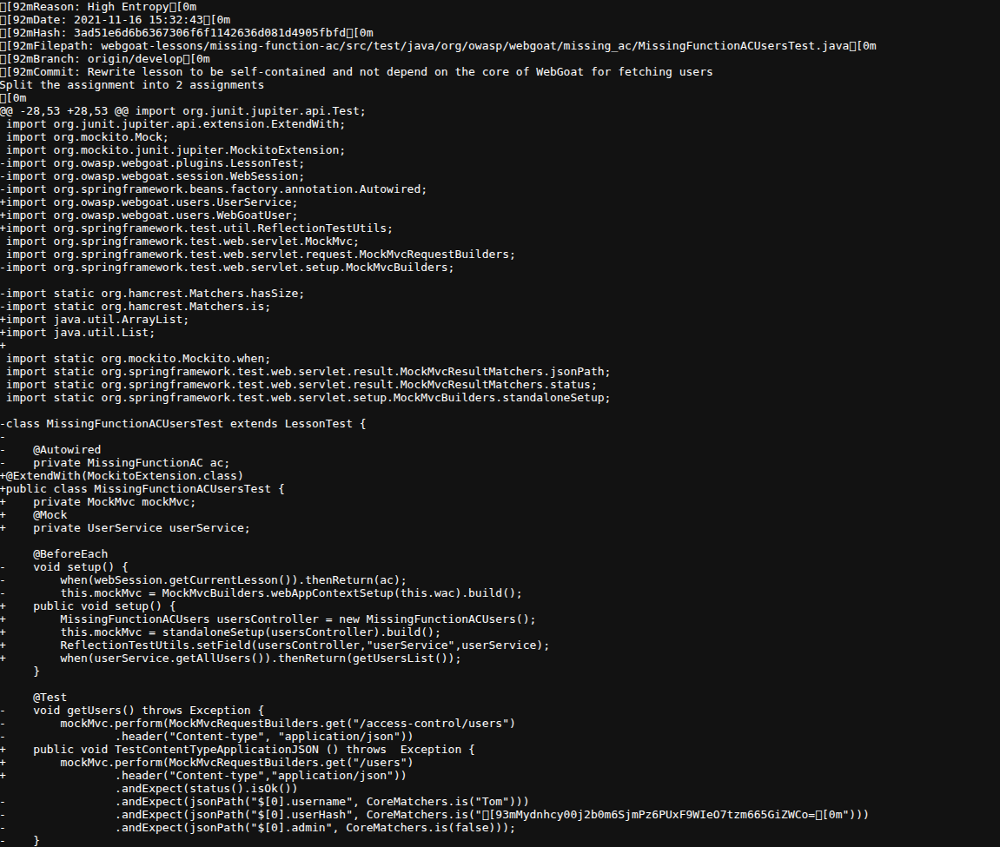
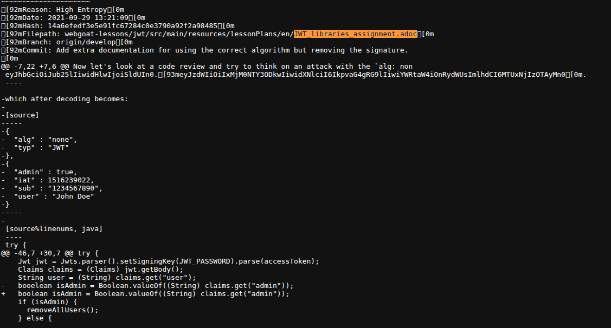

# Лабораторная работа №6

## 1. Секреты

Запускаем http.server и смотрим отчет по секретам в браузере

### Секрет №1: GITHUB_TOKEN

**Расположение секрета (файл/строка):** `.github/workflows/release.yml` (Строка 72)

**Почему найденое является секретом:** Этот токен предоставляет полный административный доступ к репозиторию, механизмам автоматизации, публикации релизов и управлению инфраструктурой от лица конкретного пользователя или сервисного аккаунта. 

**Правильный способ хранения и устранение:** 
Токен должен быть немедленно отозван в панели управления GitHub.
Значения авторизационных токенов должны храниться в зашифрованном хранилище секретов самого репозитория или организации (`GitHub Secrets`).

### Секрет №2: Закрытый криптографический ключ RSA Private Key
 
**Расположение секрета (файл/строка):** `webgoat-server/privatekey.key` (Строки 1–28)

**Почему найденое является секретом:** Приватные ключи используются для расшифровки конфиденциальных данных, генерации цифровых подписей (Digital Signatures), авторизации по протоколам SSH/TLS или расшифровки сессионных токенов.

**Правильный способ хранения и устранение:** 
Текущий ключ и все связанные с ним сертификаты должны быть признаны недействительными и перевыпущены.
Криптографические ключи никогда не должны находиться в репозитории кода. Их необходимо добавлять в специализированные менеджеры секретов корпоративного уровня, такие как *HashiCorp Vault*.

### Секрет №3: Запрос на подпись сертификата (CSR) со статическим Challenge-паролем
**Расположение секрета (файл/строка):** `webgoat-server/certificatesigningrequest.csr` (Строки 1–18)

**Почему найденное является секретом:**Внутри структуры запроса на подпись сертификата (`CSR`) был жестко зашит пароль проверки (`Challenge Password`), имеющий простое значение `1234` (закодировано в Base64 структуре как `MIw...MDEyMzQwDQYJ...`). Публикация сопутствующих дефолтных паролей и векторов аутентификации в репозиториях нарушает политики безопасности.

**Правильный способ хранения и устранение:**
Файлы генерации инфраструктурных запросов (`.csr`, `.csr.pem`) необходимо внести в файл `.gitignore`.
Использовать внутреннюю автоматизированную систему управления инфраструктурой открытых ключей (PKI) на базе *HashiCorp Vault PKI secrets engine* или *Cert-manager* в k8s.

### Секрет №4: Статический хэш пароля и соль в тестах
**Расположение секрета (файл/строка):** `webgoat-lessons/missing-function-ac/src/test/java/org/owasp/webgoat/missing_ac/MissingFunctionACUsersTest.java` (Строки 28, 53)

**Почему найденное является секретом:** В коде тестов безопасности зафиксирована жесткая Base64-строка хэша пароля (`cplTjehjI/e5ajqTxWaXhU5NW9UotJfXj+gcbPvfWWc=`) и соль для проверки корректности ролевой модели доступа. Использование статических, предсказуемых криптографических солей и хэшей паролей в коде (даже тестовом) создает риски того, что аналогичные конфигурации могут быть скопированы разработчиками в реальную продуктивную среду. 

**Правильный способ хранения и устранение:**
Для юнит-тестов (Unit Testing) хэши и соли не должны быть захардкожены. Их следует генерировать динамически при каждом запуске тестового класса в блоках инициализации.
сли тесты интеграционные и нужно сверяться с эталоном, параметры хэширования должны передаваться в тестовый контейнер через файлы конфигурации, которые не публикуются в открытый доступ.

### Секрет №5: JWT Токен с небезопасным алгоритмом в документации 
**Расположение секрета (файл/строка):** `webgoat-lessons/jwt/src/main/resources/lessonPlans/en/JWT_libraries_assignment.adoc` (Строка ~7)

**Почему найденное является секретом:**
В реальных проектах утечка аналогичных токенов или секретных ключей для их подписи  приводит к компрометации пользовательских сессий  и позволяет злоумышленникам подделывать права доступа.

**Правильный способ хранения и устранение:**
При написании инструкций, руководств и README-файлов любые реальные или похожие на них токены, ключи и пароли должны быть заменены явными плейсхолдерами. 
Секретные ключи, используемые бэкендом для подписи и валидации JWT, должны храниться строго в переменных окружения на сервере приложений и никогда не упоминаться в текстовых документах.

## Дополнительно

###  BFG Repo-Cleaner
**BFG Repo-Cleaner** — это легковесный специализированный консольный инструмент, разработанный как значительно более быстрая и удобная альтернатива стандартной команде `git filter-branch`.

**Основное предназначение:**
* **Полное удаление конфиденциальных данных из истории Git:**  BFG сканирует абсолютно все коммиты, ветки и теги в истории репозитория и полностью вырезает указанные файлы либо заменяет приватный текст внутри файлов на заглушку.
* **Очистка репозитория от больших файлов:** Если разработчик случайно зафиксировал в Git тяжелый бинарный файл (например, zip-архив на 2 ГБ или базу данных), BFG позволяет быстро удалить этот объект из базы данных Git, уменьшая физический размер (.git каталога) репозитория.

### Как можно автоматизировать процесс поиска секретов и насколько это правильный подход?

Внедрение автоматизированного поиска секретов является фундаментальным требованием методологии **DevSecOps**.

#### Архитектура автоматизации (Слои защиты):
1.  **Локальный уровень (Слой разработчика / Pre-commit и Pre-push хуки):**
    Использование таких утилит, как `Gitleaks`, `TruffleHog` или фреймворка `pre-commit`. На машине каждого разработчика настраивается триггер, который автоматически запускает сканирование измененных строк кода непосредственно в момент вызова команды `git commit`. Если утилита обнаруживает высокую энтропию или регулярное выражение, соответствующее приватному ключу, коммит блокируется локально.
2.  **Уровень CI/CD пайплайнов (Централизованный контроль):**
    Интеграция этапа проверки кода  в облачные системы автоматизации сборки (GitHub Actions, GitLab CI). При создании любого Pull Request автоматически запускается контейнер со сканером, проверяющий дельту изменений. Если разработчик обошел локальные хуки, пайплайн сборки падает, блокируя слияние кода в стабильную ветку, и отправляет уведомление команде ИБ.

#### Плюсы и Минусы:

* **Плюсы (Почему это критически правильно):**
    * **Проактивное предотвращение:** Секрет перехватывается до того, как он покинет рабочую станцию или внутренний периметр. 
    * **Непрерывность (Continuous Security):** Автоматика полностью исключает человеческий фактор и проверяет код в режиме 24/7.
* **Минусы (Основные вызовы при внедрении):**
    * **Ложные срабатывания (False Positives):** Алгоритмы поиска  часто принимают за секреты случайные хэши коммитов, длинные идентификаторы GUID, base64-строки встроенных иконок. Это требует постоянной поддержки файлов исключений .
    * **Сопротивление команды:** Неоптимизированные pre-commit хуки могут замедлять повседневную работу разработчиков.

Автоматизация поиска секретов — это  правильный и обязательный подход в современной разработке. Наиболее эффективной практикой является комбинация быстрых регулярных выражений на этапе `pre-commit` для разработчиков и глубокого сканирования всей кодовой базы в пайплайнах `CI/CD`.