# Лабораторная работа №7

## Файл .gitlab-ci.yaml

Добавляем сканнеры:

```
include:
  - template: Jobs/SAST.gitlab-ci.yml
  - template: Jobs/Dependency-Scanning.gitlab-ci.yml
  - template: Jobs/Secret-Detection.gitlab-ci.yml
  - template: Jobs/Container-Scanning.gitlab-ci.yml
```

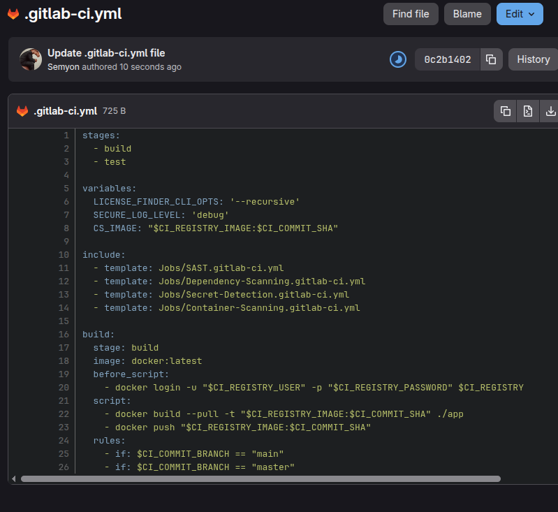

Результаты пайплайна

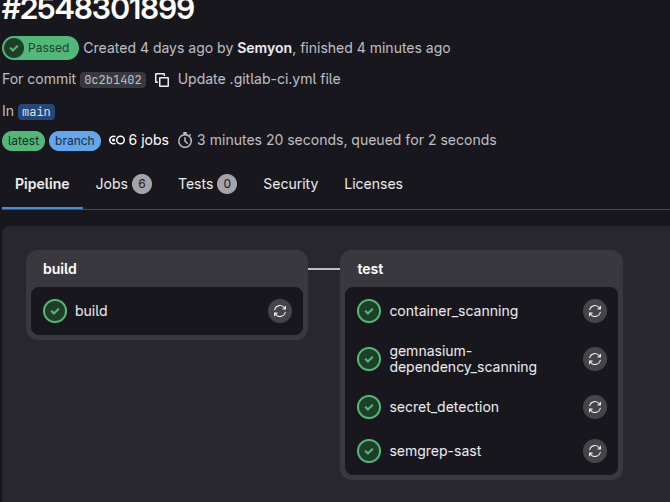
## 1. SAST

### Настройка и подключение
Инструмент SAST подключен через официальный шаблон `Jobs/SAST.gitlab-ci.yml`. Анализ исходного кода выполнялся в автоматическом режиме с помощью сканера **Semgrep**.

### Анализ результатов
По результатам `gl-sast-report.json`, в исходном коде веб-приложения обнаружены **3 уязвимости уровня Critical**.

* **Тип уязвимости:** Improper Neutralization of Special Elements used in an SQL Command (**SQL Injection**).
* **Классификация:** CWE-89 / OWASP A03:2021 — Injection.
* **Локация в проекте:**
  1. Файл `app/server.js`, строка `24`
  2. Файл `app/server.js`, строка `54`
  3. Файл `app/server.js`, строка `81`

В файле `server.js` на указанных строках обнаружена прямая конкатенация (склейка) строк при формировании сырых SQL-запросов к базе данных без предварительной валидации или экранирования:


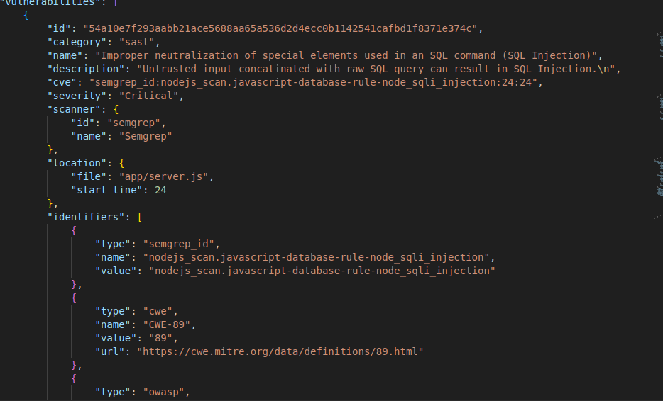
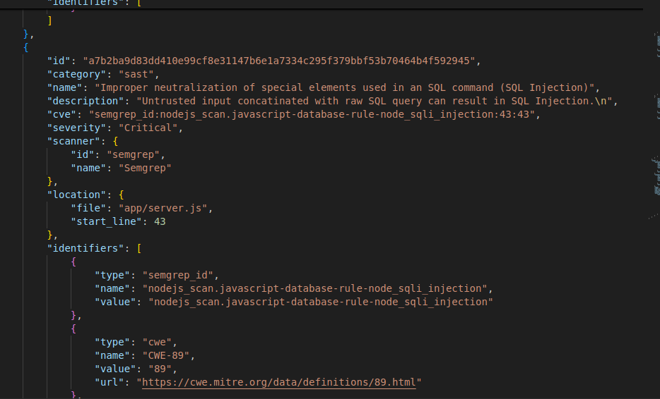
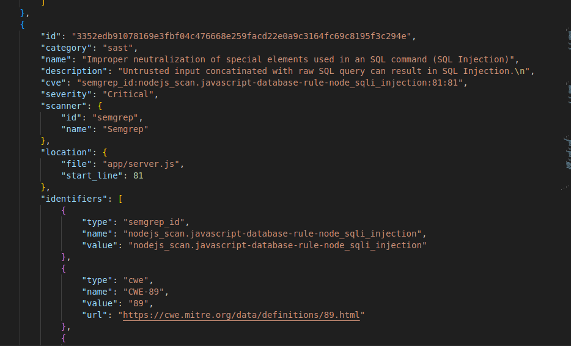

Места с возможной инъекцией

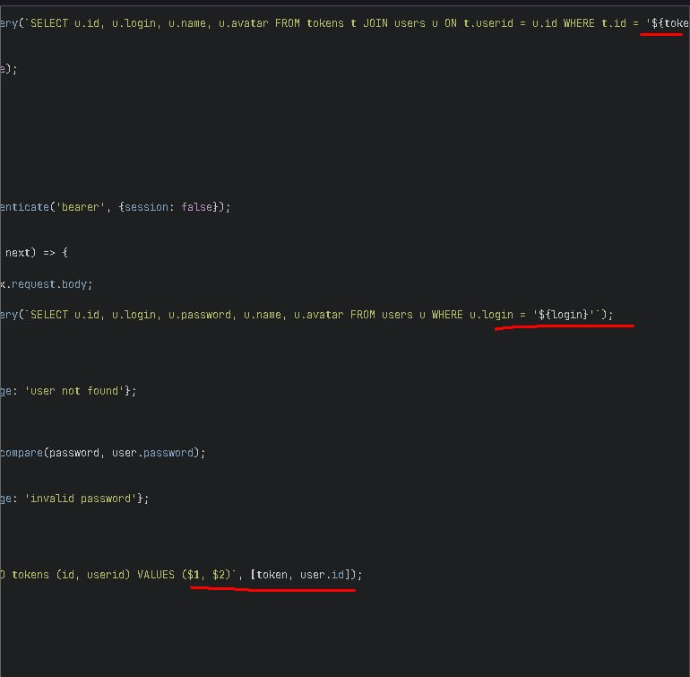

## 2. License Scanning

### Лицензионный аудит (License Compliance)
* **Тип лицензий:** Для всех 412 пакетов статус определен как `1 unknown` (неизвестно / не определено в манифесте репозитория apt пакетов). 
* **Юридические риски:** Отсутствие явных юридических рисков, связанных с коммерческим использованием «вирусного» ПО (copyleft / GPL), так как утилиты являются стандартной частью дистрибутива Linux и не встраиваются напрямую в проприетарный исходный код приложения.
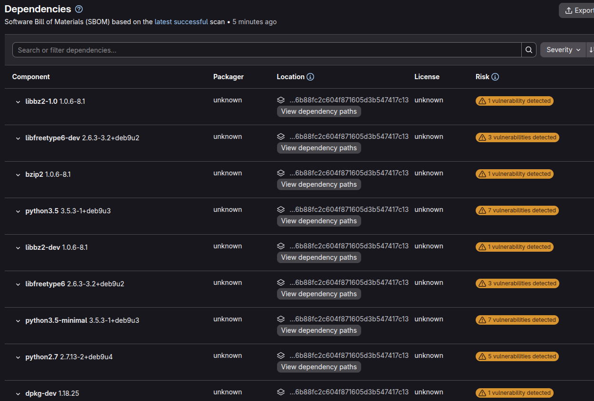
## 3. Dependency Scanning 

**Всего зависимостей:** 412 пакетов.

**Компоненты с уязвимостями:** 212 пакетов из 412 

**Общее число зафиксированных уязвимостей в системе:** 1459 проблем безопасности.

**Наиболее критичные и уязвимые системные компоненты:**
  * `binutils` (версия `2.28-5`) — содержит **93 уязвимости** (включая критические переполнения буфера и DoS-атаки).


Выгруженный список зависимостей подтверждает критическое состояние безопасности инфраструктурного слоя приложения. Наличие **1459 уязвимостей** обусловлено тем, что базовый Docker-образ использует неподдерживаемый дистрибутив ОС (Debian 9). 


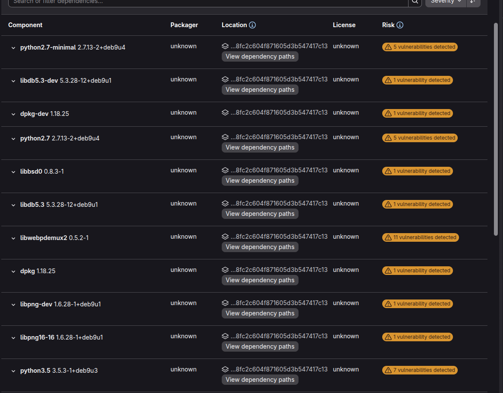

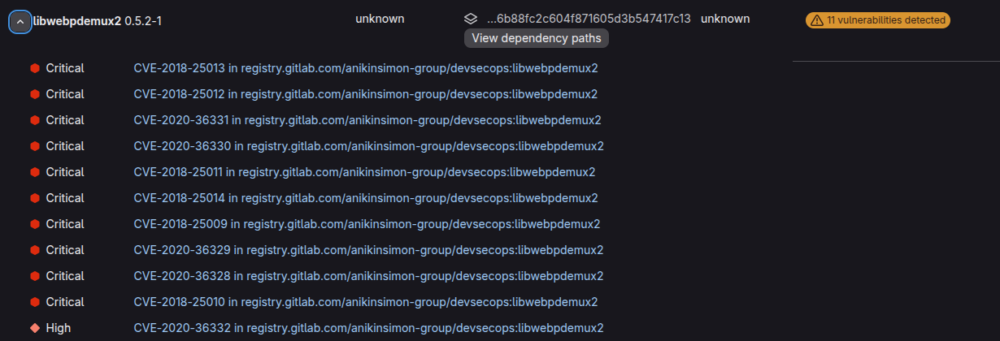

## 4. Container Scanning 

**Инструмент анализа:** Trivy

### Ключевые проблемы и критические уязвимости
Анализ системных слоев выявил критические архитектурные недостатки, связанные с использованием устаревшей базовой ОC. Это привело к наличию большого количества известных незакрытых CVE.

Наиболее значимые примеры зафиксированных уязвимостей уровня (**High**):
1. **Пакет `binutils` (версия `2.28-5`):** * **Идентификатор:** CVE-2017-12448
2. **Библиотека `zlib1g-dev` (версия `1:1.2.8.dfsg-5`):** * **Идентификатор:** CVE-2018-25032

Большинство найденных уязвимостей в отчете помечены статусом `"vendor_status": "fixed"`. Это указывает на то, что патчи безопасности для данных пакетов **существуют**, но они выпущены для более свежих веток дистрибутива Debian (10/11/12) и не могут быть автоматически установлены в репозиториях Debian 9.

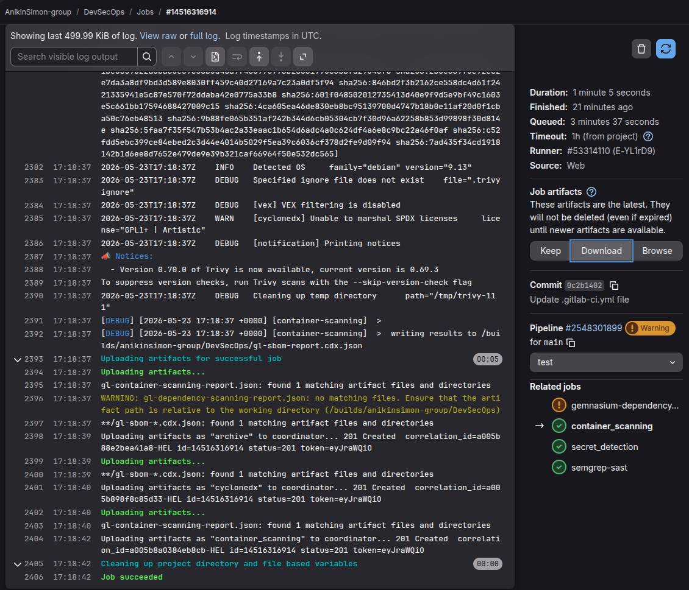
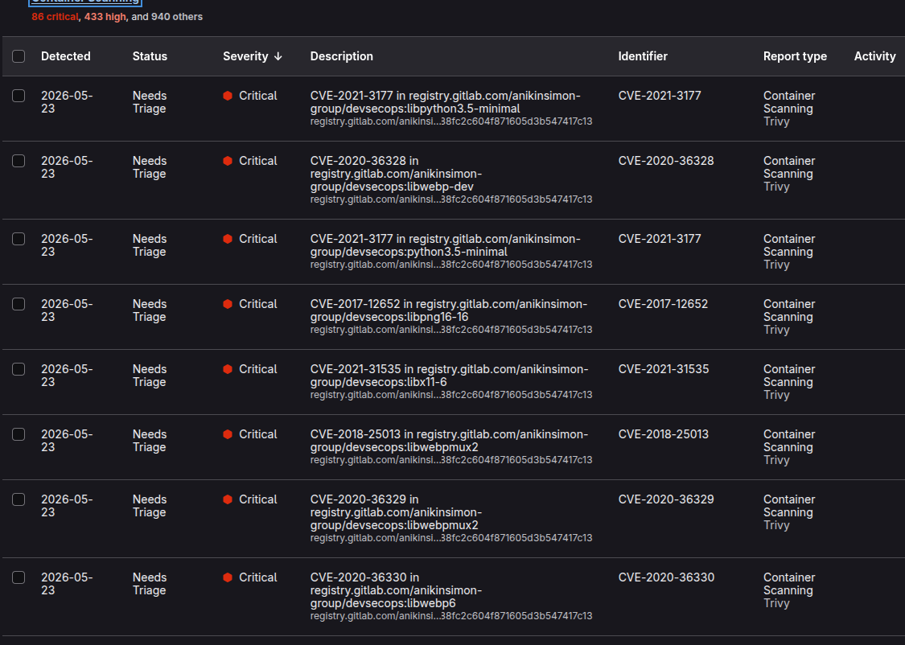

## 5. Secret Detection 

Инструмент: (Jobs/Secret-Detection.gitlab-ci.yml).

Результат: Этап пройден безошибочно. Актуальных утечек приватных ключей, паролей или токенов в истории коммитов репозитория не обнаружено ("vulnerabilities": []).

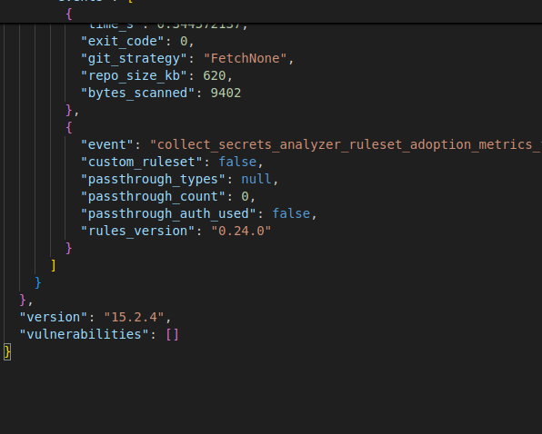
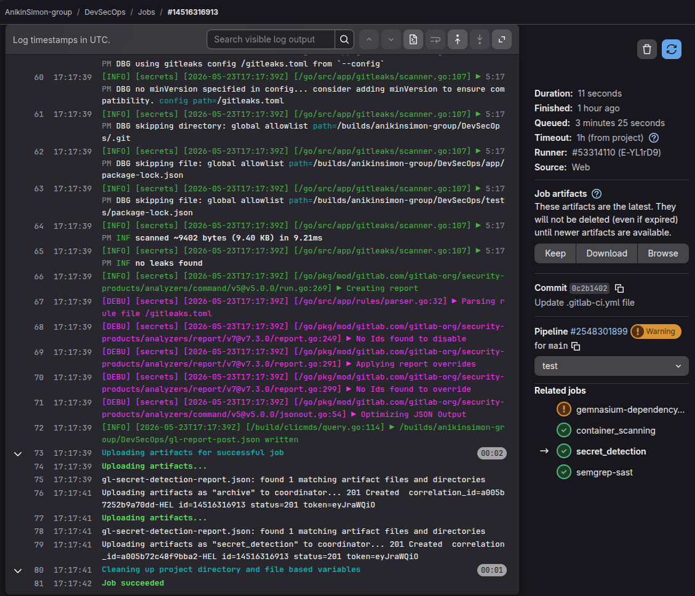