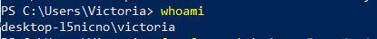
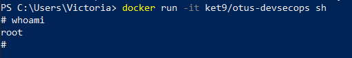
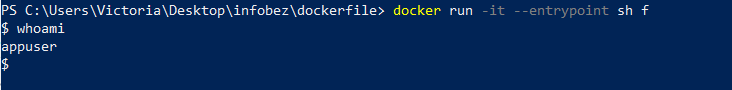
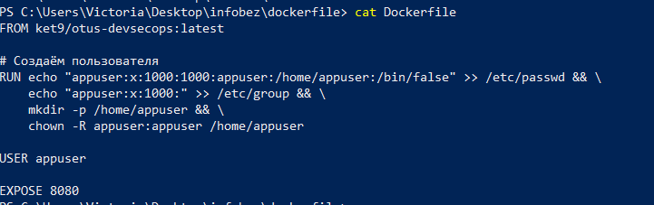
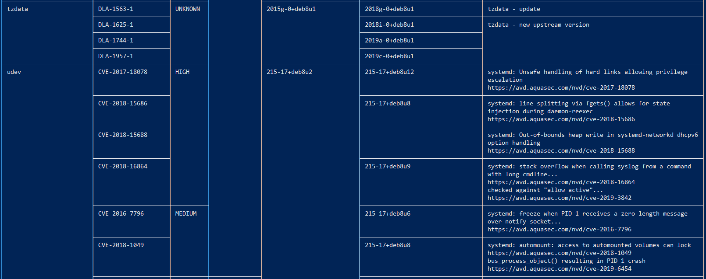
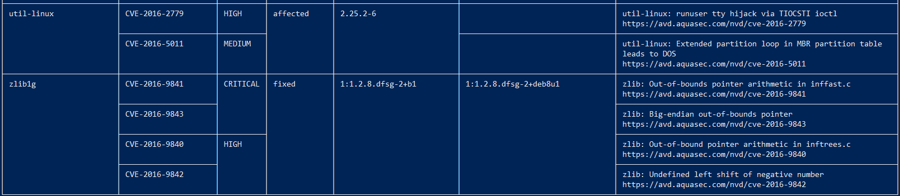

Часть 1

whoami до запуска контейнера

запуск командной оболочки sh внутри контейнера docker run -it ket9/otus-devsecops sh
и команда whoami внутри контейнера

Часть 2

Dockerfile:

Часть 3

Часть вывода сканера:

Вывод: 
Образ f содержит критические и высокие уязвимости в системных библиотеках. 
Некоторые выявленные проблемы:
CVE-2016-9841 (CRITICAL) 
CVE-2017-18078 (HIGH)
CVE-2016-2779 (HIGH)
Злоумышленник сможет повышать привилегии до root и вызывать отказ в обслуживании