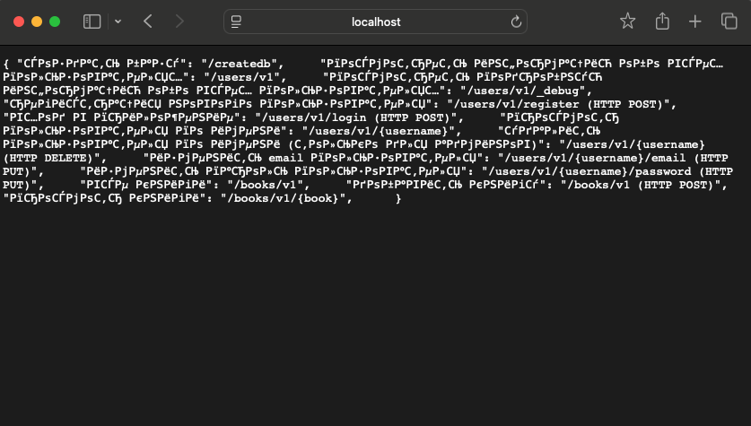
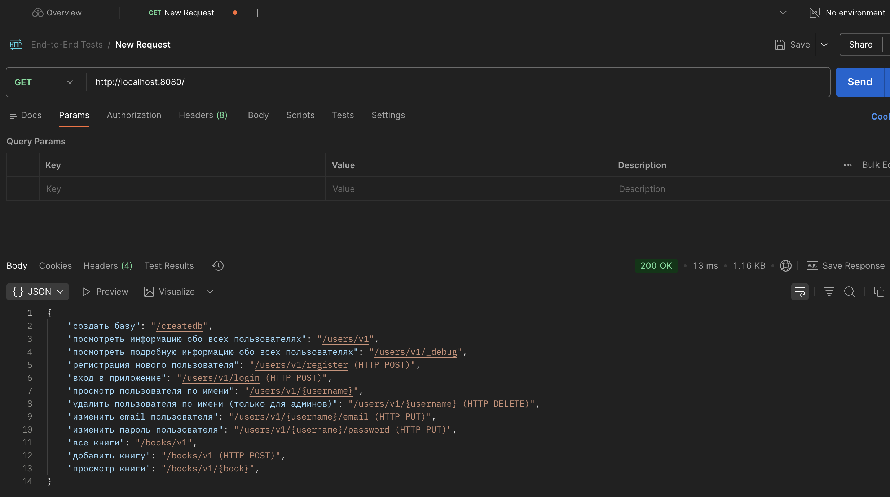
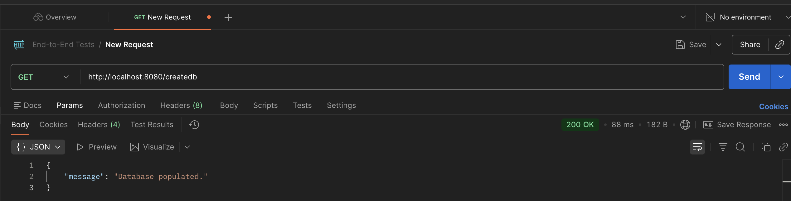
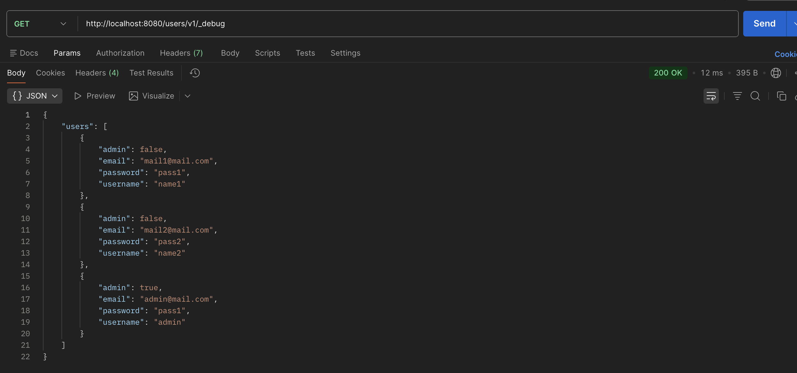
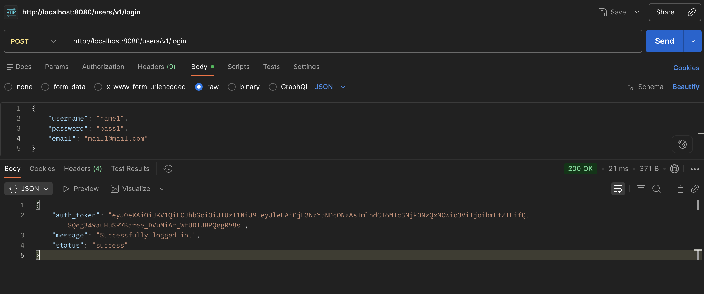

## Часть 2 Лабы №2

Открыл локально сайт, увидел это:

Для удобства опять буду работать в постмане

Заполнил БД:

Решил посмотреть эндпоионты и увидел информацию о всех пользвателях:

После чего решил залогиниться под одним из них и у меня это получилось:

Как мы понимаем, тут уже ну вообще не безопасное приложение. Я бы сказал это эталон опасного приложения. 1) почему список пользователей доступен всем, а не только админу? 2) почему всем виден пароль каждого пользователя и почему он виден в явном виде?

Итого:

Описание уязвимости:

на эндпоинте /users/v1/_debug раскрывается полный список пользователей с их чувствительными данными, даже с паролями. Получив эти сведения, злоумышленник может спокойно аутентифицироваться (/users/v1/login) под любым пользователем 

Тип уязвимости по OWASP:

API8:2023 Security Misconfiguration

Меры предотвращения: 

удалить users/v1/_debug эндпоинт из продакшена; навесить авторизацию на служебные эндпоинты; не возвращать чувствительные поля в API; хранить пароли только в виде хэшей; нанять инфобезника, чтобы тестировал эндпоинты на избыточную выдачу данных
