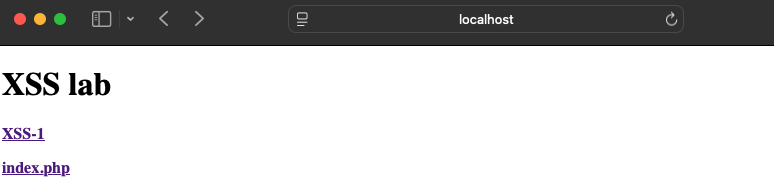
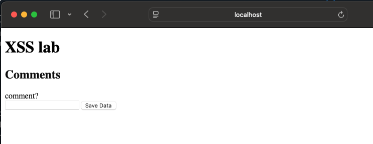
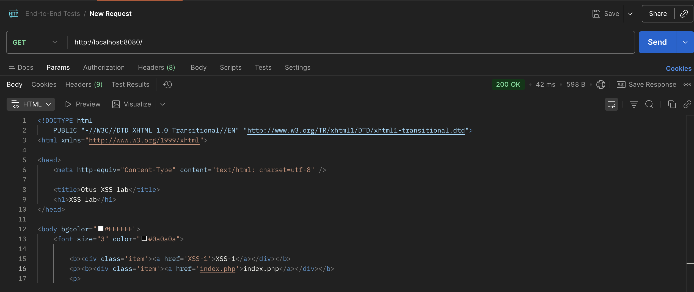
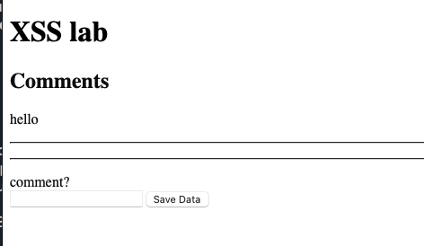
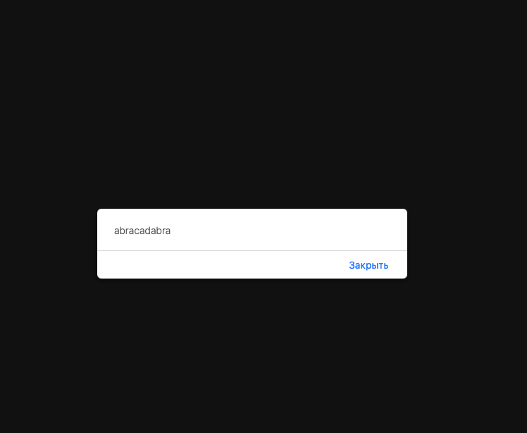
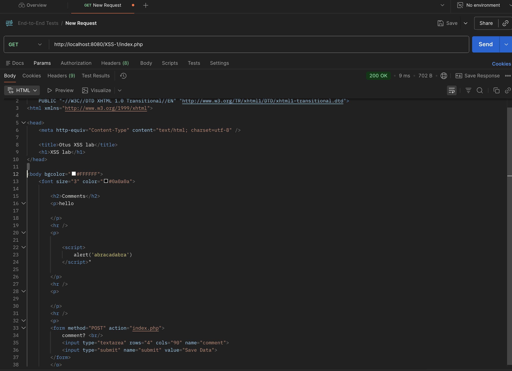

## Лаба 3. часть 1

1. CVE за 2021 год, которые содержат XSS в компонентах, написанных на PHP (данные с сайта https://nvd.nist.gov): CVE-2021-27190 (PEEL SHOPPING 9.3.0/9.4.0), CVE-2021-27330 (Triconsole Datepicker Calendar < 3.77), CVE-2021-42078 (PHP Event Calendar), CVE-2021-43657 (Sourcecodester Simple Client Management System 1.0), CVE-2021-43683 (pictshare v1.5), CVE-2021-47914 (PHP Melody 3.0), CVE-2021-40927 (Spotify-for-Alfred ≤ 0.13.9)

2. Описание двух из них:
- PHP Event Calendar - open-source PHP-скрипт для создания и управления несколькими событиями в визуальном календаре. Инструмент для ведения календаря событий. Функционал включает добавление, редактирование, удаление и просмотр событий. Для него зафиксирована XSS-уязвимость CVE-2021-42078. (https://github.com/thetutlage/Php-event-calendar/tree/master/event)

- PEEL SHOPPING - e-commerce CMS на PHP/MySQL. Предназначен для управления каталогом товаров, текстами сайта и прочими элементами магазина из единого административного интерфейса. То есть, это движок интернет-магазина: каталог, административная панель, оформление и сопровождение продаж. XSS-уязвимость для него зафиксирована как CVE-2021-27190. (https://www.softaculous.com/apps/ecommerce/PEEL_SHOPPING)

3. Всего за 2021 год общее количество CVE составляет 20040.

## Лаба 3. часть 2 

Зашел на локалхост и увидел следующую страничку: 

 

По первой ссылке доступно это: 

 

При нажатии на вторую ничего не происходит. Однако если открыть html-код странички, то видим что она должна перекидывать на index.php (открыл из постмана): 

 

Весь скрипт (просмотр комментов) исполняется по пути http://localhost:8080/XSS-1/index.php Затем я решил вписать коммент hello: 

 

Работает. Так как PHP генерирует JS-код, который выполняется браузером, напишем в комменты скрипт с алертом : 

 

Собственно, наш скрипт выполнился. Перейдем по пути http://localhost:8080/XSS-1/index.php в постмане и посмотрим что имеем: 

 

Как видим, нам удалось вшить наш код в иной сайт. XSS-атака проведена успешно. (ковычку поставил случайно когда вбивал  после скрипта) 

Итого: Это уязвимость типа Cross-Site Scripting. Пользовательский ввод передается в PHP-скрипт и выводится в HTML-страницу без безопасного экранирования, из-за чего браузер исполняет внедренный JS код. Меры защиты: Можно обезвредить символы (в первую очреедь нужно кодировать HTML-символы): & → &amp; < → &lt; > → &gt; " → &quot; ' → &#039;
