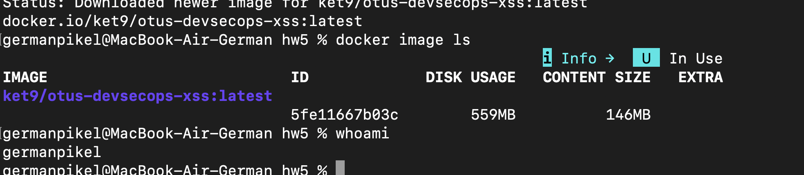
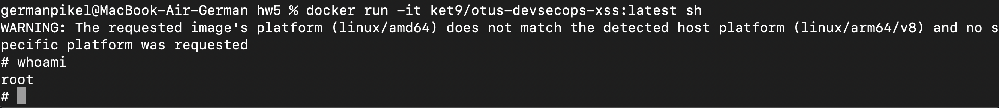
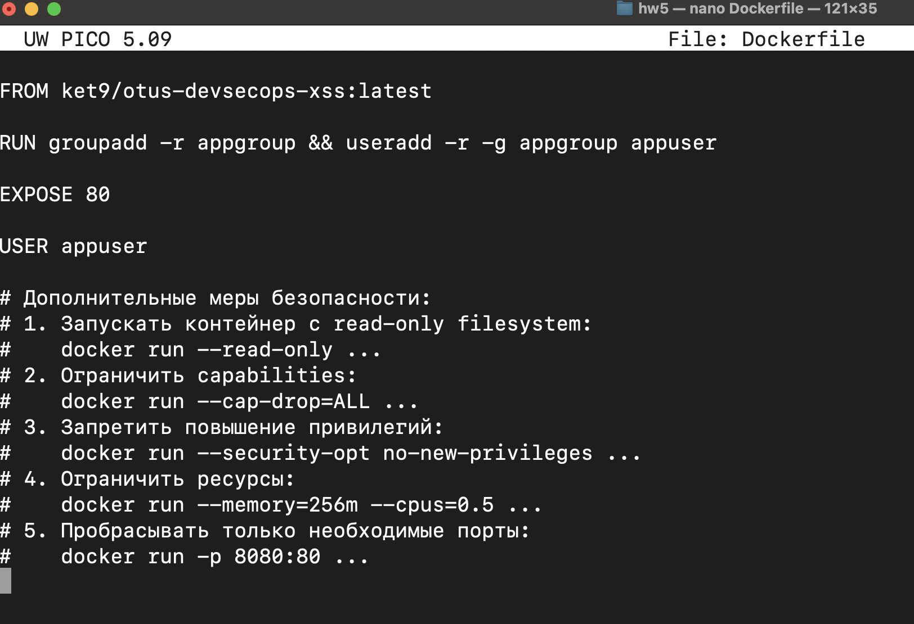
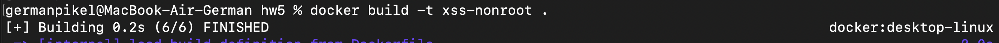
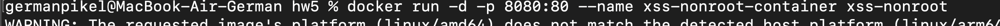
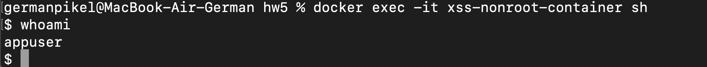
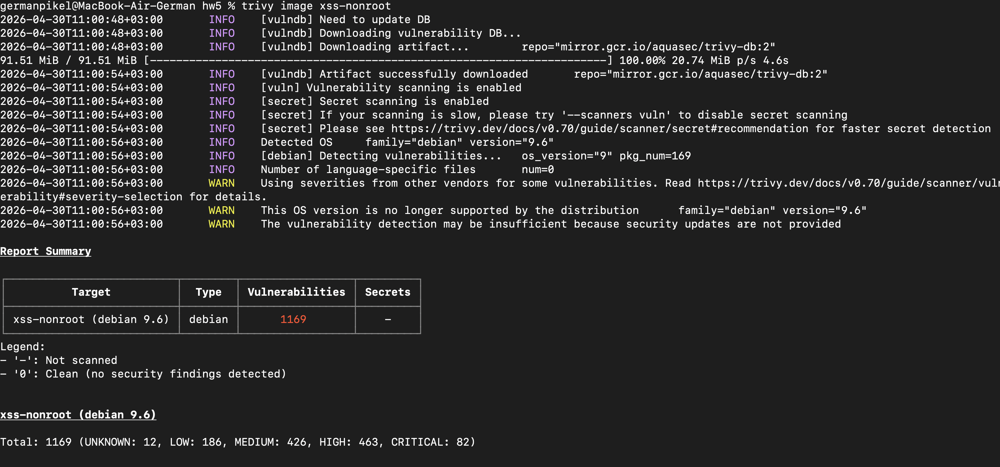
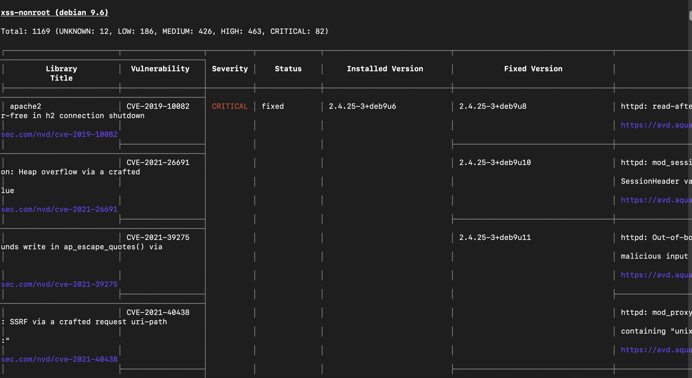

## Лаба 5. Часть 1.

Я решил скачать докер-образ из 3-ей лабы про XSS-атаки: 

`docker pull ket9/otus-devsecops-xss:latest`

С помощью команды docker images ls посмотрел все установленные у меня образы у меня на машине, также использовал команду `whomai`:

Затем я запустил командную оболочку `sh` внутри выбранного контейнера с помощью команды `docker run -it ket9/otus-devsecops-xss:latest sh` и вот какой вывод получил:

## Лаба 5. Часть 2.

Вот простейший Dockerfile, который я написал для выполнения этой части лабораторной работы. Также добавил коментарии с тем, какие настройки безопасности можно добавить в докер контейнер и с какими флагами его можно запускать:

Собрал новый образ, запустил его и ввел в командную строку внутри контейнера `whoami`:

## Лаба 5. Часть 3.

Установил `trivy через brew install trivy`.

Запустил сканирование с помощью команды `trivy image xss-nonroot` и вот что получил:

Как мы видим, слишком много уязвимостей в моем образе, их 1169. 82 критические уязвимости, 463 - серьезные, 426 - средние, 186 - некритические, и 12 пока не известных. 
Думаю, основная проблема наличия стольких ошибок - устаревший образ.
