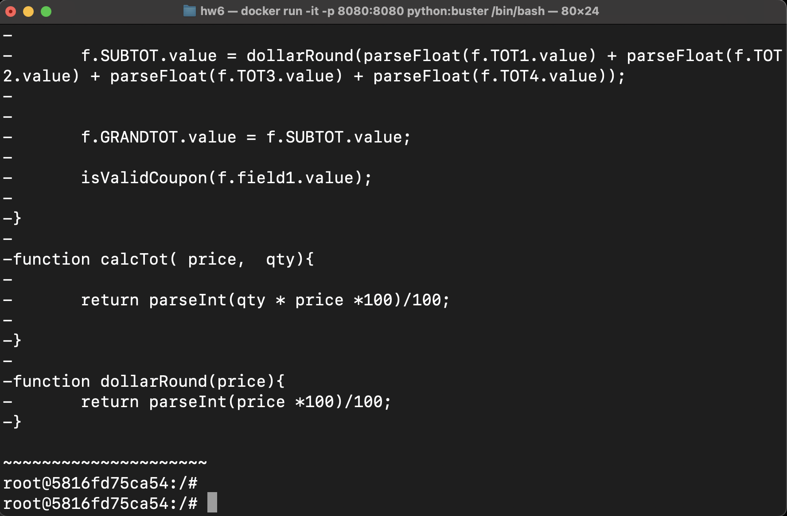
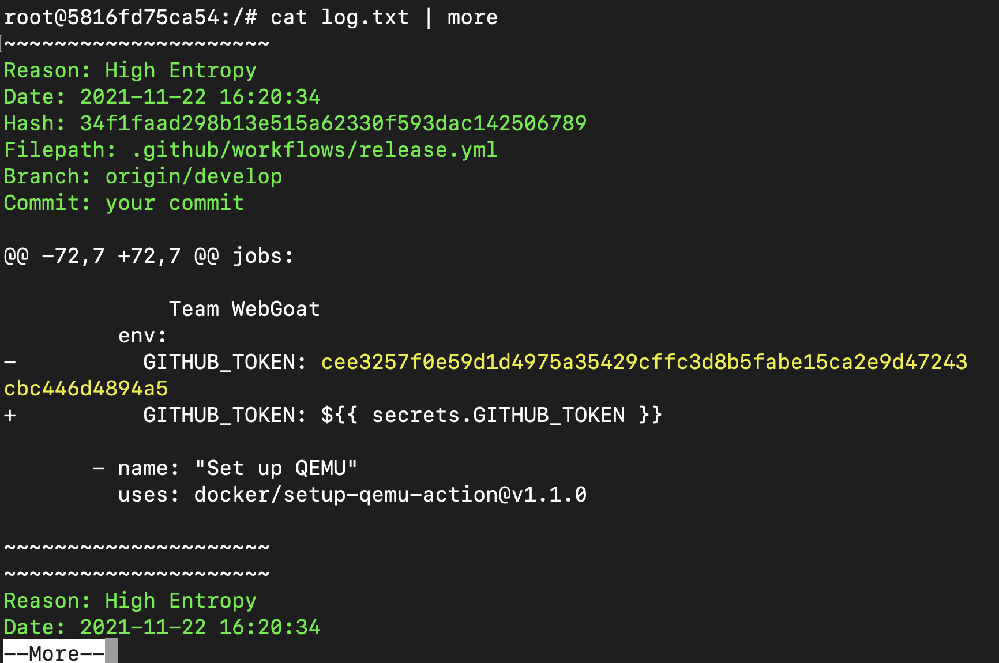
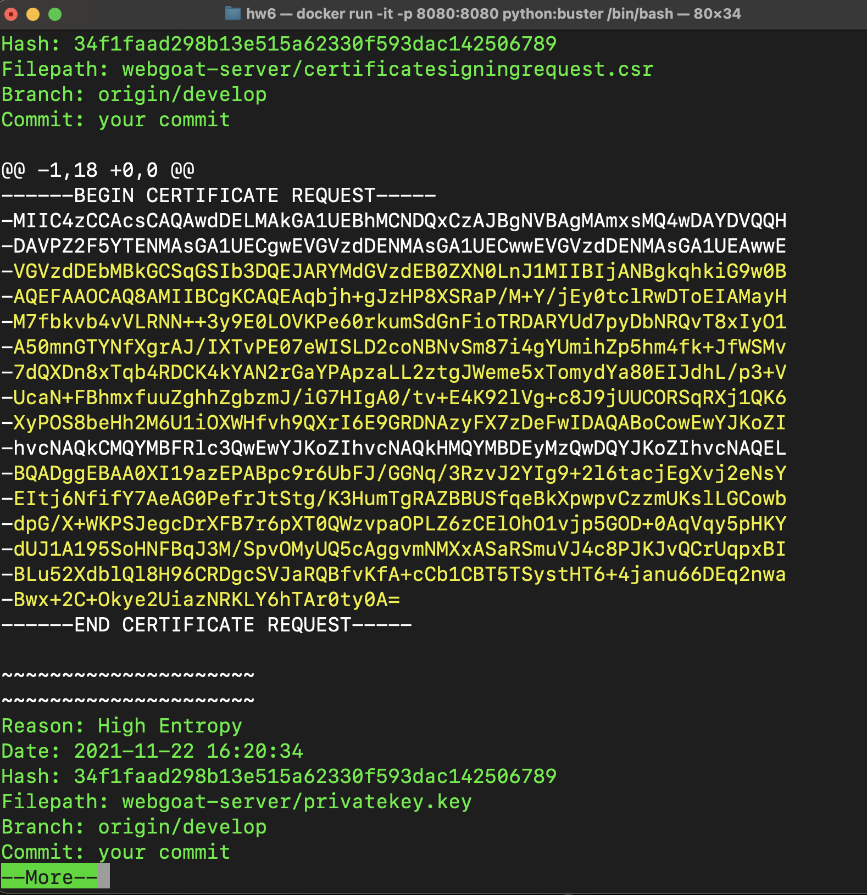
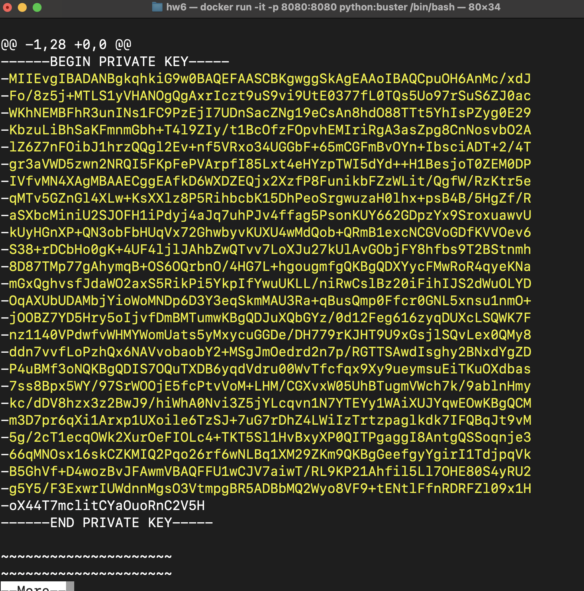
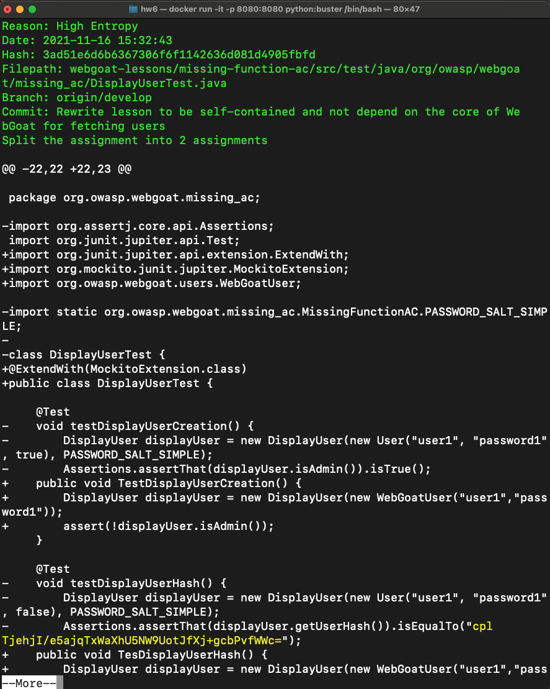
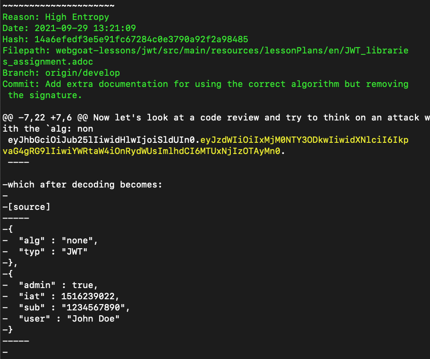

1) docker run -it -p 8080:8080 python:buster /bin/bash
2) pip install truffleHog
3) После запуска докер контейнера и установки truffleHog я запустил сканирование нужного репозитория и весь вывод сохранил в файл log.txt:
trufflehog https://github.com/OtusTeam/DevSecOps_secret-finding.git | tee -a log.txt

Сканирование завершилось

4) Просмотрим файл log.txt с помощью команды `cat log.txt | more`

5) НАЙДЕННЫЕ СЕКРЕТЫ

- GITHUB TOKEN 

Он является секретом потому что это индивидуальный токен.
Находится данный секрет в release.yml, а должен, как я считаю, находится в .env, либо в любом другом файле, находщимя в .gitignore

- Запрос на подпись сертификата CSR со статическим challenge-паролем.

Находится по пути webgoat-server/certificatesigningrequest.csr;
Внутри запроса на подпись этого сертификата захардкожен пароль проверки, это плохо для безопасности. ПОэтому это секрет. Он должен храниться в файле .csr, который должен быть в .gitingore

- RSA private key

Находится по пути  webgoat-server/privatekey.key
Ключ является важным для шифрования передаваемых данных, его нельзя хранить в открытом виде, поэтому это секрет. Файл с ключом должен быть прописан в .gitignore. 

- Хэш пароля пользователя

webgoat-lessons/missing-function-ac/src/test/java/org/owasp/webgoat/missing_ac/MissingFunctionACUsersTest.java

Хэш пароля пользователя - это точно секрет. По нему можно получить доступ к аккаунту пользователя. Также там находится соль. Это небезопасно. хэши и соли не должны быть захардкожены, при тестировании их нужно динамически генерировать, чтобы не было утечки в коде. а сами параметры для хеширования нужно хранить в файлах конфигурации иил переменных окружения, которые не должны публиковаться в опенсурс.

- JWT Token

Находистя по пути webgoat-lessons/jwt/src/main/resources/lessonPlans/en/JWT_libraries_assignment.adoc

Это очевидный секрет, он должен храниться строго в переменных окружения на серваке приложения. Утечка такого токена может привести к компрометации сессий пользователя и под аккаунтом пользователя может спокойно зайти злоумышленник, что не есть хорошо.

Дополнительно:

BFG Repo-Cleaner — инструмент для очистки истории Git-репозитория от чувствительных данных, больших файлов и нежелательных артефактов. Он используется, когда секрет уже попал в историю коммитов. В отличие от простого удаления файла в новом коммите, BFG переписывает историю репозитория и удаляет секрет из старых коммитов.

Однако после удаления секрета из истории всё равно нужно считать его скомпрометированным: отозвать старый ключ, сменить пароль или перевыпустить токен.

Поиск секретов можно автоматизировать в CI/CD pipeline: запускать truffleHog или аналогичные инструменты при pull request, перед merge в основную ветку и периодически по расписанию. Также можно использовать pre-commit hooks, чтобы проверять код ещё до отправки в репозиторий.

Это правильный подход, потому что он снижает вероятность попадания секретов в репозиторий. Но полностью полагаться только на автоматическое сканирование нельзя: возможны ложные срабатывания и пропуски. Поэтому дополнительно нужны code review, обучение разработчиков, использование secret storage и ротация ключей.