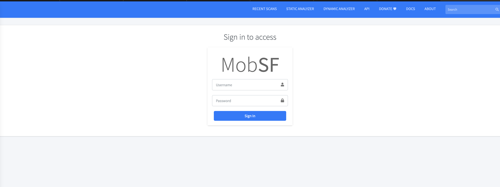
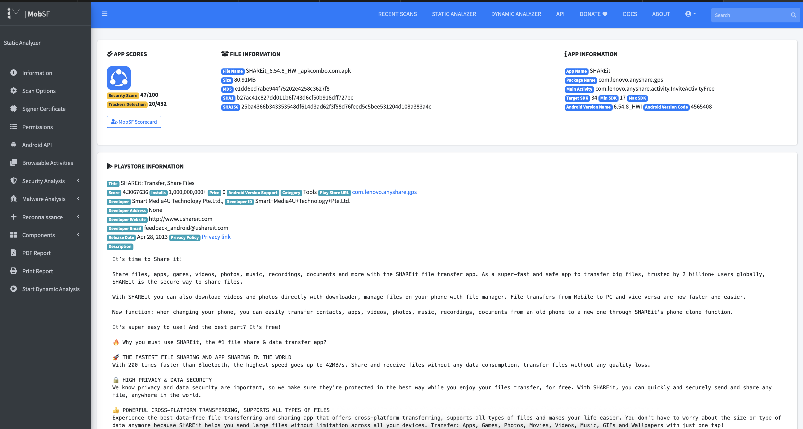
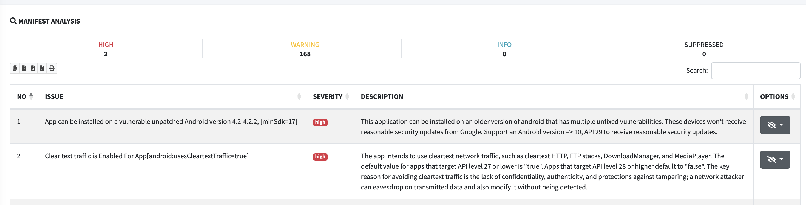

 Выполнил команды:

```
docker pull opensecurity/mobile-security-framework-mobsf:latest
docker run -it --rm -p 8000:8000 opensecurity/mobile-security-framework-mobsf:latest
```

и перешел по пути `http://localhost:8000`



Скачал apk для анализа (ShareIt) по ссылке https://apkcombo.com/shareit/com.lenovo.anyshare.gps/download/apk

т.к. при попытке скачать тикток и запустить анализ в MobSF, у меня вылетало по памяти:


Затем загрузил APK ShareIt в MobSF


После чего дождался окончания статического анализа  и открыл страницу Static Analysis Report



## Раздел Permissions:

Статус dangerous:

**Разрешение:** `android.permission.ACCESS_COARSE_LOCATION`
**Риск:** приложение может получать приблизительное местоположение пользователя. Это может привести к нарушению приватности, если геолокация собирается без явной необходимости или без понятного объяснения пользователю.
**Митигация:** запрашивать разрешение только при наличии функции, которой действительно нужна геолокация; объяснять пользователю цель запроса; использовать разрешение только во время работы соответствующей функции; удалить разрешение из `AndroidManifest.xml`, если оно не требуется.

**Разрешение:** `android.permission.ACCESS_FINE_LOCATION`
**Риск:** приложение может получать точное местоположение пользователя. Это создаёт повышенный риск утечки чувствительных данных о перемещениях пользователя.
**Митигация:** запрашивать разрешение только при необходимости; по возможности заменить точную геолокацию на приблизительную; использовать runtime permission только в момент использования функции; явно объяснять пользователю цель сбора геолокации; удалить разрешение, если точное местоположение не требуется.

**Разрешение:** `android.permission.BLUETOOTH_CONNECT`
**Риск:** приложение может подключаться к Bluetooth-устройствам пользователя. Это может привести к несанкционированному взаимодействию с устройствами или раскрытию информации о подключённых устройствах.
**Митигация:** запрашивать разрешение только при наличии функции обмена данными через Bluetooth; ограничить использование разрешения конкретными сценариями; информировать пользователя о причине запроса; удалить разрешение, если приложение не использует подключение к Bluetooth-устройствам.

**Разрешение:** `android.permission.BLUETOOTH_SCAN`
**Риск:** приложение может сканировать Bluetooth-устройства поблизости. Такие данные могут использоваться для косвенного определения местоположения пользователя или сбора информации об окружающих устройствах.
**Митигация:** выполнять сканирование только по явному действию пользователя; ограничить время и частоту сканирования; не сохранять лишние данные о найденных устройствах; объяснять пользователю цель запроса; удалить разрешение, если сканирование Bluetooth не требуется.

**Разрешение:** `android.permission.CAMERA`
**Риск:** приложение может получать доступ к камере устройства. При неправильной реализации это может привести к несанкционированной съёмке фото или видео, а также к нарушению приватности пользователя.
**Митигация:** запрашивать доступ к камере только в момент использования соответствующей функции; явно объяснять пользователю назначение доступа; не использовать камеру в фоновом режиме; ограничить доступ только необходимыми сценариями; удалить разрешение из приложения, если камера не используется.


## Network Security


### 1. Base config permits clear text traffic to all domains

**Раздел MobSF:** Network Security
**Scope:** `*`
**Severity:** High
**Описание из отчёта:** Base config is insecurely configured to permit clear text traffic to all domains.

**Обнаруженный недостаток:**
В базовой сетевой конфигурации приложения разрешена передача данных в открытом виде по HTTP для всех доменов. Это означает, что приложение потенциально может отправлять или получать данные без использования защищённого HTTPS-соединения.

**Риск:**
Передача данных в открытом виде может привести к перехвату трафика злоумышленником, особенно при использовании публичных Wi-Fi-сетей. В результате могут быть раскрыты пользовательские данные, токены сессий, параметры запросов или иная чувствительная информация. Также существует риск модификации сетевого трафика при атаке Man-in-the-Middle.

**План митигации:**
Необходимо запретить cleartext traffic в production-сборке приложения. Для этого следует настроить `networkSecurityConfig` и установить запрет на передачу данных по HTTP. Все обращения к backend-сервисам должны выполняться только по HTTPS. Также необходимо проверить код приложения и сторонние SDK на наличие HTTP-адресов и заменить их на HTTPS.

**Приоритет исправления:** High / Critical

---

### 2. Domain config permits clear text traffic to 127.0.0.1

**Раздел MobSF:** Network Security
**Scope:** `127.0.0.1`
**Severity:** High
**Описание из отчёта:** Domain config is insecurely configured to permit clear text traffic to these domains in scope.

**Обнаруженный недостаток:**
В сетевой конфигурации приложения для домена `127.0.0.1` разрешён cleartext traffic, то есть передача данных без шифрования. Несмотря на то что `127.0.0.1` является локальным адресом, такая настройка всё равно считается небезопасной, если она попадает в production-сборку.

**Риск:**
Разрешение cleartext traffic может указывать на наличие отладочной или тестовой конфигурации в релизной версии приложения. Это повышает риск небезопасного сетевого взаимодействия, неправильной маршрутизации запросов или использования локальных сервисов без шифрования. Также такая настройка может быть использована злоумышленником при эксплуатации уязвимостей, связанных с локальными интерфейсами или WebView.

**План митигации:**
Необходимо проверить, зачем в конфигурации указан адрес `127.0.0.1`. Если он использовался только для разработки или тестирования, его следует удалить из production-конфигурации. Если локальное взаимодействие действительно требуется, нужно ограничить его область применения и убедиться, что оно не используется для передачи чувствительных данных. Также рекомендуется запретить cleartext traffic по умолчанию и явно разрешать только необходимые безопасные исключения.

**Приоритет исправления:** High


## Manifest Analysis



## Code Analysis

### 1. The file or SharedPreference is World Writable

**Раздел MobSF:** Code Analysis
**Severity:** High
**Issue:** The file or SharedPreference is World Writable. Any App can write to the file.
**Стандарты:** CWE-276: Incorrect Default Permissions; OWASP Top 10 M2: Insecure Data Storage; OWASP MASVS: MSTG-STORAGE-2

**Обнаруженный недостаток:**
В приложении обнаружено использование файла или `SharedPreferences` с правами записи для других приложений. Это означает, что стороннее приложение на устройстве потенциально может изменить содержимое такого файла.

**Риск:**
Если в файле или `SharedPreferences` хранятся настройки, токены, идентификаторы пользователя, флаги авторизации или другие важные параметры, злоумышленник может изменить эти данные. Это может привести к обходу логики приложения, подмене настроек, нарушению целостности данных или компрометации пользовательской сессии.

**План митигации:**
Необходимо запретить режимы доступа, позволяющие другим приложениям читать или изменять файлы приложения. Для `SharedPreferences` следует использовать приватный режим `MODE_PRIVATE`. Также нужно проверить места хранения чувствительных данных и перенести их в более защищённое хранилище, например Android Keystore или EncryptedSharedPreferences. Если файл не должен изменяться другими приложениями, необходимо ограничить права доступа только текущим приложением.

**Приоритет исправления:** High

---

### 2. Insecure WebView Implementation

**Раздел MobSF:** Code Analysis
**Severity:** High
**Issue:** Insecure WebView Implementation. WebView ignores SSL Certificate errors and accepts any SSL Certificate. This application is vulnerable to MITM attacks.
**Файлы:**
`com/my/target/x6.java`
`com/yandex/mobile/ads/impl/q2.java`
`com/yandex/mobile/ads/impl/v90.java`
**Стандарты:** CWE-295: Improper Certificate Validation; OWASP Top 10 M3: Insecure Communication; OWASP MASVS: MSTG-NETWORK-3

**Обнаруженный недостаток:**
В приложении обнаружена небезопасная реализация WebView, при которой WebView игнорирует ошибки SSL-сертификатов и принимает любой сертификат. Это означает, что приложение может доверять недействительным, самоподписанным или подменённым сертификатам.

**Риск:**
Такая реализация делает приложение уязвимым к атаке Man-in-the-Middle. Злоумышленник может перехватить сетевой трафик, подменить содержимое страницы, получить чувствительные данные пользователя или внедрить вредоносный JavaScript-код в WebView.

**План митигации:**
Необходимо удалить обработку, которая игнорирует ошибки SSL-сертификатов, например вызовы `handler.proceed()` внутри `onReceivedSslError`. При ошибке сертификата приложение должно прерывать соединение с помощью `handler.cancel()`. Также следует использовать только HTTPS-соединения с корректными сертификатами, проверить настройки сторонних SDK и рекламных библиотек, а для критичных соединений рассмотреть использование certificate pinning.

**Приоритет исправления:** Critical

---

### 3. The App uses CBC encryption mode with PKCS5/PKCS7 padding

**Раздел MobSF:** Code Analysis
**Severity:** High
**Issue:** The App uses the encryption mode CBC with PKCS5/PKCS7 padding. This configuration is vulnerable to padding oracle attacks.
**Стандарты:** CWE-649: Reliance on Obfuscation or Encryption of Security-Relevant Inputs without Integrity Checking; OWASP Top 10 M5: Insufficient Cryptography; OWASP MASVS: MSTG-CRYPTO-3

**Обнаруженный недостаток:**
В приложении используется режим шифрования CBC с padding PKCS5/PKCS7. Такая криптографическая схема может быть небезопасной, если данные не защищены дополнительной проверкой целостности.

**Риск:**
Использование CBC без корректной проверки целостности может привести к padding oracle attacks. В результате злоумышленник при определённых условиях может получить возможность расшифровывать или модифицировать зашифрованные данные. Это особенно критично, если таким способом защищаются токены, персональные данные, ключи или другая чувствительная информация.

**План митигации:**
Необходимо заменить небезопасную криптографическую схему на современный аутентифицированный режим шифрования, например AES-GCM. Если CBC всё же используется, необходимо обеспечить строгую проверку целостности данных с помощью HMAC по схеме encrypt-then-MAC. Также следует проверить, не используются ли статические IV, захардкоженные ключи или повторное использование ключей.

**Приоритет исправления:** High

---

### 4. Remote WebView debugging is enabled

**Раздел MobSF:** Code Analysis
**Severity:** High
**Issue:** Remote WebView debugging is enabled.
**Стандарты:** CWE-919: Weaknesses in Mobile Applications; OWASP Top 10 M1: Improper Platform Usage; OWASP MASVS: MSTG-RESILIENCE-2

**Обнаруженный недостаток:**
В приложении включена удалённая отладка WebView. Такая настройка может быть полезна при разработке, но не должна присутствовать в production-сборке.

**Риск:**
Если WebView debugging включён в релизной версии, злоумышленник при наличии доступа к устройству или отладочной среде может анализировать содержимое WebView, просматривать DOM, JavaScript, сетевые запросы и потенциально получать чувствительные данные. Это повышает риск исследования внутренней логики приложения и эксплуатации других уязвимостей.

**План митигации:**
Необходимо отключить WebView debugging в production-сборке. Вызов `WebView.setWebContentsDebuggingEnabled(true)` должен использоваться только в debug-сборках. Следует добавить проверку типа сборки, например через `BuildConfig.DEBUG`, и убедиться, что в release-сборке значение всегда равно `false`.

**Приоритет исправления:** High

---

### 5. Debug configuration enabled

**Раздел MobSF:** Code Analysis
**Severity:** High
**Issue:** Debug configuration enabled. Production builds must not be debuggable.
**Файл:** `com/bumptech/glide/integration/webp/BuildConfig.java`
**Стандарты:** CWE-919: Weaknesses in Mobile Applications; OWASP Top 10 M1: Improper Platform Usage; OWASP MASVS: MSTG-RESILIENCE-2

**Обнаруженный недостаток:**
В коде приложения обнаружена включённая debug-конфигурация. Production-сборки мобильного приложения не должны быть отладочными.

**Риск:**
Включённая отладочная конфигурация может упростить анализ приложения злоумышленником, облегчить reverse engineering, получение логов, исследование внутренней логики и поиск дополнительных уязвимостей. Если отладочный режим включён в релизной сборке, это снижает защищённость приложения.

**План митигации:**
Необходимо убедиться, что production-сборка собирается с отключённым debug-режимом. В `AndroidManifest.xml` параметр `android:debuggable` должен быть установлен в `false` или отсутствовать для release-сборки. Также нужно проверить настройки Gradle, build variants и сторонние библиотеки, чтобы debug-конфигурация не попадала в финальный APK.

**Приоритет исправления:** High


# План митигации рисков

| №  | Раздел MobSF     | Обнаруженная проблема                                                | Severity / статус | Риск                                                                                                                   | План митигации                                                                                                                                                   | Приоритет |
| -- | ---------------- | -------------------------------------------------------------------- | ----------------- | ---------------------------------------------------------------------------------------------------------------------- | ---------------------------------------------------------------------------------------------------------------------------------------------------------------- | --------- |
| 1  | App Permissions  | `android.permission.ACCESS_COARSE_LOCATION`                          | dangerous         | Приложение может получать приблизительное местоположение пользователя, что создаёт риск нарушения приватности.         | Проверить необходимость разрешения. Если не используется — удалить из `AndroidManifest.xml`. Если требуется — запрашивать только в момент использования функции. | Medium    |
| 2  | App Permissions  | `android.permission.ACCESS_FINE_LOCATION`                            | dangerous         | Приложение может получать точное местоположение пользователя, что может привести к раскрытию данных о перемещениях.    | По возможности заменить на `ACCESS_COARSE_LOCATION`. Запрашивать только при необходимости и не собирать геолокацию в фоне без причины.                           | High      |
| 3  | App Permissions  | `android.permission.BLUETOOTH_CONNECT`                               | dangerous         | Приложение может подключаться к Bluetooth-устройствам пользователя.                                                    | Использовать только для функций обмена данными через Bluetooth. Если функция не нужна — удалить разрешение.                                                      | Medium    |
| 4  | App Permissions  | `android.permission.BLUETOOTH_SCAN`                                  | dangerous         | Приложение может сканировать Bluetooth-устройства рядом с пользователем, что может раскрывать информацию об окружении. | Ограничить сканирование по времени и запускать только по действию пользователя. Не хранить лишние данные о найденных устройствах.                                | Medium    |
| 5  | App Permissions  | `android.permission.CAMERA`                                          | dangerous         | Приложение может получать доступ к камере устройства, что создаёт риск нарушения приватности.                          | Запрашивать доступ только при использовании функции камеры. Исключить использование камеры в фоне.                                                               | High      |
| 6  | Network Security | Base config permits clear text traffic to all domains                | High              | Данные могут передаваться по HTTP без шифрования, что создаёт риск перехвата и MITM-атак.                              | Запретить cleartext traffic в production. Использовать только HTTPS. Проверить код и SDK на наличие HTTP-ссылок.                                                 | Critical  |
| 7  | Network Security | Domain config permits clear text traffic to `127.0.0.1`              | High              | В production-сборку могла попасть тестовая или отладочная сетевая конфигурация.                                        | Проверить необходимость `127.0.0.1`. Если это тестовая настройка — удалить. Запретить cleartext traffic по умолчанию.                                            | High      |
| 8  | Code Analysis    | File or `SharedPreferences` is World Writable                        | High              | Другое приложение может изменить файл или настройки приложения, что может привести к подмене данных.                   | Использовать `MODE_PRIVATE`. Чувствительные данные хранить через `EncryptedSharedPreferences` или Android Keystore.                                              | High      |
| 9  | Code Analysis    | Insecure WebView Implementation: WebView accepts any SSL certificate | High              | Приложение уязвимо к MITM-атакам из-за игнорирования ошибок SSL-сертификатов.                                          | Удалить `handler.proceed()` при SSL-ошибках. Использовать `handler.cancel()`. Обновить небезопасные SDK.                                                         | Critical  |
| 10 | Code Analysis    | CBC encryption with PKCS5/PKCS7 padding                              | High              | Возможны padding oracle attacks при неправильной реализации шифрования.                                                | Заменить на AES-GCM. Если CBC остаётся — добавить контроль целостности через HMAC.                                                                               | High      |
| 11 | Code Analysis    | Remote WebView debugging is enabled                                  | High              | Злоумышленник может анализировать WebView, DOM, JavaScript и сетевые запросы приложения.                               | Отключить `WebView.setWebContentsDebuggingEnabled(true)` в release-сборке. Включать только при `BuildConfig.DEBUG`.                                              | High      |
| 12 | Code Analysis    | Debug configuration enabled                                          | High              | Отладочные настройки в production упрощают reverse engineering и анализ приложения.                                    | Убедиться, что `android:debuggable=false` в release-сборке. Проверить Gradle build variants и настройки сборки.                                                  | High      |

## Вывод

По результатам SAST-анализа MobSF в приложении обнаружены риски, связанные с опасными разрешениями, небезопасной сетевой конфигурацией, передачей данных без шифрования, небезопасной реализацией WebView, отладочными настройками и небезопасным хранением данных.

Основные меры митигации: запретить cleartext traffic, использовать HTTPS, исправить обработку SSL-ошибок в WebView, отключить debug-настройки в production, ограничить dangerous permissions и использовать безопасное хранение данных.
