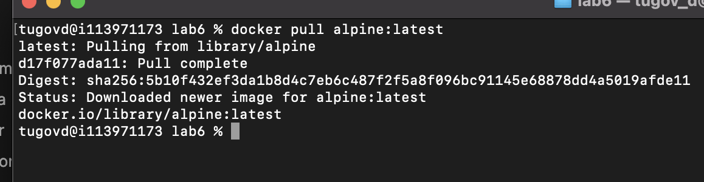
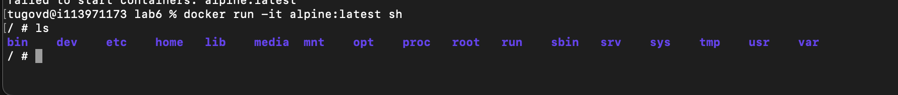
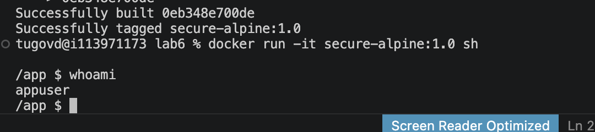
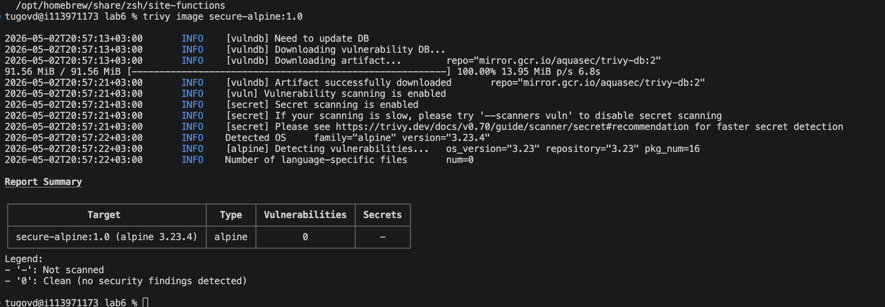

### Часть 1
Установим базовый/простой образ alpine:latest

Посмотрим через командо whoami кто хост системы и какие образы есть

Теперь запустим контейнер и зайдем в него через docker run alpine:latest sh

После whoami в докере видим root

### Часть 2

Собрал вот такой докерфайл
```Dockerfile
FROM alpine:latest

RUN addgroup -S appgroup && adduser -S appuser -G appgroup

WORKDIR /app

USER appuser

EXPOSE 8080
```

docker build -t secure-alpine:1.0 .
docker run -it secure-alpine:1.0 sh
Зайдя в него увидел после whoami что хост системы это новый пользователь без рут прав, которого создал я


Из флагов можно указать 
- --read-only - Дает права приложению в контейнере только читать файлы. Приложение не сможет менять системные фалы, отсюда никак не сможет внедрить вредоносный скрипт в файловую систему
- --cap-drop=ALL - из того, что я понял из доки для контейнера есть какието привилегии от ядра линкса и данный флаг убирает их
- --security-opt=no-new-privileges:true - думаю по названию влага понятно что запрещает приложению выдавать новые права в контейнере
- --pids-limit=100 - тоже полезный флаг, который ограничивает кол-во процессов в контейнере

### Часть 3

Теперь проверим его через trivy
```
trivy image secure-alpine:1.0
```


##### '0': Clean (no security findings detected)
Видимо это здесь самое важное - на момент сканирования никаких уязвимостей не обнаружено
Те образ чистый на известные cve

