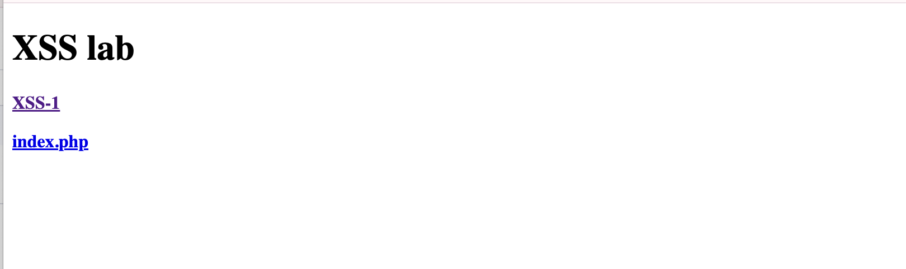
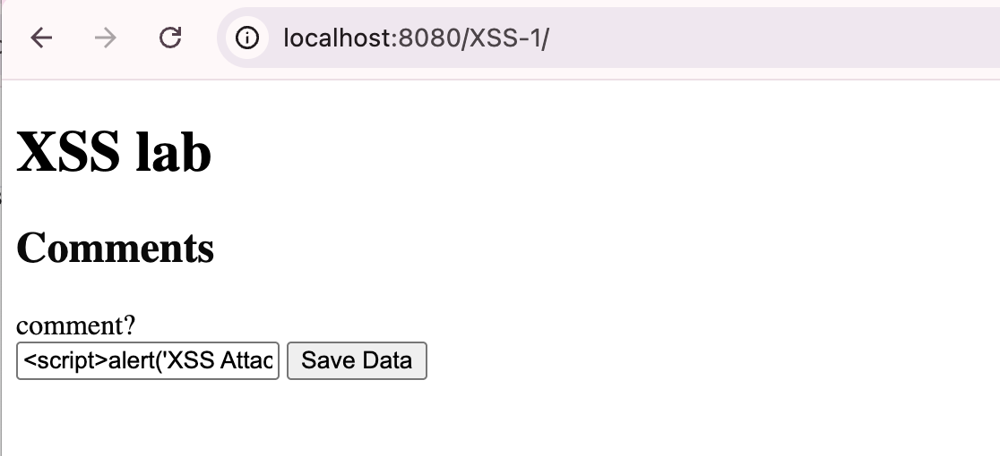
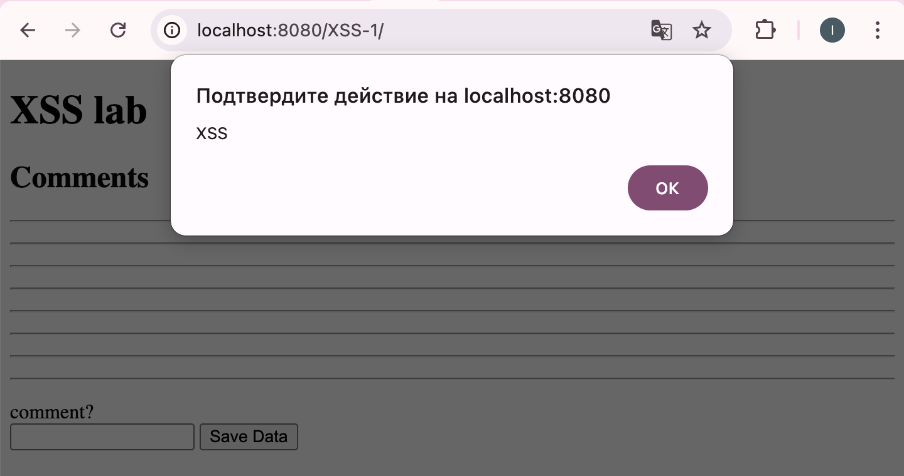

# Лабораторная работа №3

## Часть 1

### Источники:
1. CMS Made Simple (CVE-2021-26120)
Источник: https://nvd.nist.gov/vuln/detail/CVE-2021-26120

Назначение компонента: популярная система управления контентом на PHP. используется для создания сайтов, блогов и новостных порталов. Позволяет управлять страницами, меню и пользователями через админ-панель

Суть уязвимости: Stored XSS в модуле «FormBuilder». пользователь с правами редактора может внедрить код в название поля формы. при просмотре этой формы любым пользователем скрипт выполнится в его браузере

Последствия: кража сессионных cookies администратора, получение полного контроля над сайтом

2. Hospital Management System (CVE-2021-3938)
Источник: https://nvd.nist.gov/vuln/detail/CVE-2021-3938

Назначение компонента: система управления больницей на PHP. предназначена для регистрации пациентов, записи на прием, управления врачами и просмотра медицинских историй

Суть уязвимости: Reflected XSS в файле patient/search.php. параметр поиска не фильтруется. если отправить ссылку вида search.php?name=, то при переходе по ней скрипт выполнится в браузере

Последствия: перенаправление пользователей на фишинговые сайты, кража личных данных пациентов и врачей

### Общее количество уязвимостей
общее количество уязвимостей, зарегистрированных за 2021 год по данным National Vulnerability Database, составляет 20140
среди них значительную долю занимают XSS-уязвимости в веб-приложениях на PHP, что подтверждает актуальность проблемы даже для хорошо изученного типа атак

## Часть 2

Запускаю докер

и нажимаю на XSS-1

ввожу в поле  
и нажимаю save data

браузер показал всплывающее окно с текстом xss
при обновлении страницы окно появляется снова, так как скрипт сохранился в базе данных и выполняется при каждой загрузке

тип уязвимости-Stored Cross-Site Scripting (XSS)

Меры предотвращения:
1. Экранирование специальных символов
(< , > , " , ' , &)
2. Валидация входных данных
проверять тип и формат данных на стороне сервера
3. Использование Content Security Policy (CSP)
заголовок http Content-Security-Policy позволяет указать браузеру, из каких источников можно загружать скрипты

