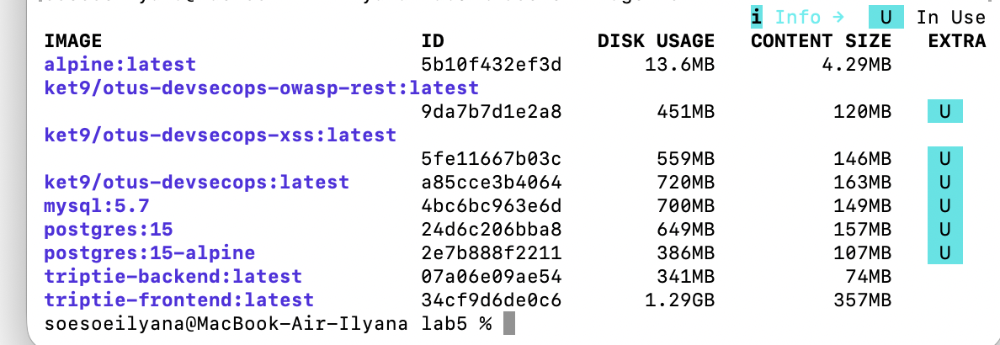
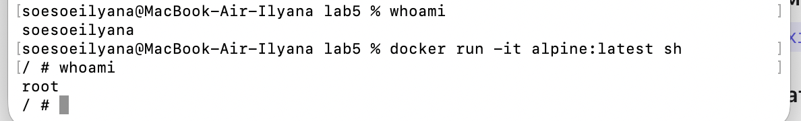
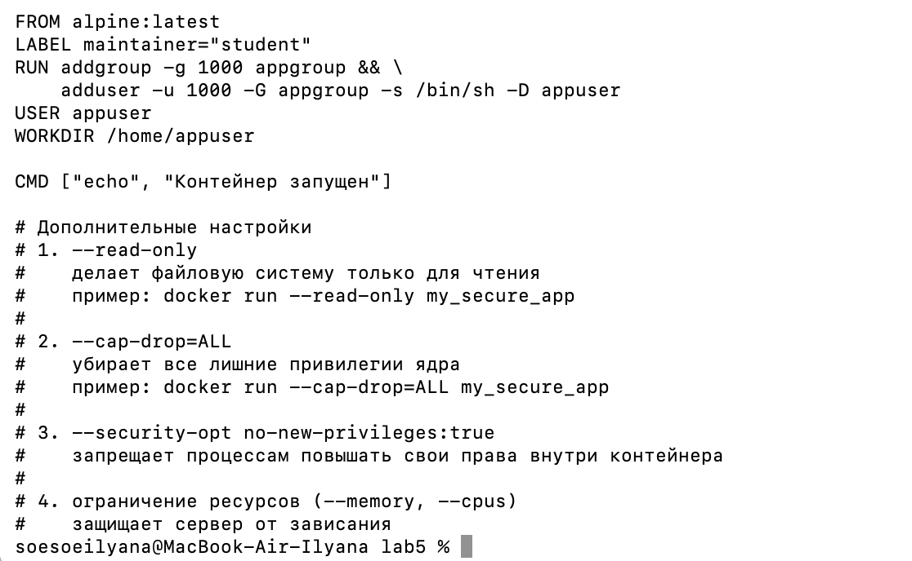
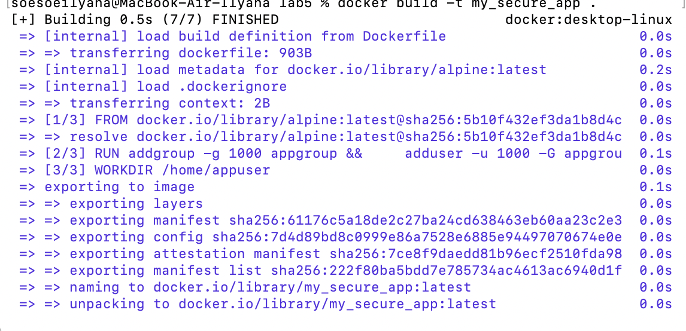
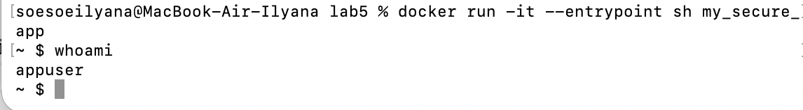
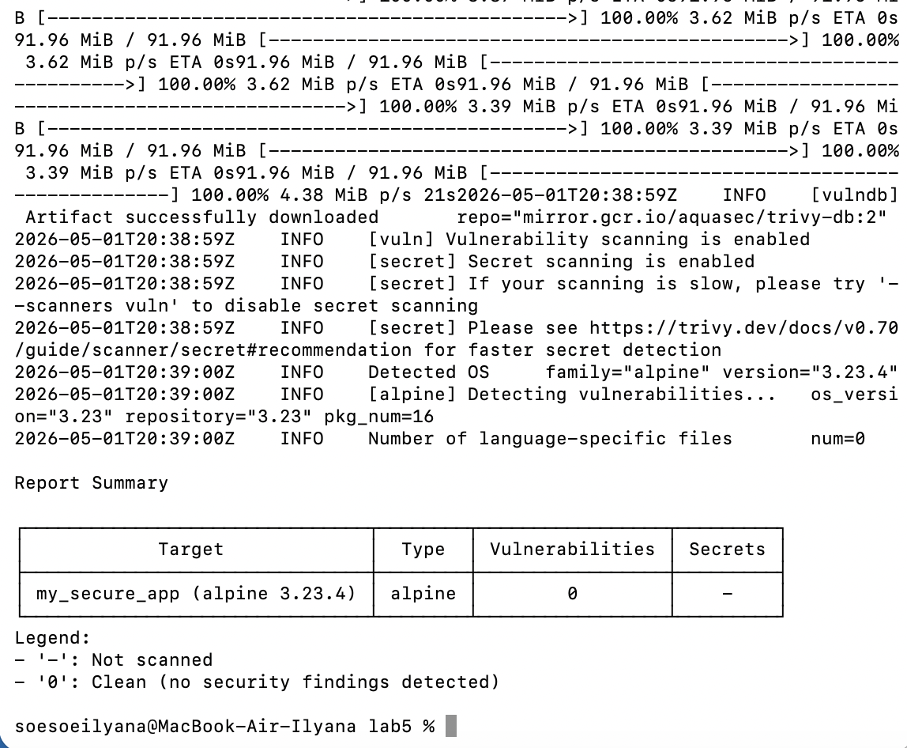

# Часть 1
смотрим список образов
docker image ls

проверяем текущего пользователя на хосте
whoami
запускаем контейнер и заходим
docker run -it alpine:latest sh
проверяем пользователя внутри контейнера
whoami

# Часть 2
создаем докерфайл на основе предыдущего образа

сборка образа
docker build -t my_secure_app .

запуск контейнера
docker run -it --entrypoint sh my_secure_app

### Дополнительные настройки
### 1. --read-only
###    делает файловую систему только для чтения
###    пример: docker run --read-only my_secure_app

### 2. --cap-drop=ALL
###    убирает все лишние привилегии ядра
###    пример: docker run --cap-drop=ALL my_secure_app

## 3. --security-opt no-new-privileges:true
###    запрещает процессам повышать свои права внутри контейнера

## 4. ограничение ресурсов (--memory, --cpus)
###    защищает сервер от зависания

# Часть 3
запуск сканера trivy
docker run --rm -v /var/run/docker.sock:/var/run/docker.sock aquasec/trivy image my_secure_app

## Вывод
этот образ alpine:latest является актуальным и не содержит известных уязвимостей в установленных пакетах.
использование свежих образов сильно снижает поверхность атаки в сравнении с тяжелыми образами, содержащими множество библиотек.