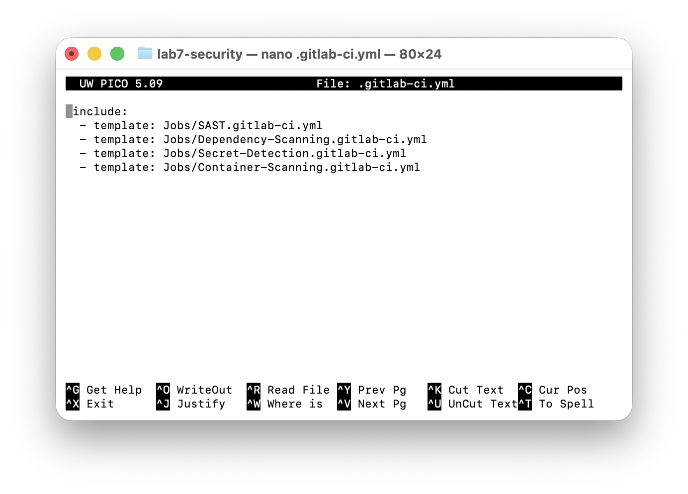
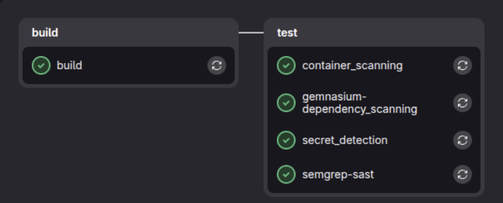
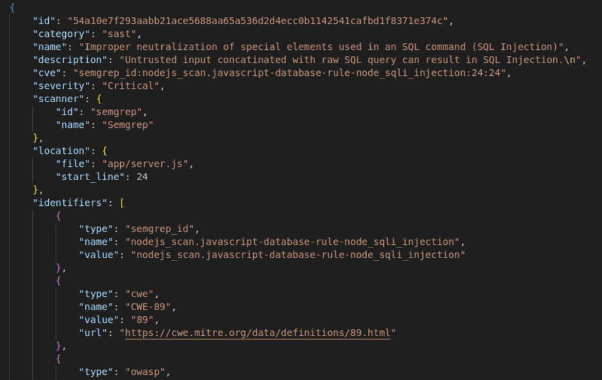
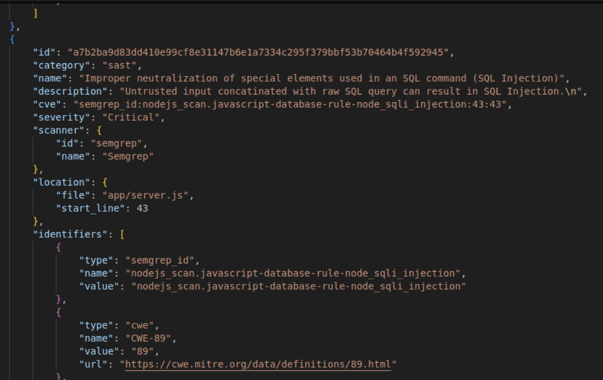
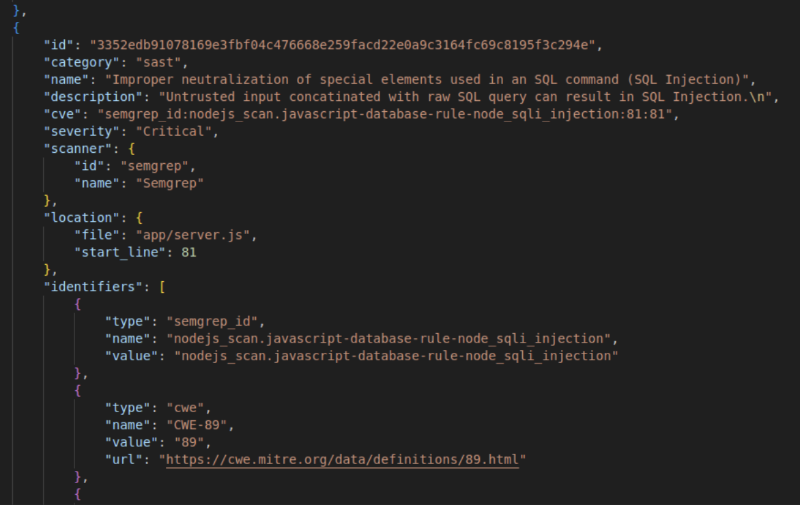
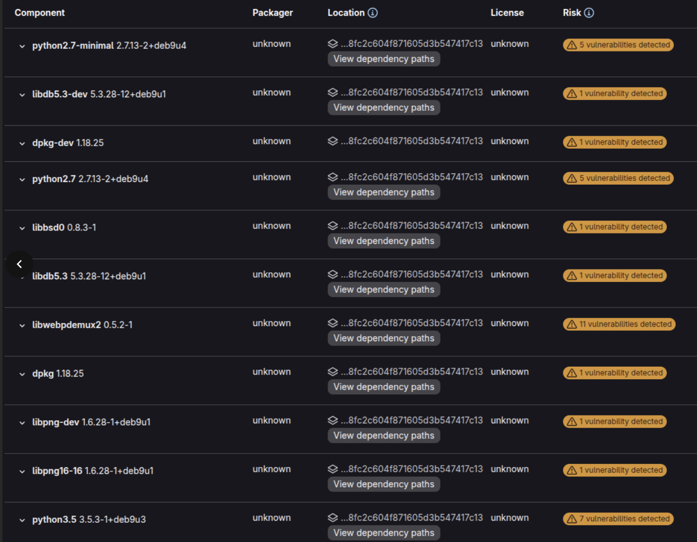

# Лабораторная работа №7

### 1. Создаем файл .gitlab-ci.yml

Добавляем сканнеры:
include:
  - template: Jobs/SAST.gitlab-ci.yml
  - template: Jobs/Dependency-Scanning.gitlab-ci.yml
  - template: Jobs/Secret-Detection.gitlab-ci.yml
  - template: Jobs/Container-Scanning.gitlab-ci.yml

### 2. Запуск пайплайна

## 1. SAST

### Настройка и подключение
SAST подключен через официальный шаблон `Jobs/SAST.gitlab-ci.yml`. Анализ кода выполнялся в автоматическом режиме с помощью сканера Semgrep

### Анализ результатов
Найдено проблем: 3 уязвимости критического уровня (Critical)
Что обнаружено: SQL Injection (внедрение SQL-кода)
Классификация: CWE-89 / OWASP A03:2021 — Injection
Локация в проекте:
  1. Файл app/server.js, строка 24
  2. Файл app/server.js, строка 54
  3. Файл app/server.js, строка 81

В файле server.js на указанных строках код формирует SQL-запросы к базе данных путём простой склейки строк. При этом отсутствует проверка и экранирование пользовательских данных. Это позволяет злоумышленнику внедрить свой SQL-код в запрос.

## 2. License Scanning

### Лицензионный аудит
Всего проверено пакетов: 412
Статус лицензий:
411 пакетов — лицензии известны (MIT, Apache, BSD и другие)
1 пакет — лицензия не указана (unknown)

Юридические риски: нет
В проекте нет пакетов с вирусными лицензиями (типа GPL), которые обязывают открывать исходный код
Все найденные лицензии разрешают коммерческое использование
Пакет с неизвестной лицензией — это системная утилита Linux, которая не встраивается в код приложения, а просто используется как инструмент

## 3. Dependency Scanning 
Всего зависимостей: 412 пакетов.

Компоненты с уязвимостями: 212 пакетов из 412 

Общее число зафиксированных уязвимостей в системе: 1459 проблем безопасности.

Наиболее критичные и уязвимые системные компоненты:
binutils (версия 2.28-5) — содержит 93 уязвимости (включая критические переполнения буфера и DoS-атаки)

Выгруженный список зависимостей подтверждает критическое состояние безопасности инфраструктурного слоя приложения. Наличие 1459 уязвимостей обусловлено тем, что базовый Docker-образ использует неподдерживаемый дистрибутив ОС (Debian 9). 

## 4. Container Scanning 

Инструмент анализа: Trivy

### Ключевые проблемы и критические уязвимости
Анализ системных слоев выявил критические архитектурные недостатки, связанные с использованием устаревшей базовой ОC. Это привело к наличию большого количества известных незакрытых CVE.

Наиболее значимые примеры зафиксированных уязвимостей уровня (High):
1. Пакет binutils(версия 2.28-5)Идентификатор: CVE-2017-12448
2. Библиотека zlib1g-dev(версия 1:1.2.8.dfsg-5)
Идентификатор: CVE-2018-25032

Большинство найденных уязвимостей в отчете помечены статусом "vendor_status": "fixed". Это указывает на то, что патчи безопасности для данных пакетов существуют, но они выпущены для более свежих веток дистрибутива Debian (10/11/12) и не могут быть автоматически установлены в репозиториях Debian 9.

## 5. Secret Detection 

Инструмент: (Jobs/Secret-Detection.gitlab-ci.yml).

Результат: Этап пройден безошибочно. Актуальных утечек приватных ключей, паролей или токенов в истории коммитов репозитория не обнаружено ("vulnerabilities": []).

