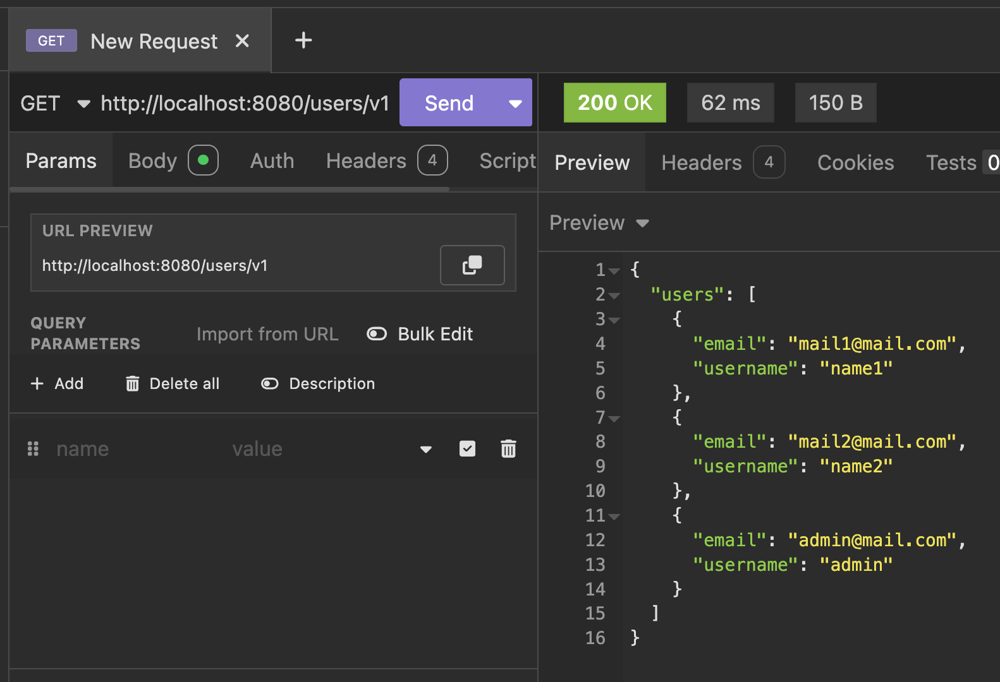
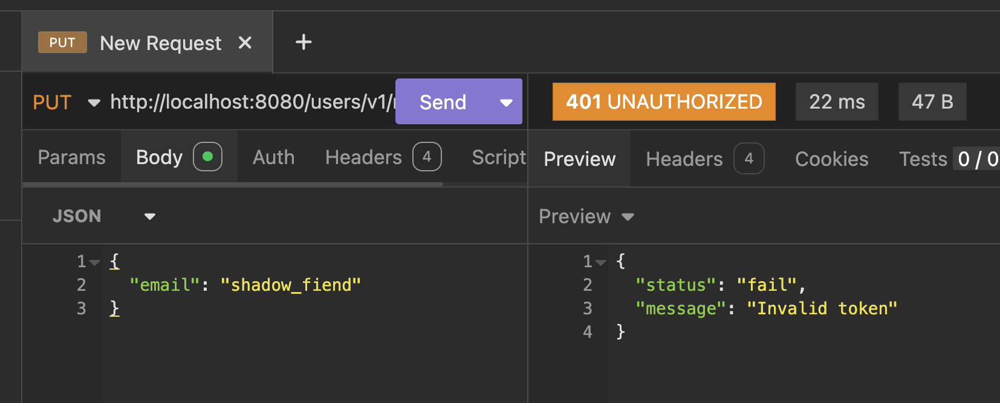
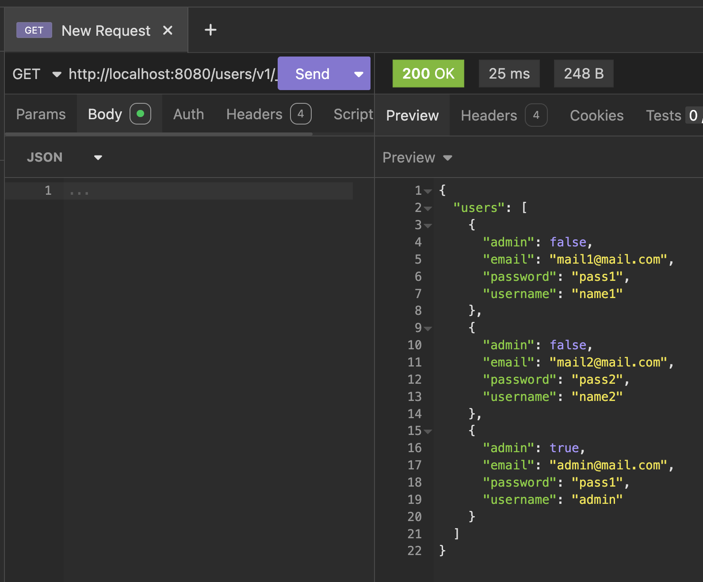
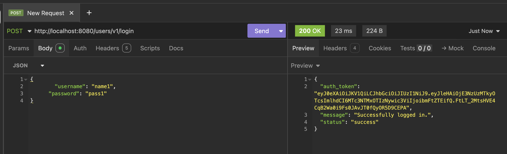
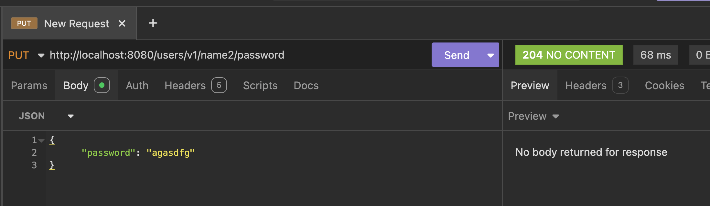
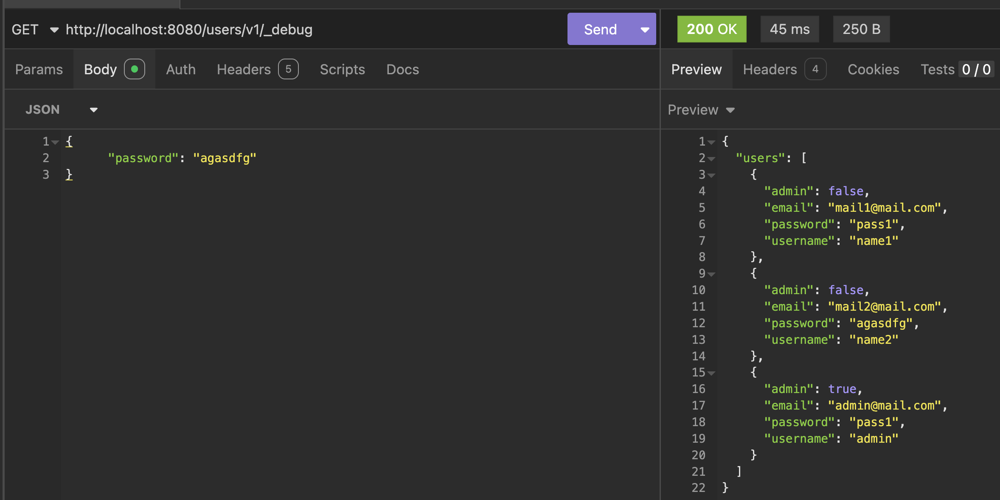
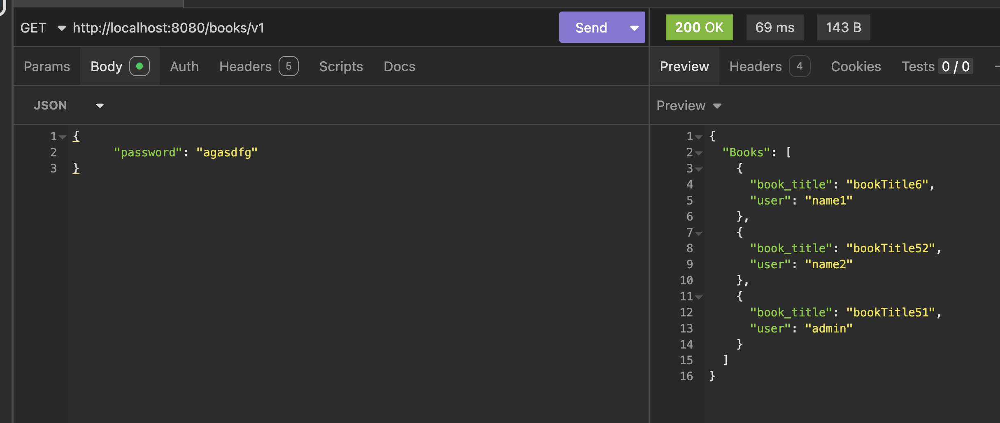

# Часть 1

## 1. Broken Function Level Authorization
источник: https://nvd.nist.gov/vuln/detail/CVE-2025-20348

недостаток: Пользователь без прав администратора может выполнять операции, предполагающие доступ админа.

причина: нету проверки прав доступа на эндпоинте, который должен быть доступен только определенным ролям
## 2. Broken Object Level Authorization (BOLA)
источник: https://nvd.nist.gov/vuln/detail/CVE-2025-23325

недостаток: обход проверки аунтификации/авторизации для определенных rest api из за недостоаточной реализации контроля доступа. Эксплуатация приводит к получению админки и выполнению несанкцианированных операций.
 
причина: Неправильная реализация контроля доступа. Система не проверяет имеет ли аутентифицированный пользователь права для выполнения определенных эндпоинтов.

## 3. Unrestricted Resource Consumption
источник: https://nvd.nist.gov/vuln/detail/CVE-2025-49559

недостаток: неаутентифицированный пользователь может отправлять спец запросы которые потребляют большое количество ресурсов что приходит к отказу

причина: отсутствие лимитов на сложность запроса. Сервер обрабатывает входящие запросы без ограничений на глубину вложенности. 

# Часть 2

Посмотрим какие у нас есть эндпоинты
--
{ "создать базу": "/createdb",     "посмотреть информацию обо всех пользователях": "/users/v1",     "посмотреть подробную информацию обо всех пользователях": "/users/v1/_debug",     "регистрация нового пользователя": "/users/v1/register (HTTP POST)",     "вход в приложение": "/users/v1/login (HTTP POST)",     "просмотр пользователя по имени": "/users/v1/{username}",     "удалить пользователя по имени (только для админов)": "/users/v1/{username} (HTTP DELETE)",     "изменить email пользователя": "/users/v1/{username}/email (HTTP PUT)",     "изменить пароль пользователя": "/users/v1/{username}/password (HTTP PUT)",     "все книги": "/books/v1",     "добавить книгу": "/books/v1 (HTTP POST)",     "просмотр книги": "/books/v1/{book}",      } 

## 1. 
в описании вижу что такие запросы можно делать без админки

 "изменить email пользователя": "/users/v1/{username}/email (HTTP PUT)",     "изменить пароль пользователя": "/users/v1/{username}/password (HTTP PUT)",     "все книги": "/books/v1",     "добавить книгу": "/books/v1 (HTTP POST)",     "просмотр книги": "/books/v1/{book}", 

 попробуем через insomnia изменить email 

до:

не получилось, защита есть 

есть эндпоинт  /users/v1/_debug попробуем с ним

получаем пароли всех пользователей без всякой шифровки и проверки на доступность обычному пользователю ходить по такому эндпоинту 

Уязвимость типа API3:2023 Broken Object Property Level Authorization. 

меры предотвращения:
1. проверять права доступа к чуствительным объектам
2. хешировать пароли 

## 2. 
Попробуем залогинится под каким то пользователем без админки и сделать что то, предполагающее действие админа 

попробуем поменять пароль другому пользователю

Успешно 

Уязвимость API1:2023 — Broken Object Level Authorization (BOLA). Меняем данные в чужом акке 

меры предотвращения:
1. Проверка прав доступа
2. менять данные по скрытому айдишнику 

## 3 
Мы можем получить доступ к чужой информации (чужие книги)

Уязвимость Уязвимость API1:2023 — Broken Object Level Authorization (BOLA)

меры предотвращения:
1. Проверка и контроль прав доступа

