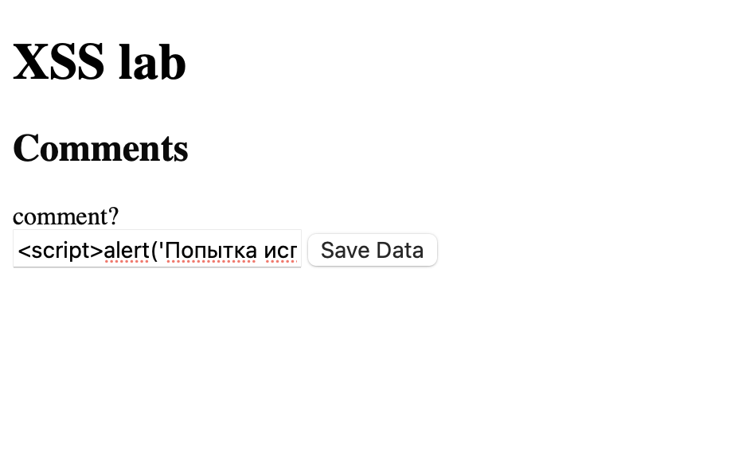
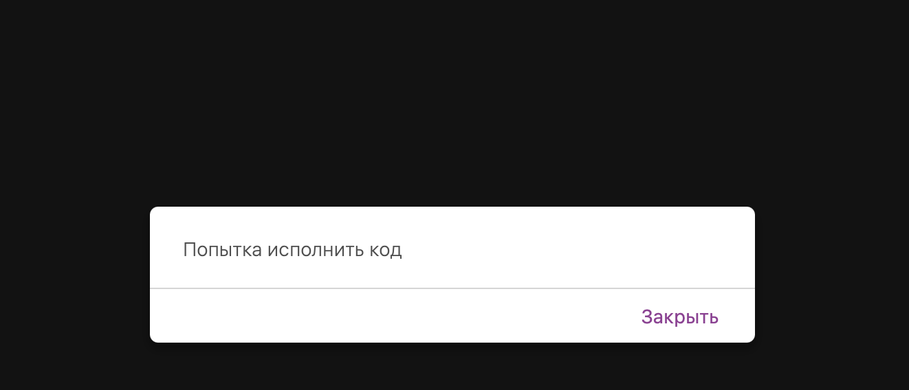

# Часть 1
По данным National Vulnerability Database общее количество уязвимостей составляет 20140 за 2021 год. За период 2021-2024 общее количество CVE XSS составляет 11300. 

Источники:
1. https://nvd.nist.gov/vuln/search#/nvd/home?resultType=records
2. https://medium.com/s2wblog/detailed-analysis-of-recent-vulnerability-trends-and-attack-patterns-742d37ff4ced
3. https://cve.komodosec.com/cve-list?cvss_score_range=&search=PHP&page_number=552&sort_by=cwe_id&order=descending&sort=cvss_score2

## 1.  PHP Event Calendar

В компоненте для системы управления событиями и календарями PHP Event Calendar. Функционал календаря с возможностью создавать, редактировать, удалять события. Позволяет внедрить свой JS-код через параметр title в файле /server/ajax/events_manager.php . Далее скрипт будет отображаться и выполнятся в браузере каждого пользователя, зашедшего на зараженное событие. 

Последствия: 
1. Выполнение действие от акков других юзеров
2. Изменение внешнего вида сайта
3. кража куков и метаданных сессии

Источник: https://vulners.com/cve/CVE-2021-42078

## 2. PHPGurukul Shopping (Shopping Cart System)

Система интернет-магазина, написанная на пхп. Функционал просмотра товаров, корзины, заказов и админка. Включает JSONP-эндпоинты для AJAX-запросов, поддержку редактирования записей и CAPTCHA-механизмы. Можно внедрить свой JS-код в URL параметры, который будет отображен в ответе от сервера и выполнится в браузере жертвы, при формировании спец. ссылки. 

Последсвтия: 
1. Кража куков
2. Обход каптчи 
3. Сбор данных польователей 

Источник: https://cve.mitre.org/cgi-bin/cvename.cgi?name=CVE-2021-39412

# Часть 2

Запустил докер, нажал на XSS-1. В поле для коммента ввел . 

Появилось окно 

При обновлении оно так же поялвяется. 

Ввод никак не валидируется и напрямую вставляется в хтмл как есть . Тип уязвимости - межсайтовая атака с использованием скрипотов (Reflected Cross-Site Scripting (XSS)) - подкатегория инъекций. 

Последсвия: 
1. Выполнение произвольных скриптов.
2. Кража куки и метаданных и данных пользователя. 
3. Подмена информации страницы. 

Меры предотвращения:
1. Экранирование через спец. символы (", ', <, >)
2. Валидация вставленных данных.
3. Не использовать опасный функционал 

