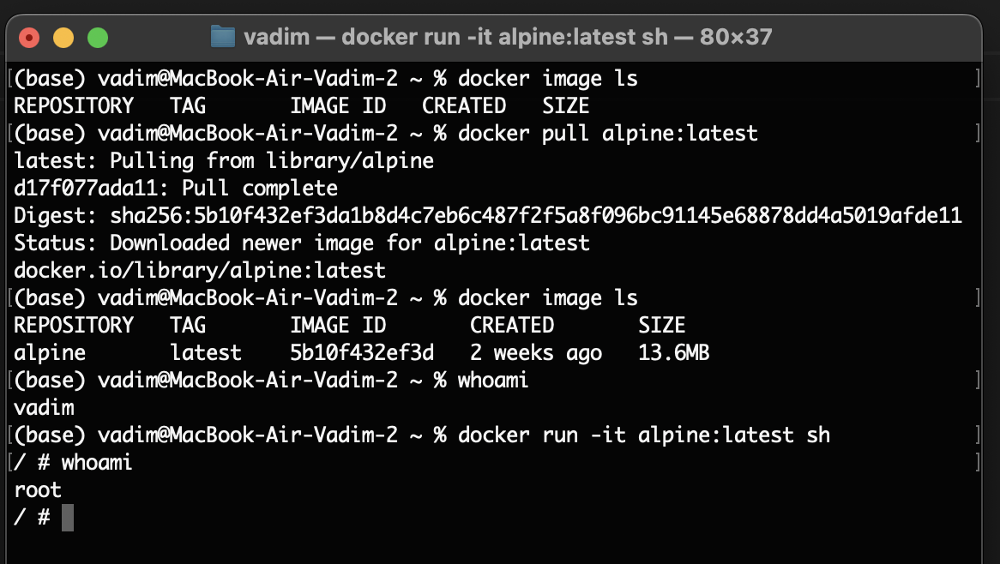
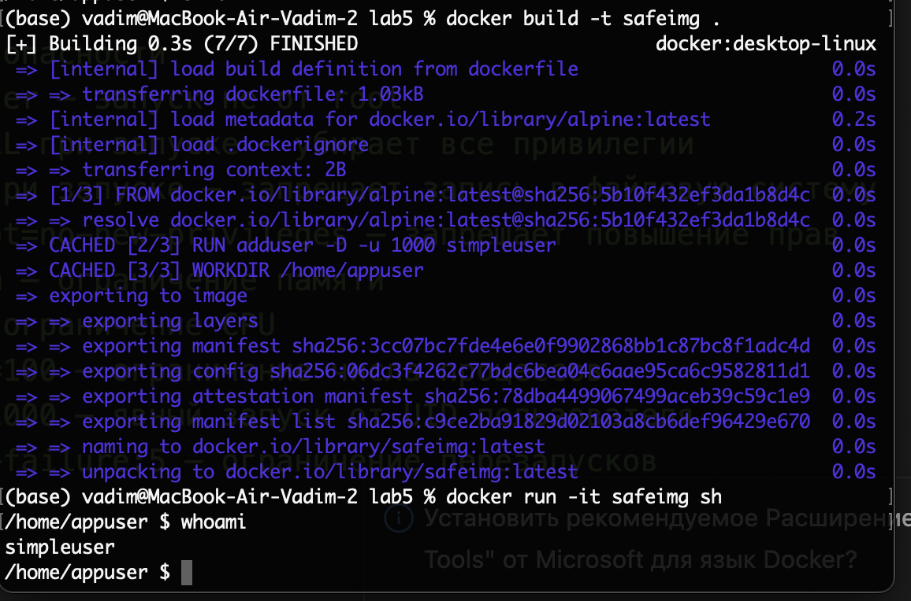
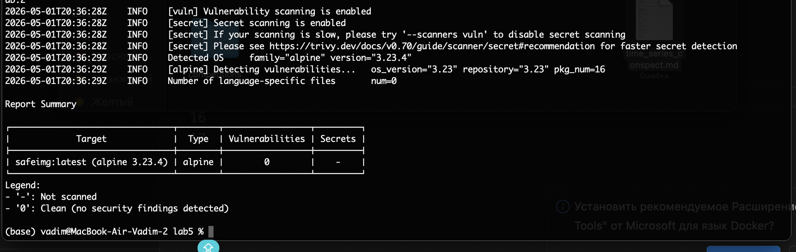

# 1 часть

Спулили новый образ. На локальной машине мой пользователь, когда запустили конейнер пользователь - root 

# 2 часть 

Написали конейнер, собрали и запустили его. Внутри проверили под каким мы юзером. Мы не под рутом, а под новым пользователем без прав. 

# 3 часть

Сделал скан с помощью Trivy, сканер не обнаружил уязвимостей (HIGH и CRITICAL — 0). Из репорта образ основан на alpine 3.23.4 , проанализировано 16 пакетов (pkg_num=16). Образ безопасен для использования.
