# Lab6

## 1. Секреты 

Качаем образ, качаем либу и запускаем сканирование

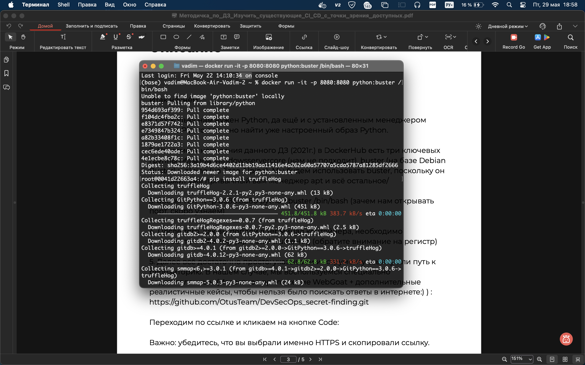

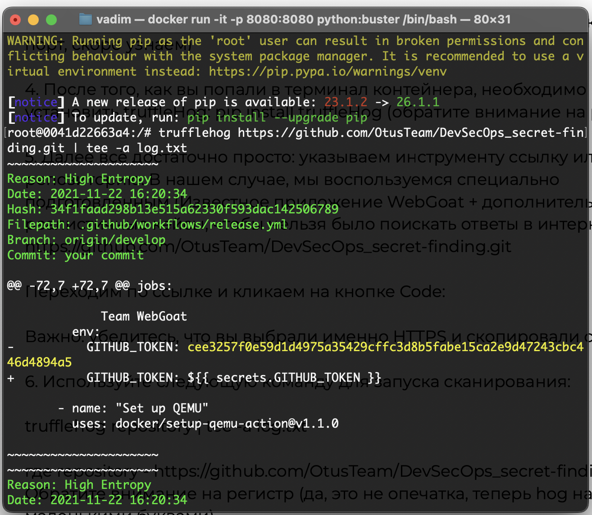

Видим кучу самых разные сикретов

Некоторые лежат в отдельных файлах и запушены

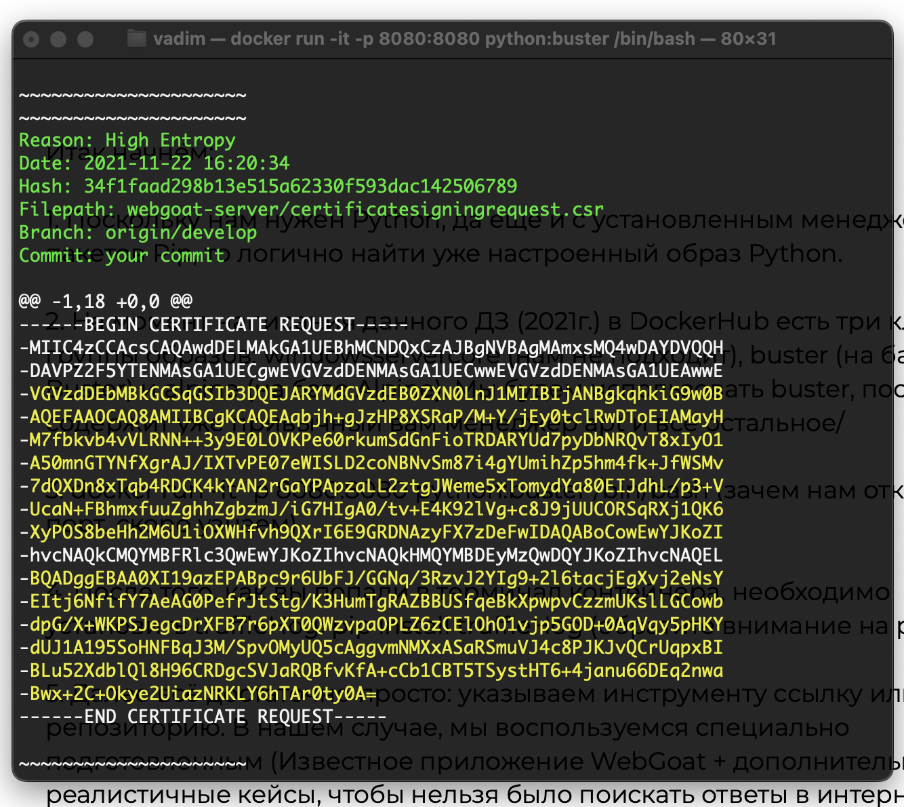

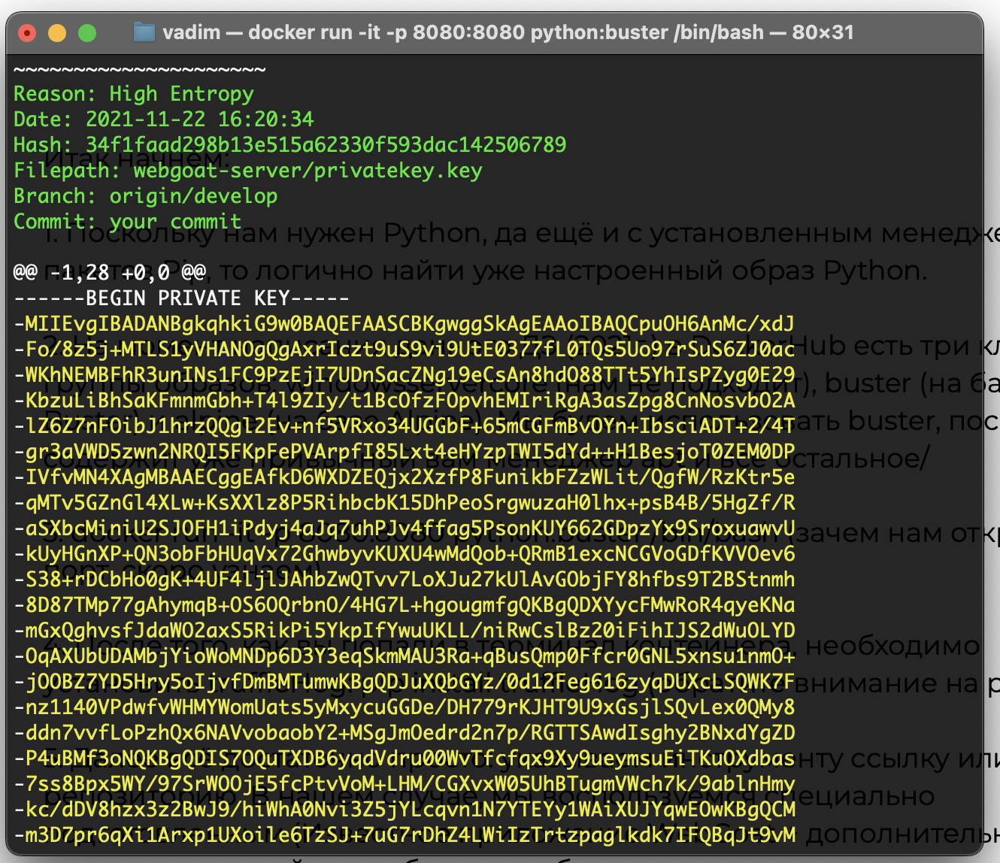

Некоторые захардкожены

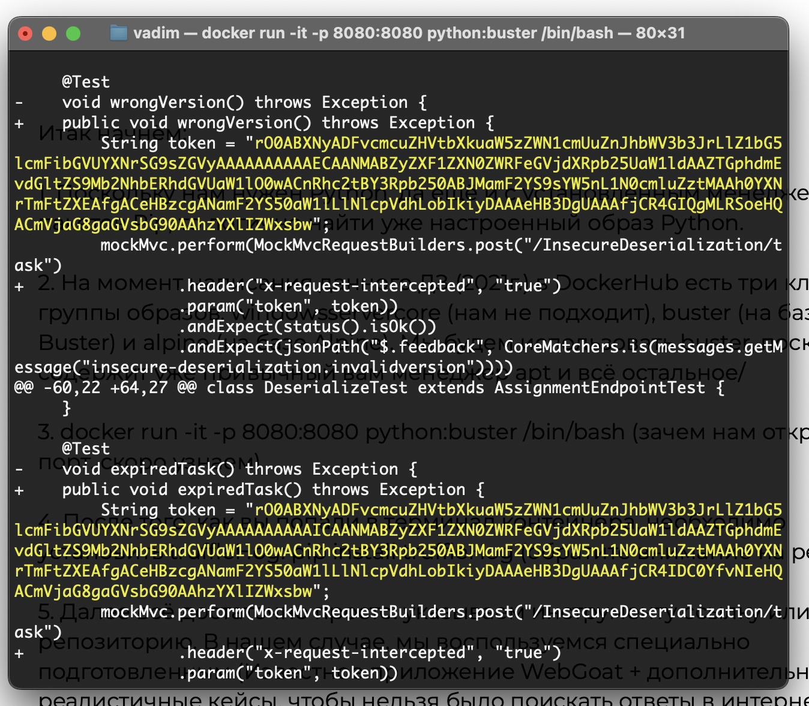

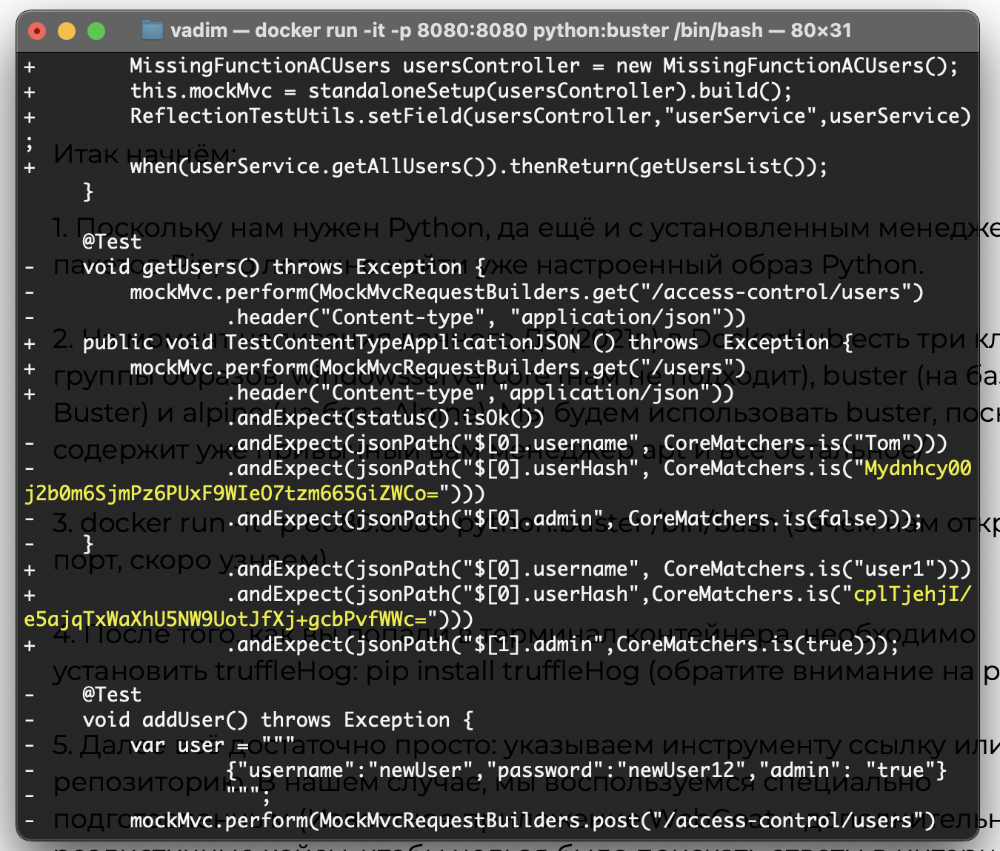

и вот через http 

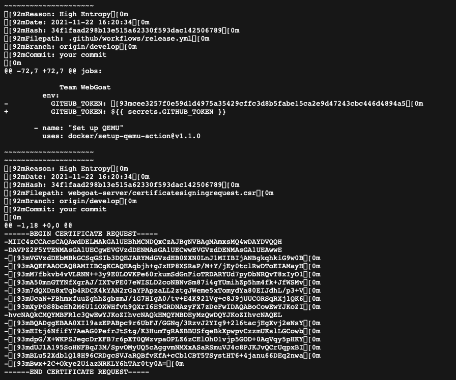

1. 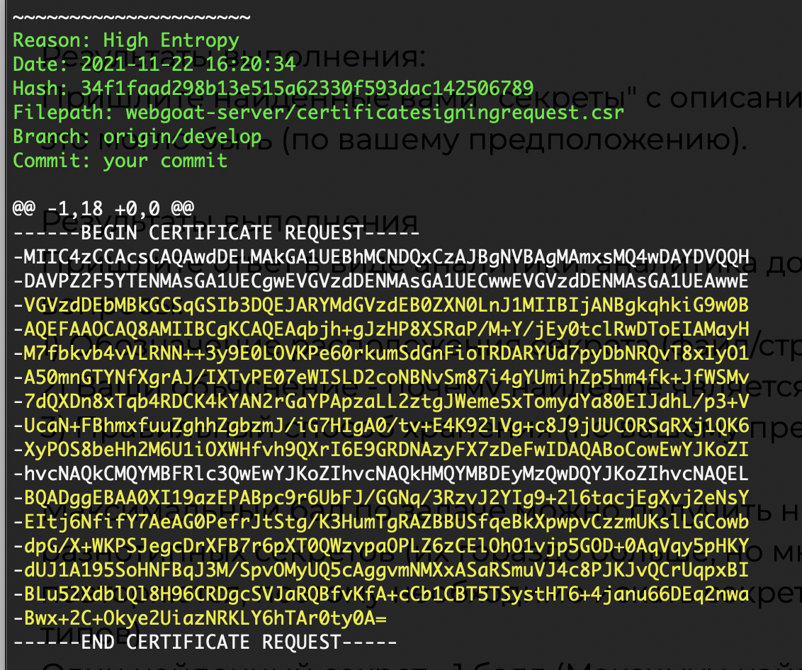 
    SSL/TLS сертификат для веб-сервера
    1) Расположен 
        Filepath: webgoat-server/certificatesigningrequest.csr
        Branch: origin/develop
        Commit: your commit
    2) секрет ------BEGIN CERTIFICATE REQUEST-----
        -MIIC4zCCAcsCAQAwdDELMAkGA1UEBhMCNDQxCzAJBgNVBAgMAmxsMQ4wDAYDVQQH
        -DAVPZ2F5YTENMAsGA1UECgwEVGVzdDENMAsGA1UECwwEVGVzdDENMAsGA1UEAwwE
        -VGVzdDEbMBkGCSqGSIb3DQEJARYMdGVzdEB0ZXN0LnJ1MIIBIjANBgkqhkiG9w0B
        -AQEFAAOCAQ8AMIIBCgKCAQEAqbjh+gJzHP8XSRaP/M+Y/jEy0tclRwDToEIAMayH
        -M7fbkvb4vVLRNN++3y9E0LOVKPe60rkumSdGnFioTRDARYUd7pyDbNRQvT8xIyO1
        -A50mnGTYNfXgrAJ/IXTvPE07eWISLD2coNBNvSm87i4gYUmihZp5hm4fk+JfWSMv
        -7dQXDn8xTqb4RDCK4kYAN2rGaYPApzaLL2ztgJWeme5xTomydYa80EIJdhL/p3+V
        -UcaN+FBhmxfuuZghhZgbzmJ/iG7HIgA0/tv+E4K92lVg+c8J9jUUCORSqRXj1QK6
        -XyPOS8beHh2M6U1iOXWHfvh9QXrI6E9GRDNAzyFX7zDeFwIDAQABoCowEwYJKoZI
        -hvcNAQkCMQYMBFRlc3QwEwYJKoZIhvcNAQkHMQYMBDEyMzQwDQYJKoZIhvcNAQEL
        -BQADggEBAA0XI19azEPABpc9r6UbFJ/GGNq/3RzvJ2YIg9+2l6tacjEgXvj2eNsY
        -EItj6NfifY7AeAG0PefrJtStg/K3HumTgRAZBBUSfqeBkXpwpvCzzmUKslLGCowb
        -dpG/X+WKPSJegcDrXFB7r6pXT0QWzvpaOPLZ6zCElOhO1vjp5GOD+0AqVqy5pHKY
        -dUJ1A195SoHNFBqJ3M/SpvOMyUQ5cAggvmNMXxASaRSmuVJ4c8PJKJvQCrUqpxBI
        -BLu52XdblQl8H96CRDgcSVJaRQBfvKfA+cCb1CBT5TSystHT6+4janu66DEq2nwa
        -Bwx+2C+Okye2UiazNRKLY6hTAr0ty0A=
        ------END CERTIFICATE REQUEST-----
    3) Потому что высокая энтропия 
    4) в энвах или Vault

2. 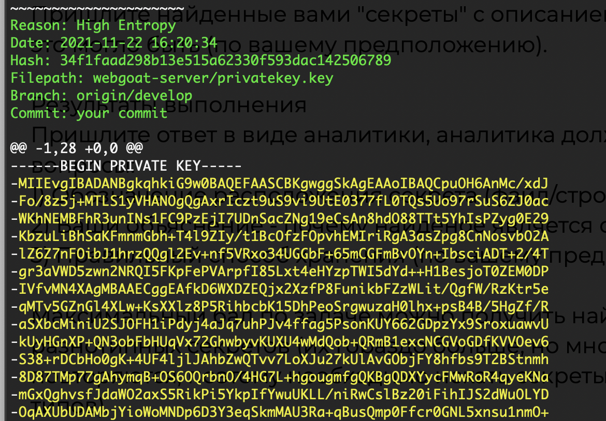
    (закрытый ключ, которым подписывается сертификат)
    1) Расположен 
        Filepath: webgoat-server/privatekey.key
        Branch: origin/develop
        Commit: your commit
    2) секрет
        -MIIEvgIBADANBgkqhkiG9w0BAQEFAASCBKgwggSkAgEAAoIBAQCpuOH6AnMc/xdJ
        -Fo/8z5j+MTLS1yVHANOgQgAxrIczt9uS9vi9UtE0377fL0TQs5Uo97rSuS6ZJ0ac
        -WKhNEMBFhR3unINs1FC9PzEjI7UDnSacZNg19eCsAn8hdO88TTt5YhIsPZyg0E29
        -KbzuLiBhSaKFmnmGbh+T4l9ZIy/t1BcOfzFOpvhEMIriRgA3asZpg8CnNosvbO2A
        -lZ6Z7nFOibJ1hrzQQgl2Ev+nf5VRxo34UGGbF+65mCGFmBvOYn+IbsciADT+2/4T
        -gr3aVWD5zwn2NRQI5FKpFePVArpfI85Lxt4eHYzpTWI5dYd++H1BesjoT0ZEM0DP
        -IVfvMN4XAgMBAAECggEAfkD6WXDZEQjx2XzfP8FunikbFZzWLit/QgfW/RzKtr5e
        -qMTv5GZnGl4XLw+KsXXlz8P5RihbcbK15DhPeoSrgwuzaH0lhx+psB4B/5HgZf/R
        -aSXbcMiniU2SJOFH1iPdyj4aJq7uhPJv4ffag5PsonKUY662GDpzYx9SroxuawvU
        -kUyHGnXP+QN3obFbHUqVx72GhwbyvKUXU4wMdQob+QRmB1excNCGVoGDfKVVOev6
        -S38+rDCbHo0gK+4UF4ljlJAhbZwQTvv7LoXJu27kUlAvGObjFY8hfbs9T2BStnmh
        -8D87TMp77gAhymqB+OS6OQrbnO/4HG7L+hgougmfgQKBgQDXYycFMwRoR4qyeKNa
        -mGxQghvsfJdaWO2axS5RikPi5YkpIfYwuUKLL/niRwCslBz20iFihIJS2dWuOLYD
        -OqAXUbUDAMbjYioWoMNDp6D3Y3eqSkmMAU3Ra+qBusQmp0Ffcr0GNL5xnsu1nmO+
        -jOOBZ7YD5Hry5oIjvfDmBMTumwKBgQDJuXQbGYz/0d12Feg616zyqDUXcLSQWK7F
        -nz1140VPdwfvWHMYWomUats5yMxycuGGDe/DH779rKJHT9U9xGsjlSQvLex0QMy8
        -ddn7vvfLoPzhQx6NAVvobaobY2+MSgJmOedrd2n7p/RGTTSAwdIsghy2BNxdYgZD
        -P4uBMf3oNQKBgQDIS7OQuTXDB6yqdVdru00WvTfcfqx9Xy9ueymsuEiTKuOXdbas
        -7ss8Bpx5WY/97SrWOOjE5fcPtvVoM+LHM/CGXvxW05UhBTugmVWch7k/9ablnHmy
        -kc/dDV8hzx3z2BwJ9/hiWhA0Nvi3Z5jYLcqvn1N7YTEYy1WAiXUJYqwEOwKBgQCM
        -m3D7pr6qXi1Arxp1UXoile6TzSJ+7uG7rDhZ4LWiIzTrtzpaglkdk7IFQBqJt9vM
        -5g/2cT1ecqOWk2XurOeFIOLc4+TKT5Sl1HvBxyXP0QITPgaggI8AntgQSSoqnje3
        -66qMNOsx16skCZKMIQ2Pqo26rf6wNLBq1XM29ZKm9QKBgGeefgyYgirI1TdjpqVk
        -B5GhVf+D4wozBvJFAwmVBAQFFU1wCJV7aiwT/RL9KP21Ahfil5Ll7OHE80S4yRU2
        -g5Y5/F3ExwrIUWdnnMgsO3VtmpgBR5ADBbMQ2Wyo8VF9+tENtlFfnRDRFZl09x1H
        -oX44T7mclitCYaOuoRnC2V5H
    3) Потому что высокая энтропия 
    4) в энвах или Vault

3. 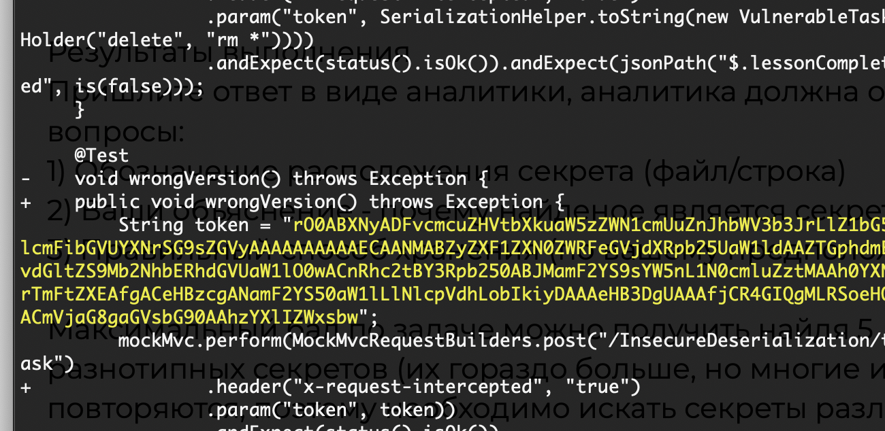
    (может быть сериализованный JWT-токен)
    1) Расположен 
    Filepath: webgoat-lessons/insecure-deserialization/src/test/java/org/owasp/webgoat/deserialization/DeserializeTest.java
Branch: origin/develop
Commit: Move unit test to JUnit 5
    2) секрет
    String token = "rO0ABXNyADFvcmcuZHVtbXkuaW5zZWN1cmUuZnJhbWV3b3JrLlZ1bG5lcmFibGVUYXNrSG9sZGVyAAAAAAAAAAECAANMABZyZXF1ZXN0ZWRFeGVjdXRpb25UaW1ldAAZTGphdmEvdGltZS9Mb2NhbERhdGVUaW1lO0wACnRhc2tBY3Rpb250ABJMamF2YS9sYW5nL1N0cmluZztMAAh0YXNrTmFtZXEAfgACeHBzcgANamF2YS50aW1lLlNlcpVdhLobIkiyDAAAeHB3DgUAAAfjCR4GIQgMLRSoeHQACmVjaG8gaGVsbG90AAhzYXlIZWxsbw";
    3) Потому что высокая энтропия 
    4) в энвах или Vault

4. 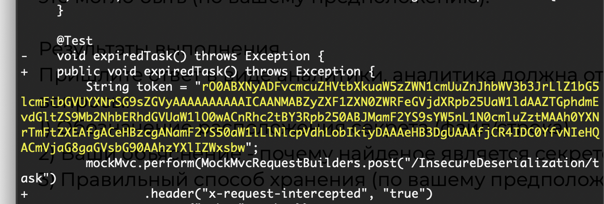
    (может быть API-ключом, токеном доступа, refresh-токеном)
    1) Расположен 
    Filepath: webgoat-lessons/insecure-deserialization/src/test/java/org/owasp/webgoat/deserialization/DeserializeTest.java
Branch: origin/develop
Commit: Move unit test to JUnit 5
    2) секрет
    String token = "rO0ABXQAVklmIHlvdSBkZXNlcmlhbGl6ZSBtZSBkb3duLCBJIHNoYWxsIGJlY29tZSBtb3JlIHBvd2VyZnVsIHRoYW4geW91IGNhbiBwb3NzaWJseSBpbWFnaW5l";
    3) Потому что высокая энтропия 
    4) в энвах или Vault

5. 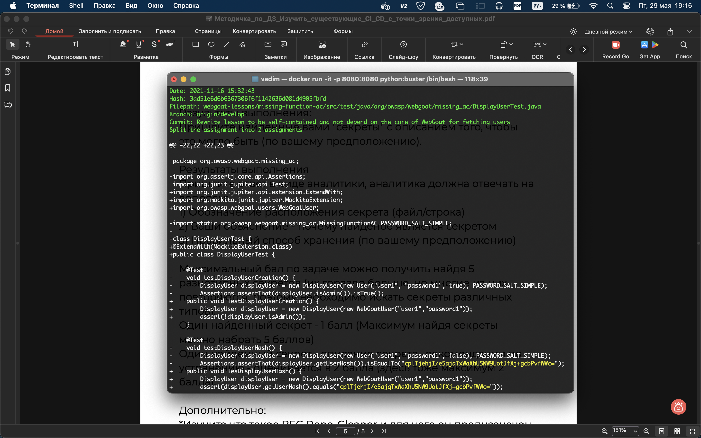
    (хэш пароля)
    1) Расположен 
    Filepath: webgoat-lessons/missing-function-ac/src/test/java/org/owasp/webgoat/missing_ac/DisplayUserTest.java
Branch: origin/develop
Commit: Rewrite lesson to be self-contained and not depend on the core of WebGoat for fetching users
    2) секрет
    cplTjehjI/e5ajqTxWaXhU5NW9UotJfXj+gcbPvfWWc=
    3) Потому что высокая энтропия 
    4) в энвах или Vault

## Дополнительно

### Что такое BFG Repo-Cleaner

**BFG Repo-Cleaner** — это лёгкая консольная программа, которая создавалась как более быстрая и удобная замена стандартной команде `git filter-branch`.

**Для чего нужна:**

1. **Полное удаление секретов из истории Git.** Программа проходит по всем коммитам, веткам и тегам репозитория и либо полностью вырезает указанные файлы, либо заменяет приватный текст внутри файлов на заглушку. Это нужно, потому что если секрет попал в Git один раз, просто удалить его из текущей версии недостаточно — он остаётся в старых коммитах, и любой может его найти.

2. **Очистка репозитория от больших файлов.** Если разработчик случайно закоммитил тяжёлый бинарный файл (например, zip-архив на 2 ГБ или дамп базы данных), BFG удаляет этот объект из базы данных Git. Это сильно уменьшает размер папки `.git`.

---

### Как автоматизировать поиск секретов и насколько это правильный подход

Автоматизация поиска секретов — это обязательное требование методологии **DevSecOps** (когда безопасность встроена прямо в процесс разработки).

#### Как это устроено (два уровня защиты)

**Уровень 1: на компьютере разработчика (pre-commit и pre-push хуки)**

На машину каждого разработчика ставят инструменты типа `Gitleaks`, `TruffleHog` или фреймворк `pre-commit`. Настраивается триггер, который автоматически запускает сканирование изменённых строк кода в момент, когда разработчик вводит команду `git commit`. Если программа находит что-то похожее на секрет (высокая энтропия или совпадение с регулярным выражением для приватного ключа), коммит блокируется прямо на месте.

**Уровень 2: в CI/CD пайплайнах (централизованный контроль)**

Сканер добавляется в облачные системы сборки — GitHub Actions, GitLab CI и т.д. При каждом создании Pull Request автоматически запускается контейнер со сканером, который проверяет только изменения (дельту). Если разработчик каким-то образом обошёл локальные хуки, пайплайн сборки падает, слияние кода блокируется, а команда безопасности получает уведомление.

#### Плюсы

- **Проактивное предотвращение.** Секрет перехватывается до того, как он покидает рабочую станцию разработчика или внутренний контур компании.
- **Непрерывность.** Автоматика работает 24/7, не устаёт, не забывает, не делает ошибок по невнимательности. Человеческий фактор полностью исключён.

#### Минусы

- **Ложные срабатывания (False Positives).** Алгоритмы часто принимают за секреты случайные хэши коммитов, длинные идентификаторы GUID, base64-строки от встроенных иконок. Это требует постоянной поддержки файлов исключений — их нужно пополнять и править.
- **Сопротивление команды разработки.** Если pre-commit хуки настроены плохо и сильно тормозят работу, разработчики начнут их отключать или искать способы обойти. Нужно настраивать аккуратно, чтобы балансировать между безопасностью и скоростью.

Автоматизация поиска секретов — это правильный и обязательный подход в современной разработке. Лучшая практика — комбинировать два уровня:
- быстрые проверки на основе регулярных выражений на этапе `pre-commit` (на машинах разработчиков)
- полное глубокое сканирование всей кодовой базы в пайплайнах `CI/CD`
