# Lab7

## Start

Скачал образ MobSF

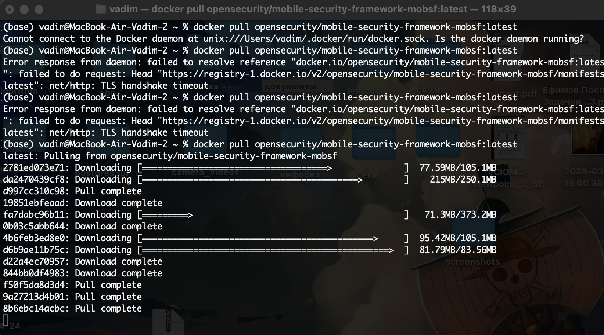

И запустил 
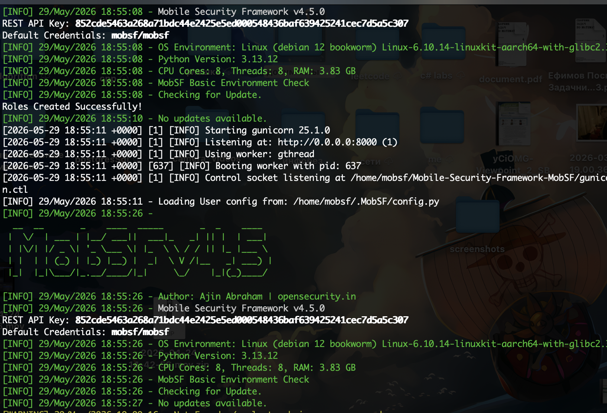

Входим как обычный пользователь по данным из логов
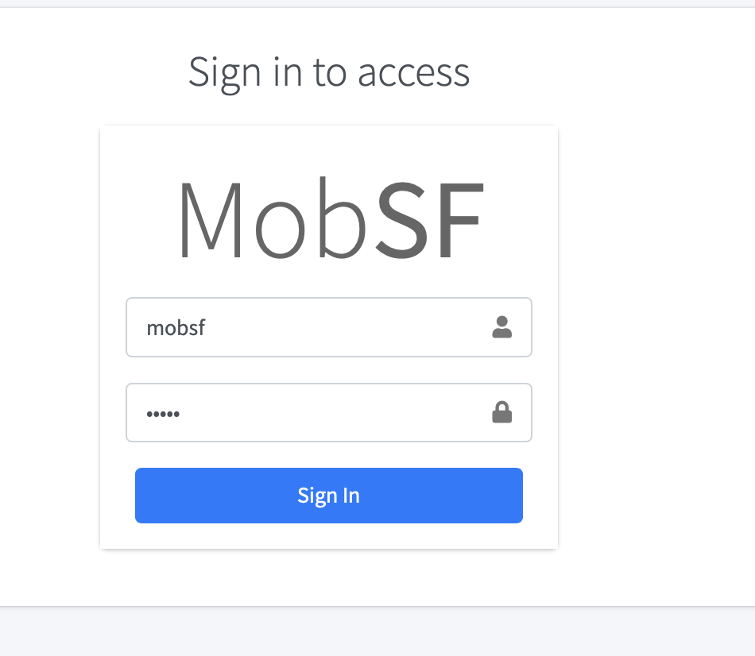

Для исследования взял это приложение
https://github.com/hax0rgb/InsecureShop

загружаем
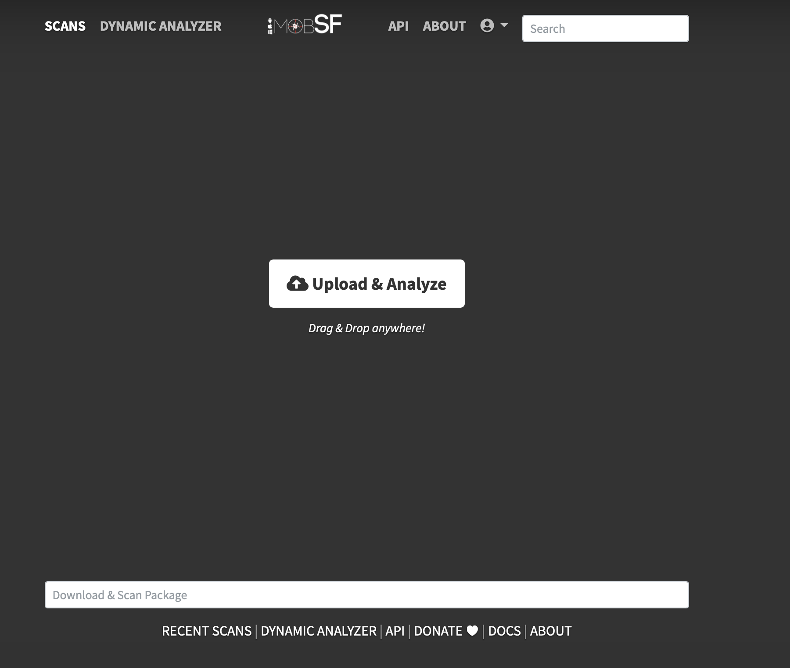

Ждем когда пройдет анализ
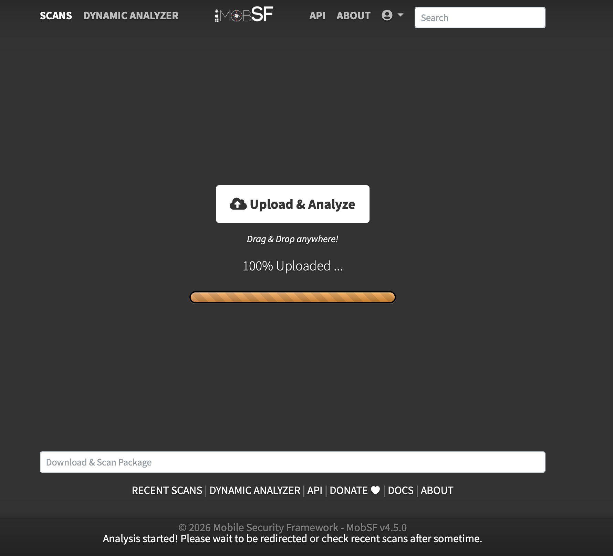

Анализ завершен
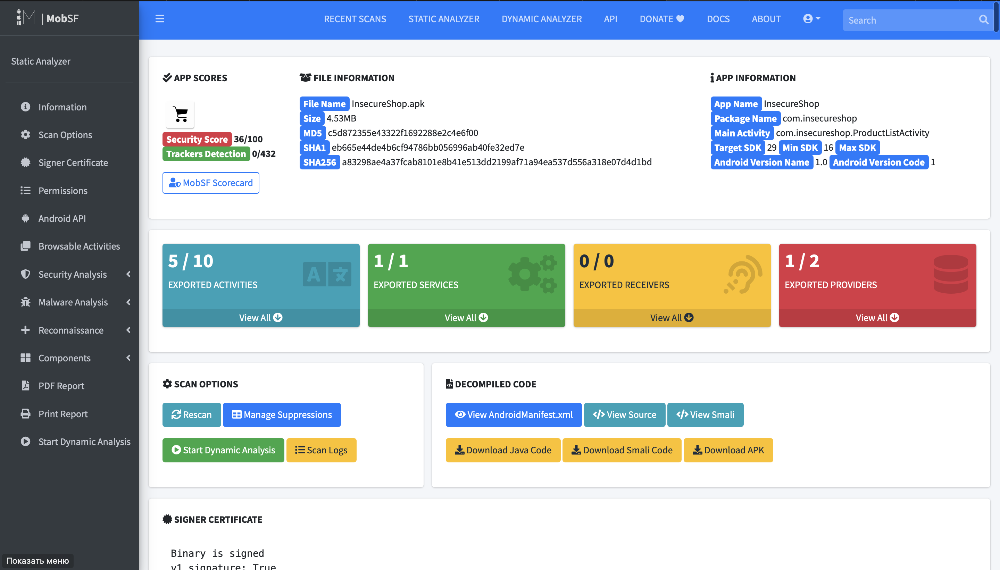

## app permissions со статусом dangerous 

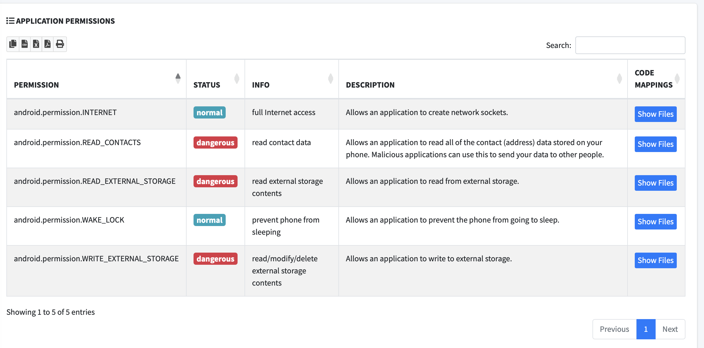
READ_CONTACTS - (dangerous)	Чтение контактов пользователя

READ_EXTERNAL_STORAGE - (dangerous)	Чтение файлов на SD-карте

WRITE_EXTERNAL_STORAGE - (dangerous) Запись/удаление файлов на SD-карте

Вывод: Приложению-магазину не нужен доступ к контактам и полная запись на внешний накопитель. Эти разрешения следует удалить или запрашивать в рантайме с объяснением.

network security не обнаружено
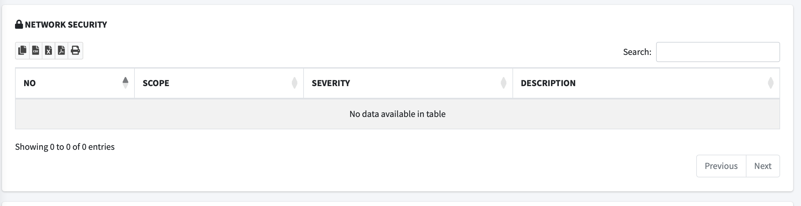

## code analysis

1) Insecure WebView Implementation. WebView ignores SSL Certificate errors and accept any SSL Certificate. This application is vulnerable to MITM attacks

WebView игнорирует ошибки SSL-сертификатов и принимает любые сертификаты. Приложение уязвимо к MITM-атакам — злоумышленник может перехватывать и подменять трафик

CWE: CWE-295: Improper Certificate Validation
OWASP Top 10: M3: Insecure Communication
OWASP MASVS: MSTG-NETWORK-3

2) Debug configuration enabled. Production builds must not be debuggable.

Отладка включена в приложении. Злоумышленник может подключить отладчик и анализировать работу приложения

CWE: CWE-919: Weaknesses in Mobile Applications
OWASP Top 10: M1: Improper Platform Usage
OWASP MASVS: MSTG-RESILIENCE-2

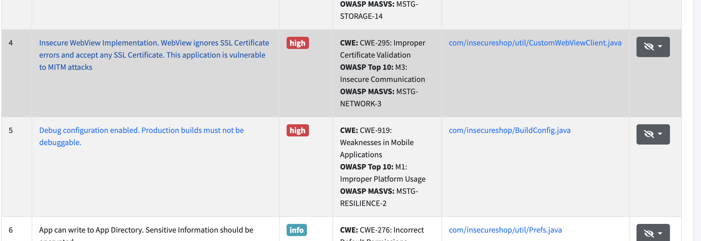

## Certificate Analysis

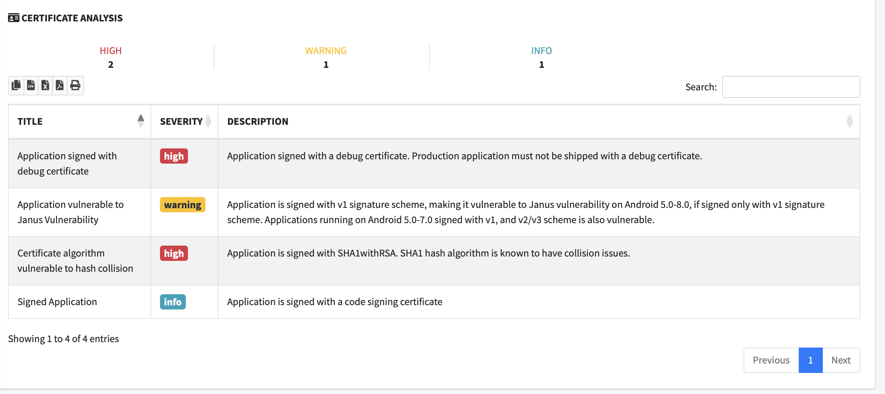

Application signed with debug certificate (high) - Релизное приложение подписано отладочным сертификатом (небезопасно)

Certificate algorithm vulnerable to hash collision (high) - Используется SHA1withRSA — алгоритм с известными коллизиями

## Manifest Analysis с severity high

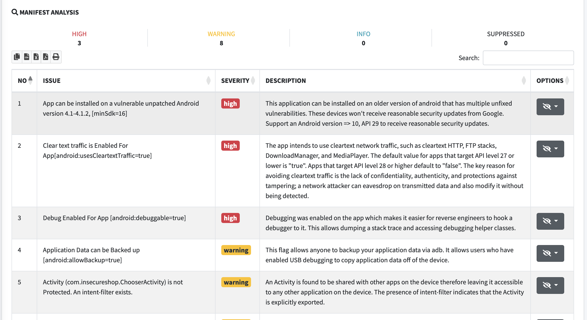

App can be installed on vulnerable Android 4.1-4.1.2 (minSdk=16) - Приложение можно установить на старые версии Android, которые не получают обновления безопасности

Clear text traffic Enabled (android:usesCleartextTraffic=true) - Tрафик может передаваться по HTTP без шифрования → перехват паролей (MITM)

Debug Enabled For App (android:debuggable=true) - К приложению можно подключить отладчик → реверс-инжиниринг

android:allowBackup=true (warning) — данные можно скопировать через adb

## Result

- Опасные разрешения — удалить READ_CONTACTS, READ_EXTERNAL_STORAGE, WRITE_EXTERNAL_STORAGE из манифеста. Они не нужны магазину.
- Старые версии Android — поднять minSdk с 16 до 29 (Android 10), чтобы приложение не ставилось на устаревшие устройства без обновлений.
- Нешифрованный трафик — выключить usesCleartextTraffic, перевести весь трафик на HTTPS, иначе пароли перехватываются.
- Отладка — выключить debuggable в релизной сборке, чтобы нельзя было подключить отладчик.
- WebView — убрать игнорирование SSL-ошибок, иначе MITM-атака.
- Подпись — подписать релиз своим ключом, а не дебаг-сертификатом.
- Алгоритм — заменить SHA1 на SHA-256.