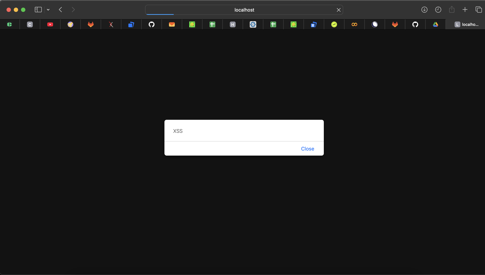

# Лабораторная работа 4

**Тема:** симуляция XSS-атаки.

---

# Часть 1. CVE за 2021 год

Я искал CVE за 2021 год по словам `XSS`, `PHP`, `WordPress`, `plugin`, `CWE-79`. Таких уязвимостей оказалось реально много.

По NVD за 2021 год получилось примерно **21957 CVE**. Число может чуть отличаться из-за фильтров, но главный вывод такой: даже за один год уязвимостей очень много.

Источник:  
https://nvd.nist.gov/vuln/search

---

## CVE-2021-29625 — Adminer XSS

Источники:  
https://nvd.nist.gov/vuln/detail/CVE-2021-29625  
https://github.com/advisories/GHSA-2v82-5746-vwqc

**Что за компонент:**  
Adminer- это PHP-инструмент для управления базами данных через браузер. Более легкая альтернатива phpMyAdmin. Через него можно смотреть таблицы, выполнять SQL-запросы и менять данные.

**Суть уязвимости:**  
В Adminer 4.6.1–4.8.0 была XSS-уязвимость в обработке ссылки `doc_link`. Данные недостаточно нормально экранировались и могли попасть в HTML.

**Причина:**  
Пользовательские данные выводились на страницу без безопасного экранирования.

**Последствия:**  
Можно было заставить браузер пользователя выполнить JavaScript-код. Неприятно, особенно если пользователь сидит под админкой.

---

## CVE-2021-34641 — SEOPress WordPress Plugin XSS

Источники:  
https://nvd.nist.gov/vuln/detail/CVE-2021-34641  
https://www.wordfence.com/vulnerability-advisories/

**Что за компонент:**  
SEOPress - это WordPress-плагин для SEO. Он помогает настраивать title, description, meta-теги, sitemap и др.

**Суть уязвимости:**  
В SEOPress 5.0.0–5.0.3 была Stored XSS. Авторизованный пользователь мог вставить вредоносный JS через поля title/description.

**Причина:**  
Ввод плохо проверялся и потом выводился в админке без нормальной обработки.

**Последствия:**  
Скрипт сохранялся и выполнялся у других пользователей, которые открывали эту страницу. То есть баг не одноразовый, а сохраняемый.

---

# Часть 2. XSS-атака на стенде

## Запуск

Сначала я скачал образ:

```bash
docker pull ket9/otus-devsecops-xss
```

Потом запустил контейнер:

```bash
docker run -d -p 8080:80 ket9/otus-devsecops-xss:latest
```

После этого открыл приложение:

```text
http://localhost:8080/
```

На странице были разные задания. Я выбрал **XSS-1**, потому что там есть поле для комментария и сразу понятно, куда можно попробовать вставить payload.

---

## Что я пробовал

Сначала я ввел обычный текст:

```text
hello test
```

Он появился на странице после сохранения. Значит, приложение берет мой ввод и вставляет его обратно в HTML.

Потом я ввел payload:

```html
<script>alert('XSS')</script>
```

После сохранения и обновления страницы появилось alert-окно с текстом `XSS`.



Вывод: JS реально выполнился в браузере, значит XSS есть.

---

# Найденная уязвимость

Тип: **Stored XSS**.

Почему Stored:

- payload вводится через форму;
- приложение его сохраняет;
- после обновления страницы скрипт снова выполняется;
- значит, код хранится в приложении или базе.

Также это относится к **CWE-79**- неправильная обработка пользовательского ввода при генерации HTML.

Если бы это был реальный сайт, через такую дыру можно было бы украсть cookie, токены, подменить страницу или сделать действие от имени пользователя.

---

# Меры предотвращения

Главная идея: нельзя просто брать пользовательский ввод и вставлять его в HTML как есть.

## 1. Экранировать вывод

Опасные символы надо заменять на безопасные HTML-сущности:

| Символ | Замена |
|---|---|
| `<` | `&lt;` |
| `>` | `&gt;` |
| `"` | `&quot;` |
| `'` | `&#039;` |
| `&` | `&amp;` |

В PHP можно сделать так:

```php
htmlspecialchars($comment, ENT_QUOTES, 'UTF-8');
```

Тогда `<script>alert('XSS')</script>` будет показан как текст, а не выполнится как код.

## 2. Фильтровать ввод

Для комментариев лучше запрещать или удалять:

- `<script>` и `</script>`;
- `onerror`, `onclick`, `onload`;
- `javascript:` в ссылках;
- лишние HTML-теги, если они не нужны.

Если HTML в комментариях не нужен, проще разрешить только обычный текст. Меньше свободы- меньше шансов словить баг.

## 3. Использовать белый список

Черный список легко обойти, потому что payload-ов миллион. Лучше разрешать только безопасные символы: буквы, цифры, пробелы и обычную пунктуацию.

## 4. Добавить CSP

Можно добавить заголовок:

```http
Content-Security-Policy: default-src 'self'; script-src 'self'
```

Это не фиксит проблему полностью, но сильно усложняет выполнение inline-скриптов.

## 5. Проверять данные на сервере

Проверки только в браузере не считаются защитой, потому что их легко обойти. Нормальная обработка должна быть именно на сервере.

---

# Итог

Я нашел две CVE за 2021 год с XSS в PHP-компонентах и провел атаку на тестовом стенде. Payload:
