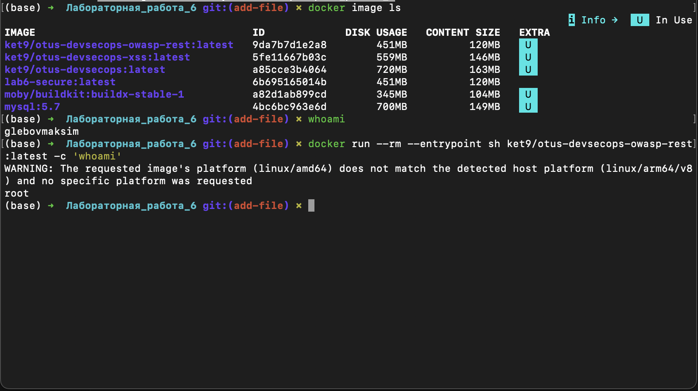
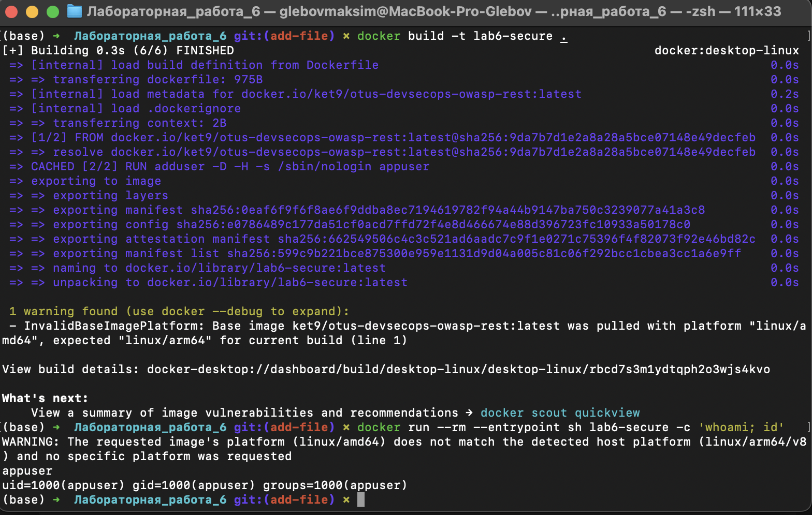

# Лабораторная работа 6

**Тема:** базовая настройка безопасности Docker-контейнера.

---

# Часть 1. Проверка пользователя в контейнере

Для работы я выбрал образ:

```text
ket9/otus-devsecops-owasp-rest:latest
```

Сначала посмотрел локальные образы:

```bash
docker image ls
```

На машине уже были образы `ket9/otus-devsecops-owasp-rest`, `ket9/otus-devsecops-xss`, `ket9/otus-devsecops` и `mysql:5.7`.

До запуска контейнера выполнил:

```bash
whoami
```

Результат:

```text
glebovmaksim
```

Потом проверил пользователя внутри контейнера:

```bash
docker run --rm --entrypoint sh ket9/otus-devsecops-owasp-rest:latest -c 'whoami'
```

Результат:

```text
root
```

Вывод: базовый контейнер запускается от пользователя `root`, это небезопасно.



---

# Часть 2. Dockerfile с non-root пользователем

Я написал Dockerfile на основе выбранного образа:

```dockerfile
FROM ket9/otus-devsecops-owasp-rest:latest

RUN adduser -D -H -s /sbin/nologin appuser

USER appuser

EXPOSE 8080
```

Полный файл лежит рядом с отчетом:

```text
Dockerfile
```

Собрал образ:

```bash
docker build -t lab6-secure .
```

Проверил пользователя внутри нового контейнера:

```bash
docker run --rm --entrypoint sh lab6-secure -c 'whoami; id'
```

Результат:

```text
appuser
uid=1000(appuser) gid=1000(appuser) groups=1000(appuser)
```

Вывод: теперь контейнер запускается не от `root`.



---

# Часть 3. Сканирование образа Trivy

Для проверки я использовал Trivy:

```bash
trivy image --scanners vuln --severity HIGH,CRITICAL --ignore-unfixed \
  ket9/otus-devsecops-owasp-rest:latest
```

Краткий результат:

| Уровень | Количество |
|---|---:|
| HIGH | 62 |
| CRITICAL | 8 |
| Всего | 70 |

По целям:

| Цель | Количество |
|---|---:|
| Alpine 3.14.2 | 56 |
| Python packages | 14 |

Trivy также показал предупреждение, что `Alpine 3.14.2` больше не поддерживается. Значит, для этой версии уже не выпускаются security updates, и использовать такой образ в production нельзя.

Примеры найденных уязвимостей:

- `CVE-2021-42378` в `busybox`;
- `CVE-2022-22822` в `expat`;
- `CVE-2023-30861` в `Flask`;
- уязвимости в `PyJWT`, `Werkzeug`, `setuptools`, `urllib3`.

---

# Вывод

Исходный контейнер запускался от `root`, поэтому я собрал новый образ с пользователем `appuser`. Это снижает риск, если приложение внутри контейнера будет скомпрометировано.

Сканирование Trivy показало, что выбранный образ небезопасен: старая Alpine 3.14.2 уже не поддерживается, а в системных и Python-пакетах есть 70 уязвимостей уровня `HIGH` и `CRITICAL`.

Что нужно сделать для улучшения:

- обновить базовый образ до поддерживаемой версии Alpine;
- обновить Python и зависимости приложения;
- запускать контейнер от non-root пользователя;
- запускать контейнер с ограничениями `--read-only`, `--cap-drop ALL`, `no-new-privileges`;
- добавить сканирование Trivy в CI/CD.
