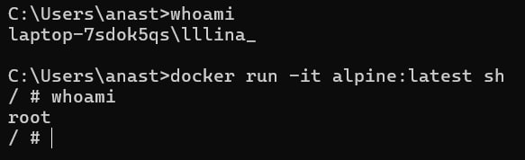
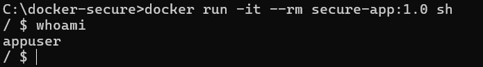
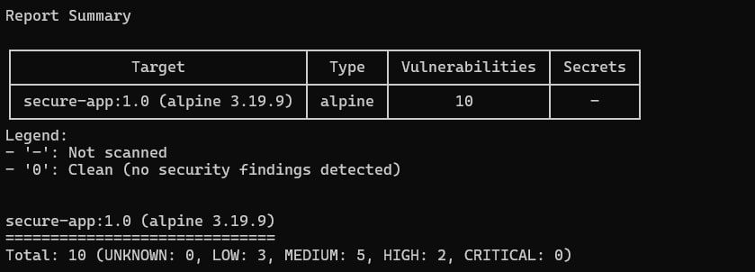
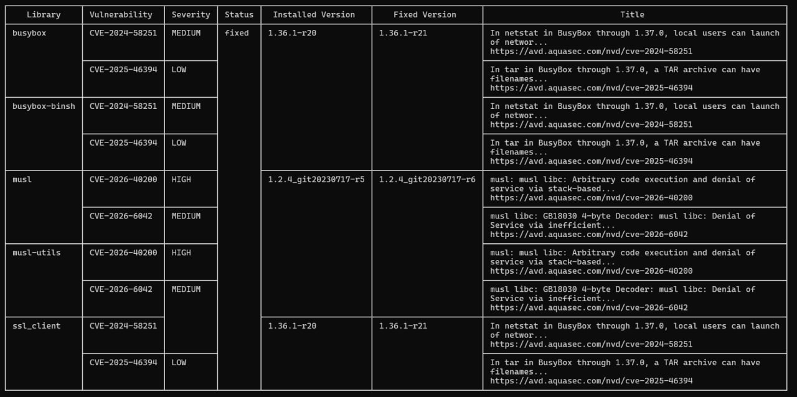

# ЛР 5. Базовая настройка безопасности docker-контейнера

## Часть 1

## Часть 2

## Часть 3

### По результатам сканирования Trivy в образе обнаружено 10 уязвимостей: 2 HIGH, 5 MEDIUM и 3 LOW. Критических уязвимостей нет.

## Основные проблемы:

- 2 HIGH уязвимости в musl libc (CVE-2026-40200) — риск выполнения произвольного кода и DoS-атак

- 5 MEDIUM уязвимостей в busybox и musl — уязвимости в netstat и GB18030 декодере

- 3 LOW уязвимости в busybox — проблемы с обработкой TAR архивов

*Вывод:* Образ небезопасен для production использования, потому что есть HIGH уязвимости. Нужно обновление Alpine (сейчас 3.19.9, а доступна 3.19.10+) и пересборка контейнера