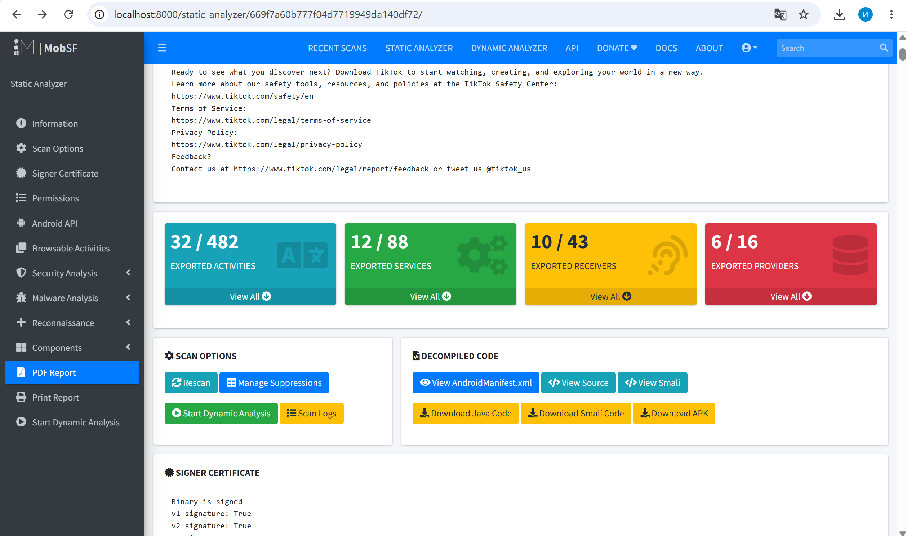

**Сделала задание, которое вы предложили вместо основного, потому что так и не заработал пайплайн** 

# Отчёт SAST-анализа моб. приложения (TikTok)

## 1. Сводка результатов сканирования

 

## 2. App Permissions - Dangerous

| Разрешение | Риск |
|---|---|
| ACCESS_COARSE_LOCATION | Приблизительное местоположение (отслеживание пользователя) |
| ACCESS_FINE_LOCATION | Точное GPS (определение местонахождения в реальном времени) |
| ACCESS_MEDIA_LOCATION | Геолокация из EXIF медиафайлов |
| BLUETOOTH_ADVERTISE | Реклама ближайшим блютуз устройствам |
| BLUETOOTH_CONNECT | Подключение к сопряжённым устройствам |

## 3. Network Security - HIGH

| № | Проблема | Severity |
|---|---|---|
| 1 | Base config разрешает cleartext (HTTP) для всех доменов | HIGH |
| 2 | Base config обходит certificate pinning | HIGH |
| 3 | Domain config разрешает cleartext для zero-rating.tiktok.com | HIGH |
| 4 | Base config доверяет системным сертификатам | WARNING |

## 4. Manifest Analysis - HIGH

| № | Проблема | Severity |
|---|---|---|
| 1 | minSdk=23 - приложение работает на Android 6.0, который не получает патчи безопасности | HIGH |
| 2 | android:usesCleartextTraffic=true - незашифрованный HTTP трафик разрешён глобально | HIGH |

## 5. Code Analysis - HIGH

| № | Проблема | CWE | Файл | Severity |
|---|---|---|---|---|
| 7 | ECB-режим шифрования - одинаковый шифротекст для одинаковых блоков | CWE-327 | X/C1531540pxZ.java | HIGH |
| 9 | Слабый алгоритм шифрования | CWE-327 | com/heytap/mcssdk/utils/c.java | HIGH |
| 2 | Запись чувствительных данных в логи | CWE-532 | X/C1036660d5N.java | INFO |

## 6. План митигации

**Cleartext HTTP + certificate pinning bypass**
- Установить `android:usesCleartextTraffic=false` в AndroidManifest.xml
- Убрать из Network Security Config разрешение cleartext для всех доменов
- Удалить bypass certificate pinning, внедрить Public Key Pinning для API-доменов

**Слабая криптография (CWE-327)**
- Заменить ECB на `AES/GCM/NoPadding` с уникальным IV для каждой операции
- Заменить слабые алгоритмы на AES-256 или ChaCha20-Poly1305

**minSdk=23**
- Поднять `minSdkVersion` до 29 (Android 10), Android 6.x не получает патчи с 2019 года

**Dangerous permissions**
- Запрашивать геолокацию только в момент использования функции (геотег к видео)
- Оценить необходимость BLUETOOTH_ADVERTISE/CONNECT, может быть можно удалить