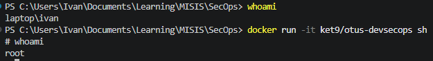
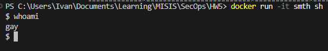
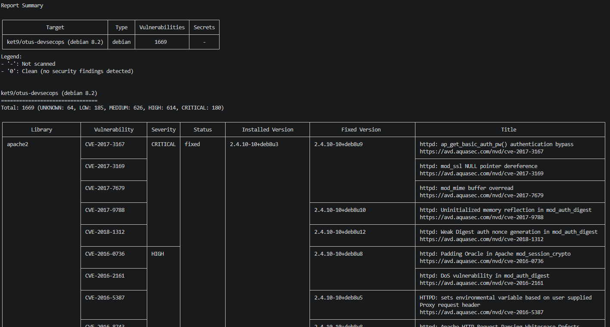

# Лабораторная работа № 5

## Часть 1

## Часть 2

## Часть 3

HOLY FUCK THAT IS A LOT

\* и там ещё огромная таблица внизу

Образ, конечно, жутко дырявый и в прод его выкатывать, конечно, можно, но, вероятно, только один раз.
Судя по всему, большинство этих уязвимостей — давным давно обнаруженные и пропатченные дыры в разных компонентах образа.
Вывод, который можно сделать — надо по возможности обновлять используемые компоненты до последней версии и стараться минимизировать их количество.
