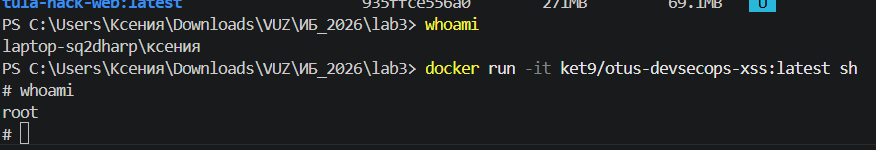
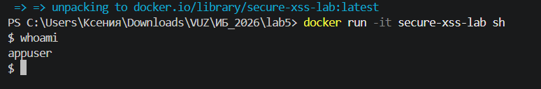
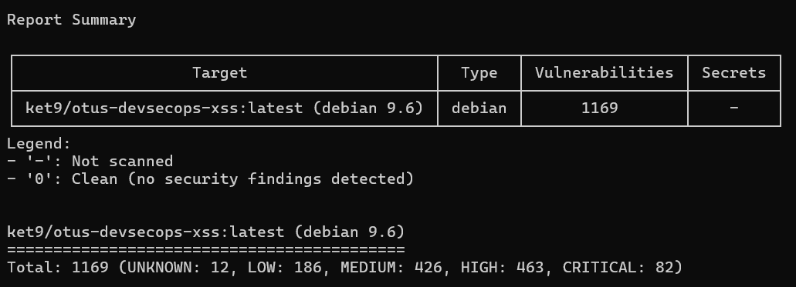
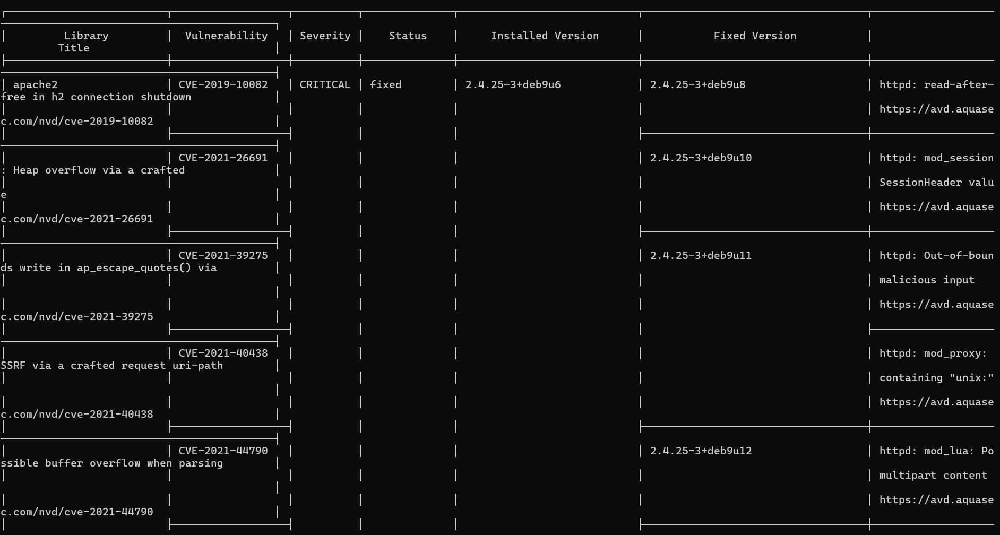

## Часть 1. Проверка пользователя по умолчанию

1. Скачала образ из предыдущих лаб:
```bash
docker pull ket9/otus-devsecops-xss:latest
```

2. Посмотрела список образов:
```bash
docker image ls
```
Вывод показал несколько образов, включая `ket9/otus-devsecops-xss`.

3. Выполнила `whoami` на машине:
```bash
$ whoami
laptop-sq2dharp\ксения
```

4. Запустила оболочку внутри контейнера:
```bash
docker run -it ket9/otus-devsecops-xss:latest sh
```

5. Внутри контейнера снова выполнила `whoami`:
```sh
# whoami
root
```



По умолчанию контейнеры запускаются от имени root. Если злоумышленник получит доступ к процессу внутри контейнера, он будет иметь максимальные привилегии.

---

## Часть 2. Создание безопасного Dockerfile

**Dockerfile:**
[Dockerfile](Dockerfile)

**Проверка:**
```bash
docker build -t secure-xss-lab .

docker run -it secure-xss-lab sh
$ whoami
appuser
```



---

## Часть 3. Сканирование образа на уязвимости

**Выбранный инструмент:** Trivy (проще в установке)

**Запуск:**
```bash
docker run --rm -v /var/run/docker.sock:/var/run/docker.sock aquasec/trivy image ket9/otus-devsecops-xss:latest
```





**Выводы про безопасность образа:**

- Критическое количество уязвимостей. Честно говоря, цифра 1169 впечатлила, особенно 82 уязвимости уровня CRITICAL. Это значит, что образ использовать в реальной работе нельзя без предварительной подготовки.

- Причина проблем. Судя по количеству уязвимостей в системных пакетах (типа apache2, curl, libc), образ собран на основе старой версии ос и давно не обновлялся.

- Реальные риски. 82 критических уязвимости - высокий риск удаленного выполнения кода или утечки данных. Например, уязвимости в apache2 или openssl позволяют злоумышленнику полностью захватить контейнер.