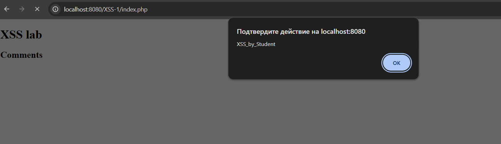

# Отчет по лабораторной работе №3

## Часть I. Анализ уязвимостей (XSS в PHP)

### 1. Общее количество CVE за 2021 год

Для определения точного числа уязвимостей использовались данные официальных отчетов **CVE Program** и агрегатора **CVE Details**. 

* **Количество за 2021 год:** ~20 171 уязвимость.
* **Источник:** [CVE Details - Vulnerabilities by Year](https://www.cvedetails.com/browse-by-date.php)

Динамика регистраций по кварталам (согласно CVE Program Report 2021):
* **Q1:** 4 419 | **Q2:** 5 000 | **Q3:** 5 421 | **Q4:** 5 331.

---

### 2. Подробный анализ выбранных CVE

#### А. CVE-2021-29447 (Symfony Framework / Twig)
* **Источник:** [NVD CVE-2021-29447](https://nvd.nist.gov/vuln/detail/CVE-2021-29447)
* **Компонент:** Symfony (PHP-фреймворк), модуль шаблонизации **Twig**.
* **Назначение:** Symfony — каркас для разработки веб-приложений. Компонент **Twig** отвечает за генерацию HTML-страниц, вставляя данные из базы в шаблоны.
* **Причина уязвимости:** Недостаточное экранирование выходных данных при специфических конфигурациях фильтров.
* **Последствия:** Выполнение произвольного JS-кода, кража сессионных кук (Session Hijacking).

#### Б. CVE-2021-40926 (getID3 Library)
* **Источник:** [NVD CVE-2021-40926](https://nvd.nist.gov/vuln/detail/CVE-2021-40926)
* **Компонент:** Библиотека **getID3**, файл `demos/demo.mysqli.php`.
* **Назначение:** PHP-библиотека для извлечения метаданных из медиафайлов (MP3, MP4 и др.). Используется в музыкальных порталах для чтения тегов (артист, альбом).
* **Причина уязвимости:** Отсутствие санитизации параметра `showtagfiles`, который выводился напрямую на страницу.
* **Последствия:** Подмена контента страницы (Deface), выполнение скриптов в браузере клиента.

#### В. CVE-2021-24151 (Social Warfare Plugin)
* **Источник:** [NVD CVE-2021-24151](https://nvd.nist.gov/vuln/detail/CVE-2021-24151)
* **Компонент:** Плагин **Social Warfare** (версии до 4.2.1) для WordPress.
* **Назначение:** PHP-плагин для интеграции кнопок социальных сетей. Он позволяет владельцам сайтов настраивать отображение счетчиков «лайков» и репостов, а также оптимизировать мета-данные для соцсетей.
* **Причина уязвимости:** **Stored XSS**. Плагин не выполнял должную проверку и санитизацию (очистку) данных в настройках «Twitter Username». Это позволяло аутентифицированному пользователю (например, с правами контрибьютора) сохранить вредоносный скрипт в базе данных.
* **Последствия:** Скрипт выполняется в браузере любого посетителя страницы, где отображаются кнопки плагина. Это ведет к краже cookie-файлов сессии и потенциальному захвату прав администратора.
---

### Вывод

Анализ статистики за 2021 год подтверждает, что XSS остается массовой проблемой для PHP-разработки. Ошибки встречаются как в крупных фреймворках (Symfony), так и в популярных плагинах (Social Warfare). Это подчеркивает необходимость обязательной фильтрации входных данных и экранирования вывода.

---

## Часть II. Симуляция XSS-атаки на стенде

### 1. Ход выполнения и анализ работы приложения

**Шаг 1: Подготовка окружения**
Я скачал и запустил уязвимый Docker-образ:
```bash
docker pull ket9/otus-devsecops-xss
docker run -d -p 8080:80 ket9/otus-devsecops-xss:latest
```
Стенд открыт по адресу `http://localhost:8080/`. Для атаки был выбран раздел **XSS-1**, содержащий форму ввода комментариев.

**Шаг 2: Поиск точки входа и внедрение кода**
В ходе тестирования было замечено, что комментарии сохраняются и отображаются всем пользователям. В поле `comment` был введен следующий payload:
```html
<script>alert('XSS_by_Student')</script>
```

**Шаг 3: Наблюдение результатов**
После нажатия "Save Data" браузер выполнил скрипт, отобразив модальное окно.



При обновлении страницы окно `alert` появлялось снова. Анализ исходного кода показал, что сервер записывает данные в файл и выводит их без обработки:
```html
<h2>Comments</h2><p><script>alert('XSS_by_Student')</script></p><hr />
```

### 2. Тип найденной уязвимости

Обнаруженная уязвимость — **Stored XSS (Хранимый XSS)**.
Вредоносный код сохраняется на сервере, что делает атаку крайне опасной: любой пользователь, зашедший на страницу, автоматически становится жертвой.

**Последствия:**
* Кража сессионных данных (`document.cookie`).
* Фишинг и подмена интерфейса сайта.
* Выполнение действий от имени администратора.

### 3. Меры предотвращения

Для защиты приложения необходимо внедрить следующие механизмы:

1. **Экранирование вывода (Output Encoding):** Замена спецсимволов на HTML-сущности. В PHP:
   ```php
   echo htmlspecialchars($comment, ENT_QUOTES, 'UTF-8');
   ```
   Символы `<`, `>`, `"`, `'`, `&` должны превращаться в `&lt;`, `&gt;`, `&quot;`, `&#039;` и `&amp;`.

2. **Content Security Policy (CSP):** Настройка HTTP-заголовка для запрета исполнения inline-скриптов:
   `Content-Security-Policy: default-src 'self';`

3. **Безопасность Cookie:** Использование флага `HttpOnly` для защиты кук от чтения через JavaScript.