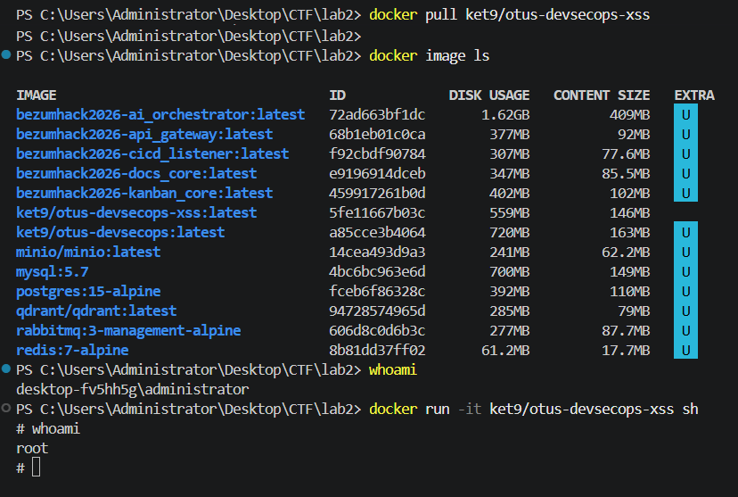
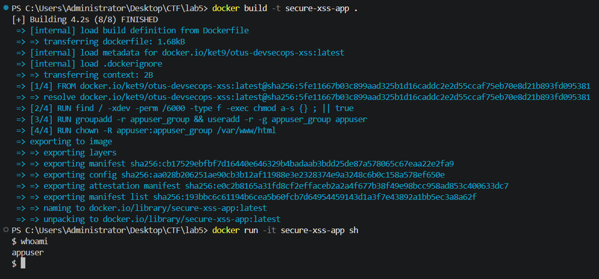
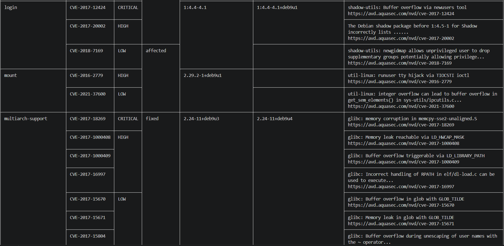

# Отчет по лабораторной работе №5

## Часть I.

**Ход выполнения:**

---

## Часть II.

**Ход выполнения:**

---

## Часть III. Сканирование безопасности (Trivy)

Для проверки базового образа на наличие известных уязвимостей (CVE) был использован сканер **Trivy** от Aqua Security. 

С помощью Trivy был просканирован оригинальный образ `ket9/otus-devsecops-xss:latest`. 

**Результаты и анализ вывода:**
Сканер проанализировал слои ОС (Debian/Ubuntu) и установленные пакеты (PHP, Apache). Вывод показал наличие ряда уязвимостей, разбитых по уровню критичности (Low, Medium, High, Critical).

*Выводы:*
Образ содержит критические уязвимости на уровне системных библиотек операционной системы и зависимостей, так как он специально создавался как уязвимый стенд. В реальном Production-окружении перед деплоем такого образа необходимо:
1. Заменить базовый образ на актуальный.
2. Добавить в пайплайн сборки команды обновления.
3. Внедрить Trivy в CI/CD пайплайн с блокировкой сборки (fail-build) при обнаружении уязвимостей уровня High и Critical.

