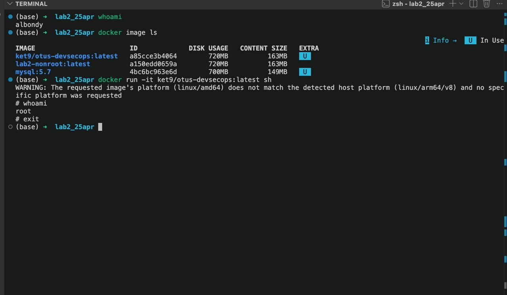
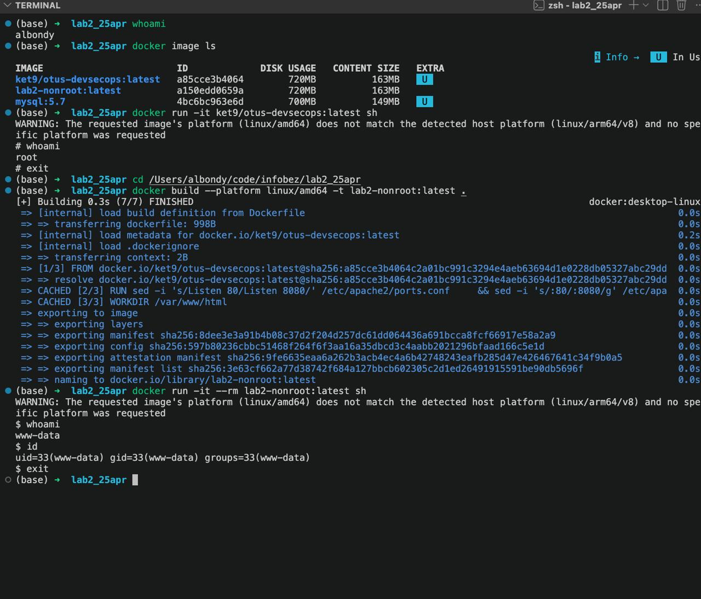
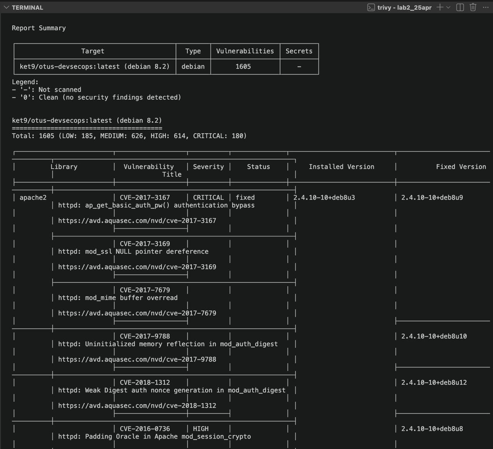

# Часть I

Взял образ из прошлой лабы: `ket9/otus-devsecops:latest`. Сначала `whoami` на хосте, получил `albondy`.

Дальше `docker image ls`:

```
IMAGE                        ID             DISK USAGE   CONTENT SIZE
ket9/otus-devsecops:latest   a85cce3b4064   720MB        163MB
lab2-nonroot:latest          bd397b4235ca   720MB        163MB
mysql:5.7                    4bc6bc963e6d   700MB        149MB
```

Запускаю `sh` внутри контейнера: `docker run -it ket9/otus-devsecops:latest sh`. Снова `whoami`, теперь уже `root`.

Посмотрим че покажет whoami. По дефолту в контейнере все процессы запускаются от рута. В общем не оч, из коробки ниче не настроено.



# Часть II

Dockerfile поверх того же образа:

```dockerfile
FROM ket9/otus-devsecops:latest

RUN sed -i 's/Listen 80/Listen 8080/' /etc/apache2/ports.conf \
    && sed -i 's/:80/:8080/g' /etc/apache2/sites-available/000-default.conf \
    && chown -R www-data:www-data /var/www/html /var/log/apache2 /var/run/apache2 /var/lock/apache2

USER www-data
WORKDIR /var/www/html
EXPOSE 8080
CMD ["apache2-foreground"]
```

Поменял немного и закинул на www-data. Юзер `www-data` уже есть в базовом образе apache, отдельно не создавал. Apache от не-рута не может слушать порт 80, поэтому переключил на 8080 и раздал права на нужные директории.

Собрал и проверил что юзер сменился:

```
$ docker build --platform linux/amd64 -t lab2-nonroot:latest .
$ docker run -it --rm lab2-nonroot:latest sh
$ whoami
www-data
$ id
uid=33(www-data) gid=33(www-data) groups=33(www-data)
```



В комментариях Dockerfile перечислил что ещё можно докрутить: заменить базу на актуальную (jessie EOL с 2020), добавить `HEALTHCHECK`, прикрутить `.dockerignore`. Из флагов запуска полезные `--read-only` (FS на чтение), `--no-new-privileges` (запрет эскалации), `--cap-drop=ALL` (режем все капы), `-u 33:33` (форсим юзера снаружи).

# Часть III

Прогнал через Trivy:

```
trivy image --severity LOW,MEDIUM,HIGH,CRITICAL ket9/otus-devsecops:latest
```

Сводка:

```
ket9/otus-devsecops:latest (debian 8.2)
Total: 1605 (LOW: 185, MEDIUM: 626, HIGH: 614, CRITICAL: 180)
```



Trivy сразу кидает варн `This OS version is no longer supported by the distribution`. Debian 8 (jessie) ушёл в EOL в июне 2020. База страше моего опыта разработки.

Цифры конечно пугают, но половина это апач и его подмудули которые трижды выстреливают по одной cve. `apache2`, `apache2-bin`, `apache2-data` считаются как три разных пакета, хотя источник один.

Чтобы починить можно сменить базу на актуальную (закроет большую часть LOW/MEDIUM из системных либ), накатить `apt-get upgrade` поверх, и подключить Trivy в CI чтобы билд падал на CRITICAL/HIGH.

Сканер довольно полезная штука для каких то явных уязвимостей.
