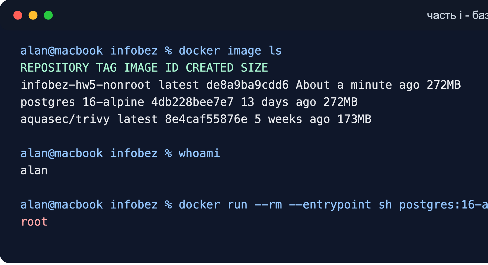
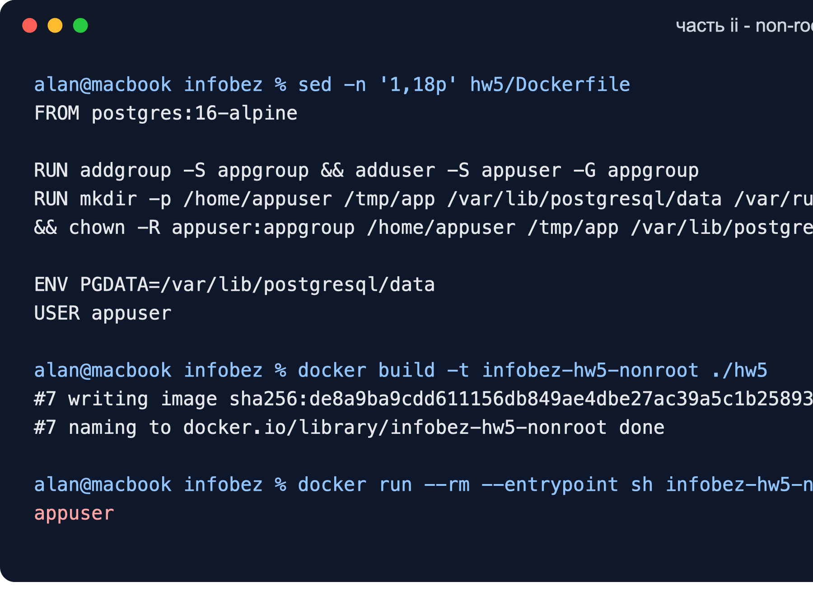
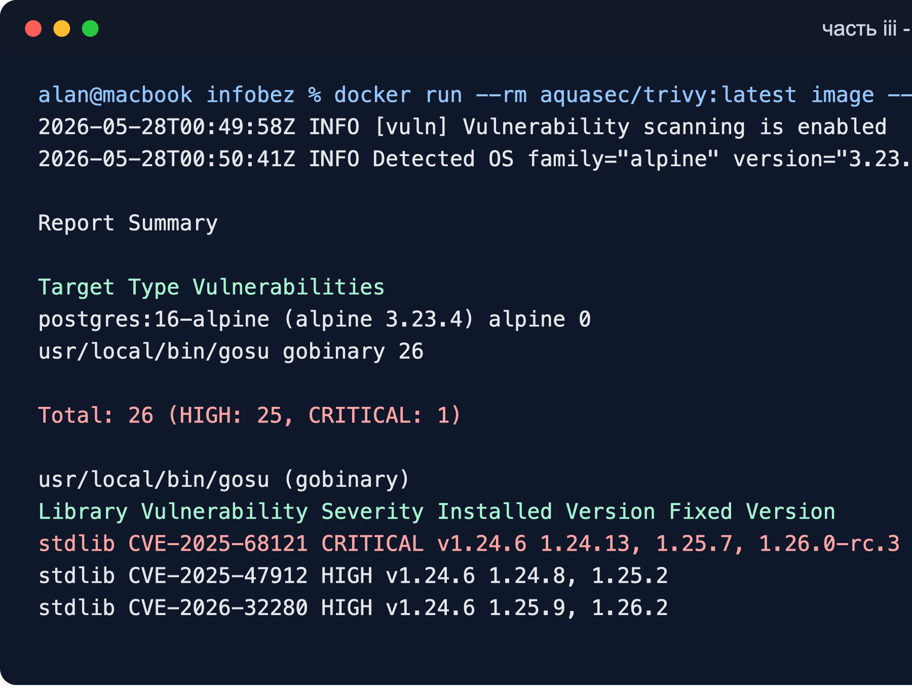

# лабораторная работа №5

студент: Халибеков Алан, БИВТ-24-9

## ход выполнения

в этой работе нужно было проверить базовую безопасность docker-контейнера: посмотреть, от какого пользователя запускается базовый образ, собрать свой образ с не-root пользователем и проверить его сканером уязвимостей.

для работы я выбрал официальный образ из docker hub:

```text
postgres:16-alpine
```

образ удобен для задания, потому что он небольшой, основан на alpine и при этом является реальным сервисом, а не пустым тестовым контейнером.

## часть i

сначала я посмотрел, какие docker-образы есть локально:

```bash
docker image ls
```

в списке был выбранный образ:

```text
REPOSITORY             TAG          IMAGE ID       CREATED        SIZE
postgres               16-alpine    4db228bee7e7   13 days ago    272MB
```

потом проверил пользователя на хосте и внутри контейнера:

```bash
whoami
alan

docker run --rm --entrypoint sh postgres:16-alpine -c whoami
root
```

получилось, что на хосте используется обычный пользователь, а внутри базового контейнера команда `whoami` показывает `root`. это не лучший вариант с точки зрения безопасности, потому что при ошибке в приложении или неправильном монтировании файлов атакующий получает больше возможностей внутри контейнера.

скриншот выполнения первой части:



## часть ii

для второй части я написал Dockerfile на основе того же образа. в нем создается отдельный пользователь `appuser`, под него готовятся рабочие каталоги PostgreSQL, после чего через `USER appuser` контейнер переключается с root на обычного пользователя.

```dockerfile
FROM postgres:16-alpine

RUN addgroup -S appgroup && adduser -S appuser -G appgroup
RUN mkdir -p /home/appuser /tmp/app /var/lib/postgresql/data /var/run/postgresql \
    && chown -R appuser:appgroup /home/appuser /tmp/app /var/lib/postgresql /var/run/postgresql

ENV PGDATA=/var/lib/postgresql/data

USER appuser

# дополнительные настройки безопасности при запуске контейнера:
# docker run --read-only --cap-drop ALL --security-opt no-new-privileges
# docker run --memory 256m --cpus 1
# docker run -p 127.0.0.1:5432:5432
# также лучше не передавать секреты через аргументы командной строки
```

после этого я собрал образ:

```bash
docker build -t infobez-hw5-nonroot ./hw5
```

сборка завершилась успешно:

```text
writing image sha256:de8a9ba9cdd611156db849ae4dbe27ac39a5c1b258936c525eec11dacc7f5a9a done
naming to docker.io/library/infobez-hw5-nonroot done
```

проверка пользователя внутри нового контейнера:

```bash
docker run --rm --entrypoint sh infobez-hw5-nonroot -c whoami
appuser
```

теперь контейнер открывает shell уже не от root, а от пользователя `appuser`. дополнительно я проверил обычный запуск контейнера с переменной `POSTGRES_PASSWORD`, PostgreSQL стартовал и в логах дошел до состояния `database system is ready to accept connections`.

скриншот сборки и проверки пользователя:



дополнительные настройки безопасности, которые я указал в комментариях Dockerfile:

- `--read-only` - запуск файловой системы контейнера только на чтение;
- `--cap-drop ALL` - отключение лишних linux capabilities;
- `--security-opt no-new-privileges` - запрет повышения привилегий внутри контейнера;
- `--memory 256m` и `--cpus 1` - ограничение ресурсов, чтобы контейнер не мог забрать всю машину;
- `-p 127.0.0.1:5432:5432` - публикация порта только на localhost, а не на все сетевые интерфейсы;
- секреты лучше передавать через защищенные переменные окружения или secret manager, а не писать в командной строке.

## часть iii

для сканирования я использовал trivy:

```bash
docker run --rm aquasec/trivy:latest image --scanners vuln --timeout 10m --severity HIGH,CRITICAL postgres:16-alpine
```

первый запуск с настройками по умолчанию шел слишком долго на анализе файлов, поэтому для части с уязвимостями я явно оставил scanner `vuln`. для задания этого достаточно, потому что нужно проверить образ на high и critical уязвимости.

сводка по результатам:

```text
Report Summary

postgres:16-alpine (alpine 3.23.4)
Total: 0

usr/local/bin/gosu (gobinary)
Total: 26 (HIGH: 25, CRITICAL: 1)
```

скриншот вывода trivy:



по системным пакетам alpine scanner не нашел high или critical уязвимостей. это хороший признак: базовая часть образа выглядит достаточно свежей.

основные проблемы нашлись в бинарном файле `gosu`, точнее в встроенной go standard library версии `v1.24.6`. trivy показал 26 уязвимостей: 25 high и 1 critical. самая важная находка:

```text
CVE-2025-68121
Severity: CRITICAL
Package: stdlib
Installed Version: v1.24.6
Fixed Version: 1.24.13, 1.25.7, 1.26.0-rc.3
Title: crypto/tls: Incorrect certificate validation during TLS session resumption
```

также были high-уязвимости в пакетах go standard library, например в `net/url`, `net/http`, `crypto/x509`, `encoding/pem`, `archive/tar`, `archive/zip` и `os`. почти для всех проблем trivy указывает исправленные версии go.

## вывод

по первой части видно, что базовый контейнер при запуске shell работает от root. это плохая привычка для production-контейнеров, даже если сам сервис потом может сбрасывать привилегии.

во второй части я собрал свой образ и переключил его на отдельного пользователя `appuser`. проверка `whoami` подтвердила, что root больше не используется для shell внутри контейнера. также в Dockerfile указал дополнительные флаги безопасного запуска: read-only filesystem, cap-drop, no-new-privileges, ограничения cpu и памяти, а также привязку порта только к localhost.

по результатам trivy сам alpine-слой выглядит нормально, но в `gosu` есть high и critical уязвимости из go standard library. поэтому образ нельзя просто считать полностью безопасным. правильное действие - обновить базовый образ, когда выйдет версия с исправленным `gosu`, либо пересобрать вспомогательный бинарник на исправленной версии go. еще такой scan нужно добавить в ci/cd, чтобы новые уязвимости ловились автоматически.
