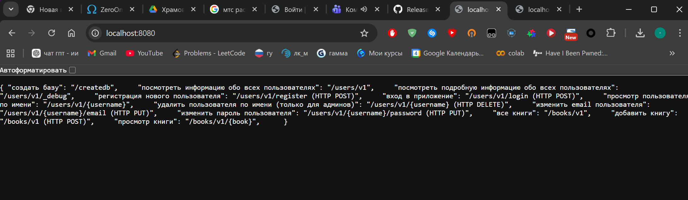
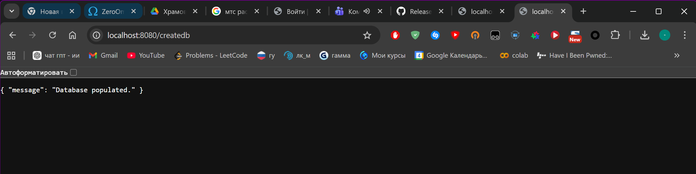
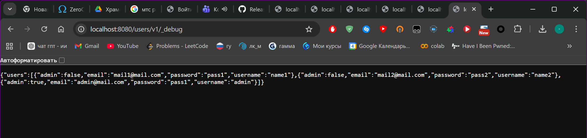
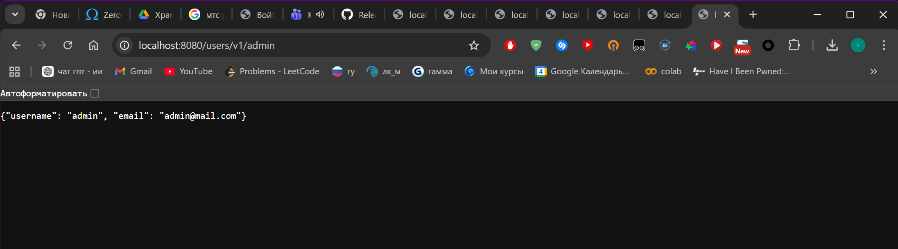

# Лабораторная работа №3: OWASP Top 10 REST API

## Часть I

Описание найденных CVE: [cve_report.txt](cve_report.txt)

## Часть II. Практика

Скачал и запустил уязвимый образ:

```bash
docker pull ket9/otus-devsecops-owasp-rest
docker run -d -p 8080:8080 ket9/otus-devsecops-owasp-rest:latest
```

Открыл http://localhost:8080/ и увидел список доступных эндпоинтов. Затем перешёл на http://localhost:8080/createdb чтобы заполнить базу данных.





На главной странице среди эндпоинтов заметил подозрительный: /users/v1/_debug с описанием "посмотреть подробную информацию обо всех пользователях". Решил проверить его первым.

Открыл в браузере http://localhost:8080/users/v1/_debug без какой-либо авторизации и получил:

```json
{"users":[
  {"admin":false,"email":"mail1@mail.com","password":"pass1","username":"name1"},
  {"admin":false,"email":"mail2@mail.com","password":"pass2","username":"name2"},
  {"admin":true,"email":"admin@mail.com","password":"pass1","username":"admin"}
]}
```

Сервер отдал данные всех пользователей включая пароли в открытом виде и флаг admin. Никакой авторизации не потребовалось.



Зная имя администратора, попробовал обратиться к его профилю напрямую: http://localhost:8080/users/v1/admin

Ответ:

```json
{"username": "admin", "email": "admin@mail.com"}
```

Данные отдались без авторизации. Этот эндпоинт хотя бы не показывает пароль, но доступ к чужому профилю без входа в систему это тоже проблема.



## Найденная уязвимость

Тип: API3 — Broken Object Property Level Authorization (Excessive Data Exposure)

Эндпоинт /users/v1/_debug доступен без авторизации и возвращает полные данные всех пользователей включая пароли в открытом виде. Разработчики оставили отладочный эндпоинт открытым, а пароли не хэшируются вообще.

Дополнительно присутствует API1 — Broken Object Level Authorization: данные любого пользователя доступны по имени без авторизации.

Ход атаки: злоумышленник открывает главную страницу, видит эндпоинт _debug, обращается к нему и получает логины, пароли и роли всех пользователей. Дальше просто заходит под администратором.

## Меры предотвращения

Debug эндпоинты нельзя оставлять открытыми в продакшне. Пароли нужно хранить в виде хэшей (bcrypt, argon2), а не в открытом виде. API должен возвращать только те поля, которые нужны клиенту, без лишних данных. Все эндпоинты с пользовательскими данными должны требовать авторизацию.
