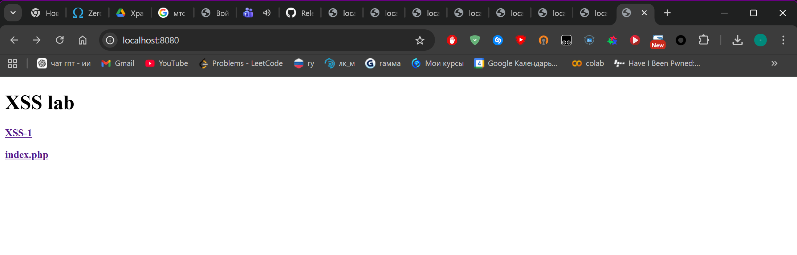
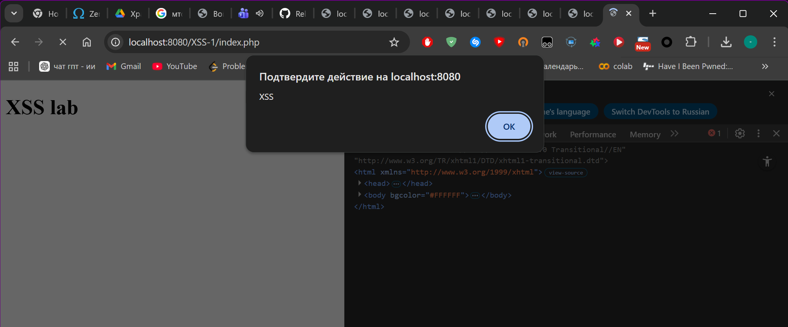

# Лабораторная работа №4: XSS-атака

## Часть I

Описание найденных CVE: [cve_report.txt](cve_report.txt)

## Часть II. Практика

Скачал и запустил уязвимый образ:

```bash
docker pull ket9/otus-devsecops-xss
docker run -d -p 8080:80 ket9/otus-devsecops-xss:latest
```

Открыл http://localhost:8080/ и увидел главную страницу с двумя ссылками: XSS-1 и index.php.



Перешёл по ссылке XSS-1, попал на страницу http://localhost:8080/XSS-1/index.php. Там раздел Comments с полем для ввода и кнопкой Save Data. Это значит что введённые данные сохраняются и потом отображаются на странице.

Сначала попробовал классический вариант:

```
<script>alert('XSS')</script>
```

Нажал Save Data несколько раз. В DevTools было видно что теги script сохранились в HTML, но alert не сработал — Chrome блокирует выполнение script тегов вставленных через innerHTML.

Попробовал другой вектор через атрибут события img тега:

```

```

Браузер несколько раз показывал диалог подтверждения навигации — JavaScript выполнился, но это не самый наглядный способ.

Попробовал через SVG:

```
<svg onload=alert('XSS')>
```

После нажатия Save Data браузер показал диалог "Подтвердите действие на localhost:8080" с текстом XSS. Скрипт выполнился в контексте браузера.



## Тип уязвимости

Stored XSS (хранимый межсайтовый скриптинг). Введённый скрипт сохраняется в базе данных приложения и выполняется в браузере каждый раз при открытии страницы с комментариями. Это опаснее Reflected XSS потому что жертве не нужно переходить по специальной ссылке — достаточно просто открыть страницу.

## Меры предотвращения

Основная причина уязвимости в том, что приложение сохраняет пользовательский ввод как есть и вставляет его напрямую в HTML без обработки.

Опасные символы которые нужно экранировать: < > " ' & и обратный слэш. Через них браузер понимает что начинается тег или атрибут.

Что делать конкретно:

В PHP использовать htmlspecialchars() при любом выводе пользовательских данных в HTML. Функция заменяет < на &lt; и > на &gt; и так далее, браузер покажет их как текст а не выполнит как код.

Использовать Content Security Policy (CSP) заголовок, который запрещает браузеру выполнять inline-скрипты. Даже если XSS нагрузка попадёт на страницу, браузер её не выполнит.

Валидировать ввод на стороне сервера: поле для комментария не должно принимать символы < > и кавычки вообще, либо они должны быть экранированы до сохранения в базу.

Использовать HttpOnly флаг для cookie, чтобы JavaScript не мог их прочитать через document.cookie. Это не устраняет XSS, но ограничивает ущерб от атаки.
