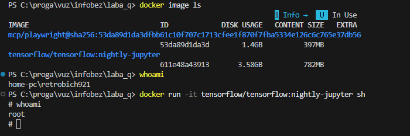
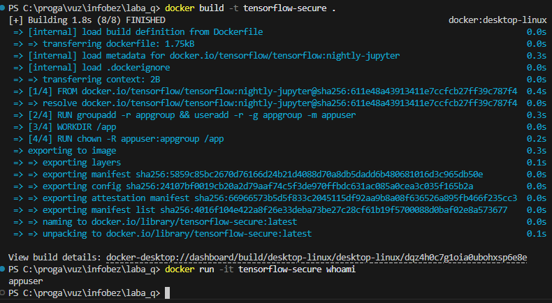
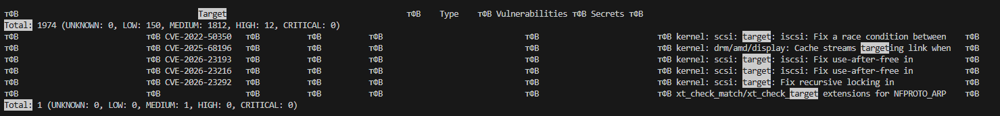

# Лабораторная работа: Базовая настройка безопасности Docker-контейнера

## Часть I: Анализ прав пользователя в стандартном образе

**Цель:** Узнать, от какого пользователя всё запускается в обычном образе из интернета.

1.  **Выбранный образ:** `tensorflow/tensorflow:nightly-jupyter`
2.  **Список образов на машине:**
    ```bash
    docker image ls
    ```
3.  **Кто я в системе (Windows):**
    ```bash
    whoami
    # Результат: home-pc\retrobich921
    ```
4.  **Кто я внутри контейнера:**
    ```bash
    docker run -it tensorflow/tensorflow:nightly-jupyter sh
    # Внутри контейнера пишем:
    whoami
    # Результат: root
    ```

**Вывод:** В обычном образе мы сразу заходим как `root` (админ). Это плохо, потому что если хакер взломает наше приложение, он сразу получит полные права внутри контейнера и сможет творить что угодно.

### Скриншот выполнения Части I


---

## Часть II: Настройка безопасности в Dockerfile

**Цель:** Сделать свой образ, который запускается от обычного пользователя, а не от админа.

1. **Dockerfile:** Написали конфиг, где создали пользователя `appuser` и запретили работу под root.
2. **Сборка своего образа:**
   ```bash
   docker build -t tensorflow-secure .
   ```
3. **Проверка:**
   ```bash
   docker run -it tensorflow-secure whoami
   # Результат: appuser
   ```

**Вывод:** Теперь мы работаем под обычным пользователем. Даже если хакер проберется внутрь, у него не будет прав админа, и он не сможет так просто захватить весь контейнер или сломать систему.

### Скриншот выполнения Части II


---

## Часть III: Анализ безопасности образа (Trivy)

**Цель:** Проверить наш образ на "дыры" (уязвимости) с помощью сканера Trivy.

1. **Запуск сканера:**
   Для полного анализа:
   ```bash
   docker run --rm -v /var/run/docker.sock:/var/run/docker.sock aquasec/trivy image tensorflow-secure
   ```
   
   Для скриншота (краткая сводка):
   ```powershell
   docker run --rm -v /var/run/docker.sock:/var/run/docker.sock aquasec/trivy image tensorflow-secure | Select-String -Pattern "Total:", "Target"
   ```
2. **Что нашли:**
   - Полный список дыр тут: [trivy_report.txt](trivy_report.txt)
   - **В системе:** нашли 1974 дыры (12 опасных, остальные средние и мелкие).
   - **Критических ошибок:** 0.
   - **В Python:** 1 средняя ошибка в библиотеке `pip`.

**Вывод:** В образе очень много мелких дыр, потому что сам Tensorflow очень тяжелый и тянет за собой много старых системных файлов Ubuntu. Самых страшных (критических) ошибок нет, но 12 опасных стоит иметь в виду. Чтобы было безопаснее, лучше использовать более "легкие" версии образов и чаще обновлять программы внутри.

### Скриншот выполнения Части III

